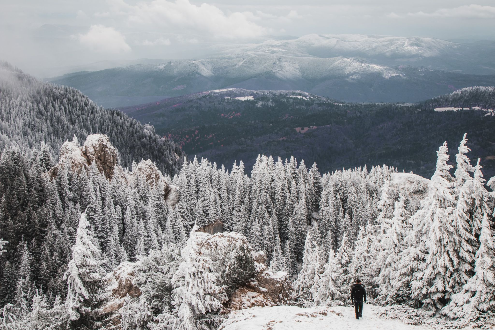
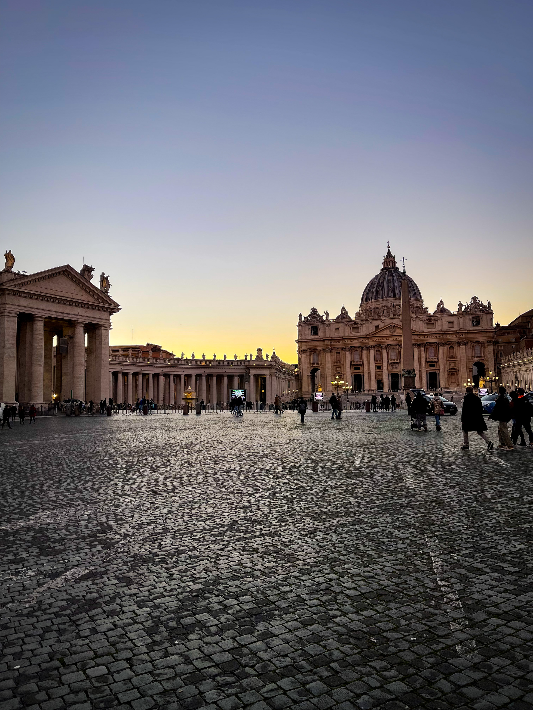
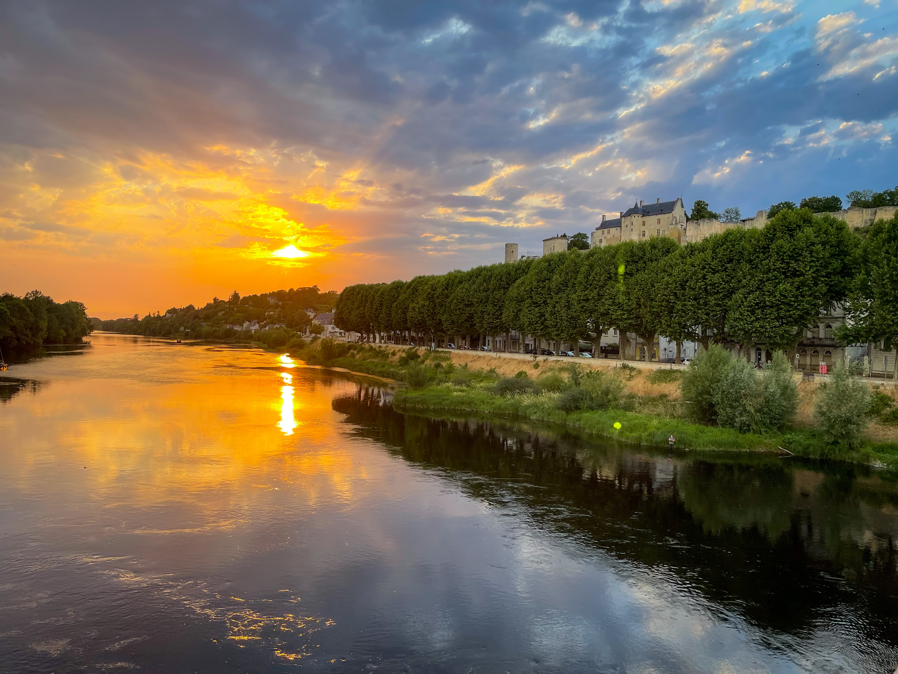
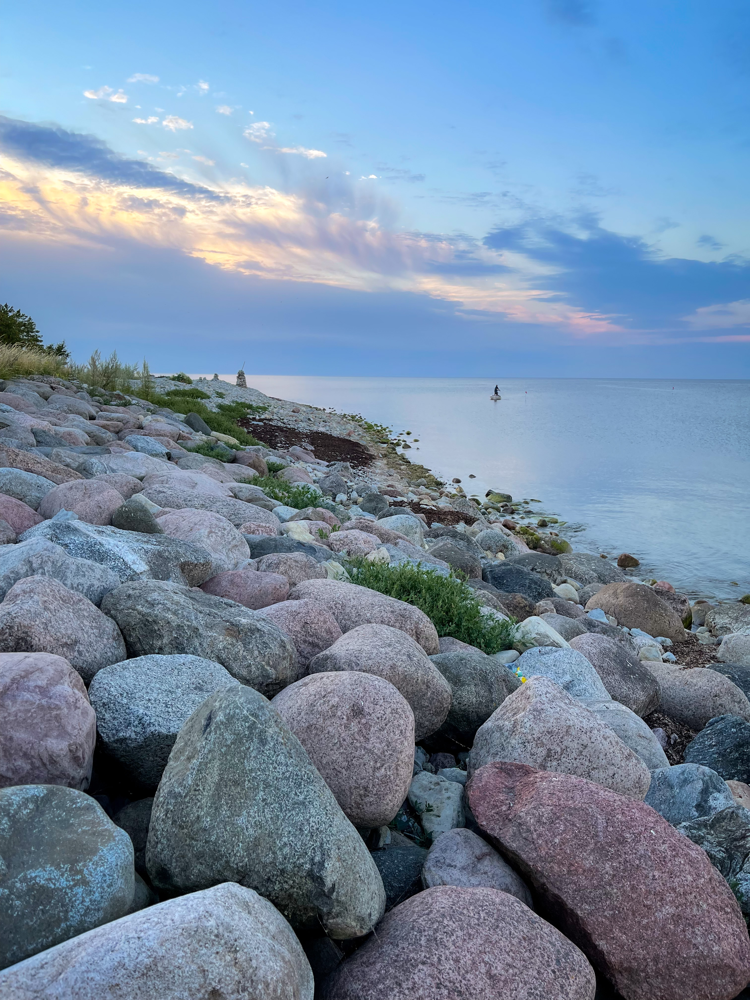
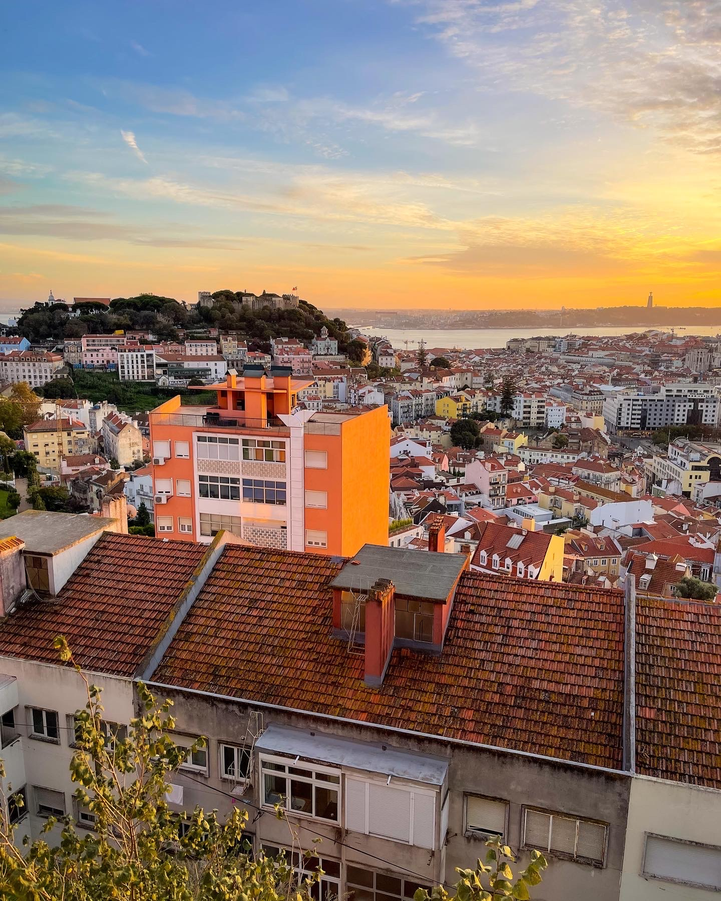
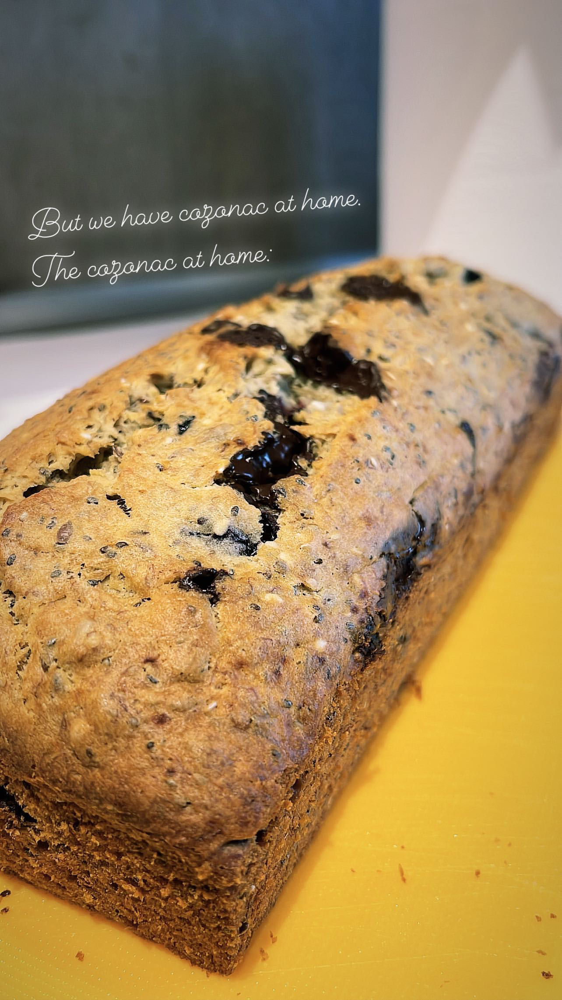
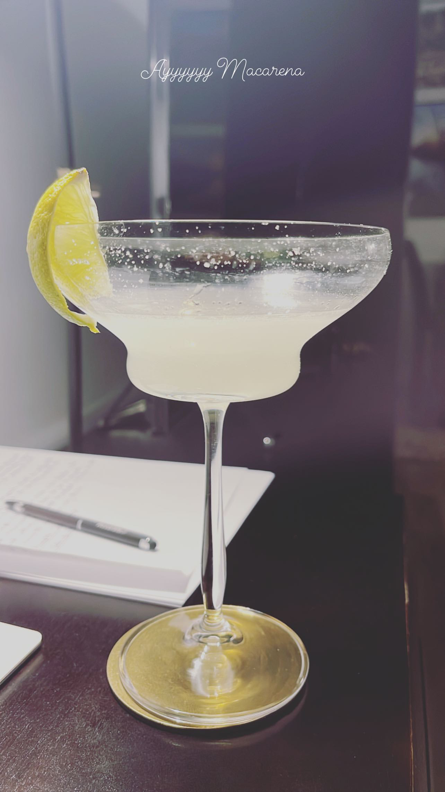
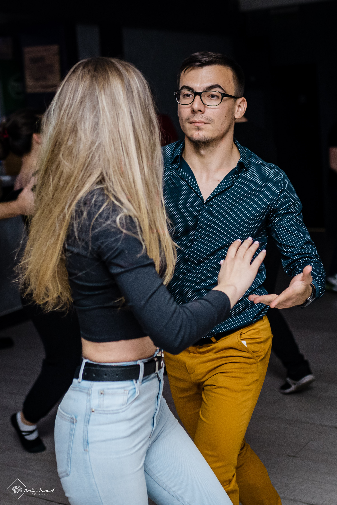

_Photo by Oana Vasilescu_

I started to write this post with an outlook of 2022's events, then decided
against it. I will only say that 2022 also brought some good news and that we
should just focus on the things that we can control.

I think that tracking past year's accomplishments serve a better purpose than
listing new year's resolutions.

They give us a better sense of where we are at this point in time, what are we
happy about, what we want to improve, how far we I with our objectives, and
other such vectors that form the big picture of life. Past year events have
happened, are easier to be measured, to receive follow-ups, to be celebrated and
to be analyzed.

As I was writing this post, it occured to me that 2022 was, personally, a year
full of events and achievements worth mentioning. Here they are:

## Building this Blog

My first most obvious achievement is, incidentally, this very blog. I started
the year by keeping a journal and writing once every few days. Shortly
afterwards, few days became more days and I found it increasingly difficult to
keep track of everything. And when I was actually writing down my thoughts, I
was mostly focusing on specific events, rather than the overall picture.
Consequently, it occured to me that I might be better off with keeping a blog
with posts about topics rather than a journal.

This realisation occured to me back in the summer, and it took me until November
to kickstart the blog creation process. I published it, along with my first
post, on December 13th, and it felt quite a piece of work. A piece of work which
is completely documented in the very same blog post,
[Building this Blog](https://silviuaavram.com/building-this-blog).

Setting up the blog made me very happy once I managed to publish it online. And
eager to write some more posts.

## Switching Roles

I started 2022 with a new role at Bolt. I was excited to help the company build
its Design System and create the ReactJS implementation for its components. I
loved the enthusiasm of delivering solid building blocks for others to use in
their applications and improve their user's experience. My team was constantly
aiming to provide superior quality in whatever we shipped, and I was very lucky
to work together with them.

Unfortunately, 2022's uncertainties left its mark on many things, but Bolt still
managed to throw the [coolest summer event ever](https://youtu.be/NX249enV6bg)
in Estonia, with over 2000 participants. It surpassed all other events that I
have been part of until now. Really amazing job!

In spite of the great blast I had working at Bolt, I decided to swith gears and
return to Microsoft in December. I will be part of the team that improves the
Messaging experience inside Microsoft Teams, a product I contributed to before.
One of the main differences is that, this time, the role is based in Bucharest,
so no relocation is needed. I am happy to see the product getting better over
the years, especially now when most of us work either remotely or in a hybrid
schedule. Very excited about what's next!

Interviewing for both these companies is not easy, as their hiring standards are
quite high. That being said, buying a leetcode subscription and having a daily
slot to solve puzzles and algorithms worked for me very well. It feels tiring
after a few weeks, but that's the price to pay in order to work in a company
with great people and a healthy culture. So far, I think it's worth paying it.

## Reading

I regret that I was not much into reading when I was in school. Even so, from my
first salary, back in 2013, I bought the
[Song of Ice and Fire collection](https://www.bookdepository.com/Song-Ice-Fire-George-R-R-Martin/9780007477159),
which was meant to be symbolic. I read the books rather quickly, but it took me
until 2018 to actually start reading on a regular basis. Despite the rough
start, I realised that 2022 was a great year for my reading habit. Here's my
list:

1. [The Picture of Dorian Gray](https://www.bookdepository.com/Picture-Dorian-Gray-Oscar-Wilde/9780141439570).
   The novel I started right after finishing Jordan Peterson's
   [12 Rules for life](https://www.bookdepository.com/12-Rules-for-Life-Jordan-B-Peterson/9780141988511).
   After learning to pick my life sufferings for the better outcome, I went
   straight down the rabbit hole of hedonism. Oscar Wilde's book is not a very
   long one, but paints a powerful picture of beauty as an end, untouched by the
   the lust and sin of human nature. The picture had the ability to keep "Prince
   Charming's" beauty and youth unscathed, but not his conscience, as he
   tragically discovered.
2. [War and Peace](https://www.bookdepository.com/War-Peace-Leo-Tolstoy/9780140447934).
   In contrast to the first book in the list, this one is huge. I was awed by
   its complexity from the beginning to the end. It's hard not to like War and
   Peace. I loved everything about it: its story of Russia's elite, the history
   of the Napoleonic wars, the characters and their struggles in society. All
   sprinkled with Tolstoy's philosophy.
   > _Yes! It’s all vanity, it’s all an illusion, everything except that
   > infinite sky._
3. [Lolita](https://www.bookdepository.com/Lolita-Vladimir-Nabokov/9780241951644).
   It was not an easy book to read for me. Maybe because I just could not
   detatch myself from the main subject of the novel, or the protagonist's
   interests. It's hard not to be impressed by the writing style though, which
   emphasizes the character's profession and education.
4. [The Plague](https://www.bookdepository.com/Plague-Albert-Camus/9780141185132).
   If it wasn't the COVID pandemic I would have probably postponed reading this
   book, but I'm glad that I haven't. Bernard's work and reaction to the events
   showcase our power of adaptability in times of crisis, even though, at times,
   it felt a bit cynical. In any case, it was hard for me to blame him.
5. [1984](https://www.bookdepository.com/1984-George-Orwell/9780141036144).
   Everyone needs to read this book. Period. It's a great way to remind us about
   the importance of free thinking, free speach and democracy. And how easy
   could these be exchanged in the name of security and improved quality of
   life. An exchange that is nothing but a lie.
   > _Who controls the past controls the future: who controls the present
   > controls the past._
6. [To Kill a Mockingbird](https://www.bookdepository.com/Kill-Mockingbird-Harper-Lee/9780099419785).
   I understand why this is widely read in the United States high school and
   middle school. The subjects are not uncommon at all, but what is powerful is
   them being projected through the viewpoint of a child. It's a great way to
   understand fundamental concepts such as justice, equality and empathy. In my
   opinion, it's a must read.
7. [The Master and Margarita](https://www.bookdepository.com/Master-Margarita-Mikhail-Bulgakov/9780140455465).
   The supernatural part of the novel was not something I particularly enjoyed.
   On the other hand, I did not expect to enjoy the part about Christian
   philosophy, which was masterfully written.
8. [The Great Gatsby](https://www.bookdepository.com/Great-Gatsby-F-Scott-Fitzgerald/9780141182636).
   I am happy to have read the book, as it delivers a conivincing story about
   the disparity of society, the relations between men and women, and the
   American way of life in the hedonistic Jazz Age. Nicks's outsider perspective
   about the events is crucial, I believe, to enjoy every bit of it.
9. [A Hundred Years of Solitude](https://www.bookdepository.com/One-Hundred-Years-Solitude-Gabriel-Garcia-Marquez/9780141184999).
   I love this book. I started to read it on my flight to Lisboa and, during
   those 4 hours, I was enchanted. The characters were not without flaws, to say
   the least, but there was something magical about each and every one of them
   that brought me inside their world. I founded Macondo, fought the Columbian
   government, kept watch over the family, deciphered the manuscripts and
   escaped the banana company massacre in their company. I did not expect to
   like this book when I saw the family tree at its beginning, thinking that
   it's going to be some kind of a South American soap opera. I was so mistaken.
   > _(...) the parchments, and that everything written on them was unrepeatable
   > since time immemorial and forever more, because races condemned to one
   > hundred years of solitude did not have a second opportunity on earth._
10. [Letters from a Stoic](https://www.bookdepository.com/Letters-from-Stoic-Seneca/9780140442106).
    I should have started my stoic journey with Seneca's book, not Marcus
    Aurelius' Meditations. The letters are clearly written for publishing, and
    it's impossible to tell that they were written 2000 years ago, they feel so
    contemporary. The desire to think about the meaning of life is not delivered
    as a strong punch to the face, as in Meditations, but as a friendly pat on
    the back while you enjoy a relaxing walk on the pristine Mediterranean
    shore.

## Learning

I'm a big fan of studying from online source, such as
[Frontend Masters](https://frontendmasters.com/),
[Coursera](https://www.coursera.org/) and [Udacity](https://www.udacity.com/).
Unfortunately, I had better years when it comes to learning new skills.

I have finished Kyle Simpson's
[Deep JavaScript Foundations](https://frontendmasters.com/courses/deep-javascript-v3/).
It allowed me to explore some JavaScript functions which I had the tendency to
only guess how they worked. And his course helps counter exactly this tendency,
as understanding the tools we use is fundamental in shipping products that are
free of bugs.

Switching gears, I am now in the process of learning accessibility from Marcy
Sutton's [Testing Accessibility](https://testingaccessibility.com/). I know
Marcy from 2019, when I attended her Deque talk at CSUN. I love the
accessibility part of web development and try to advocate for it as much as
possible, and Marcy's training course is packed with useful information and her
own experiences while working in the accessibility field.

## Open Source

I have updated [downshift](https://www.downshift-js.com/) to support the ARIA
1.2 combobox pattern for both _useSelect_ and _useCombobox_ hooks. This update
involved a breaking change version update, but the migration guide should cover
the steps needed to make the proper changes on the consumer side. More
importantly, I resumed my regular work on the library, with more bug fixes,
documentation updates, and future planning.

## Traveling

In January I went to Rome for the second time. I liked it very much the first
time and there were many places that were still on my list and I did not manage
to visit them. Truth be told, my list is far from finished, as Rome has so much
to offer. We spent one full day at the
[Vatican](https://goo.gl/maps/m9pCyu39LVmLHxYT9), as it's properly required, and
this time I also went to
[Saint Peter's Basilica](https://goo.gl/maps/6bfJMa11wsWFMKM9A), which I somehow
managed to avoid during my first trip. It's hard to grasp how big this church
is. Incredible.

|              Tiber River overlooking Trastevere              |                 The Vatican Square                  |
| :----------------------------------------------------------: | :-------------------------------------------------: |
|  |  |

Also incredible are the
[Baths of Caracalla](https://goo.gl/maps/BAUChKSaoX2s6WwG8), and it's difficult
for me to understand how the Romans managed to build this magnificent structure
2000 years ago and not keep their city clean in the present. Anyway, what I also
liked in Rome is the
[Trastevere neighbourhood](https://goo.gl/maps/DLqaNNbv8uMuTWmZ9). We went there
at sunset and it gave me the feeling of cosy castle setting, with cramped
streets, terraces everywhere, candle lights and brick walls.

My next trip took place in, you guessed it, Italy again, but this time in Genoa.
I cannot say much about the city itself, it's probably my least favorite so far,
but I enjoyed it nonetheless. The highlight of the trip was the town of
Portofino, which is probably Instagram heaven. Everything was picture perfect:
the pure white boats on the water, the hills covered in greenery,
[the Castello Brown](https://goo.gl/maps/xaDo1zZEWa66Y3HG9) with its perfect
gardens. Just excellent.

|                                     Portofino Harbor                                      |               Portofino Hills                |
| :---------------------------------------------------------------------------------------: | :------------------------------------------: |
|  |  |

My third trip involved a bike trail on the Loire Valley in France. I love biking
trips. The itinerary is simple: check in at the hotel, visit the town, get up
the next day, leave my bags there, hop on the bike and ride to the next
destination, while the luggage gets magically transfered to the next hotel. Oh,
and did I mention the chateaux on the bike trails? The Loire Valley is famous
for them. My favorite ones were
[Château de l'Islette](https://goo.gl/maps/a7YiodZ7SoRgbCXy8),
[Château de Villandry](https://goo.gl/maps/WcL8W5zpRuMDwhvK9) and
[Château du Rivau](https://goo.gl/maps/KND3zxfBM2TshBQ86).

|                      Chinon Castle                       |                      Montsoreau Castle                       |
| :------------------------------------------------------: | :----------------------------------------------------------: |
|  |  |

In July my friends and I went for a relaxing beach trip in Bulgaria's Sunny
Beach. It was a perfect combination of sun, food, beach, bachata by the pool,
relaxing walks and food. There was a lot of food.

I did mention Bolt's summer 2022 event and this involved a trip to Estonia. The
boat ride was absolutely amazing, and I managed to visit a bit of Tallinn and
Saaremaa while there. My only complaint is that we did not stay longer, as
everything felt a bit on the fast forward. I think I would have enjoyed a full
day visiting Saaremaa with a car. Or riding an electric scooter.

|                              Saaremaa Beach                               |              Tallink Ship               |
| :-----------------------------------------------------------------------: | :-------------------------------------: |
|  |  |

My last trip of 2022 was the already mandatory
[Web Summit conference](https://websummit.com/) in Lisboa, which I went to for
the third time already. They are nice enough to offer free tickets for active
open source contributors, and I was lucky to receive such a ticket. I love
Lisboa and it's one of my favorite cities, with great views, very friendly
people and [Pasteis de Nata](https://goo.gl/maps/8HcAQNdev22ZnqvY9). The
conference is a great opportunity to learn what's new in tech, climate change,
marketing and others.

We also went to Lagos for the second year in a row, as my friend is a fan of
surfing, and he convinced me to give it a try. It's not the easiest thing for me
to do, but it does feel good when you catch the proper wave.

|                      Monte Agudo in Lisboa                       |                       Portas do Sol in Lisboa                       |
| :--------------------------------------------------------------: | :-----------------------------------------------------------------: |
|  |  |

## Hobbies

Because having fun is what it's all about.

|            Banana Bread             |               Margarita Cocktail               |
| :---------------------------------: | :--------------------------------------------: |
|  |  |

There was significant progress in the kitchen this year. The winners are,
without a doubt, the banana bread and the margarita cocktail. If my software
development career happens to go south, I'm opening a coffee shop that turns
into a cocktail bar in the evening, with latino parties all day long. There is
simply no other way. Talking about latino parties, I did continue taking bachata
and salsa lessons, and I also started to learn salsa on2.

Thanks to my group of friends that enjoy hiking, this year we went on a few
trails in the Bucegi and Piatra Craiului mountains. Some of the peaks and
trails: Piatra Mare, Piatra Mica (I know, not much imagination), Neamtu, Jepii
Mari and Ciucas.

|                 Salsa Dancing                 |                         Piatra Mare hiking trail                          |
| :-------------------------------------------: | :-----------------------------------------------------------------------: |
|  |  |

I also continued to go for a run once every two days and to hit gym twice a
week. On top of that there were a few snowboarding trips and the occasional
basketball game.

## Wrap up & Plans for 2023

And that's all, folks. I am very grateful for a past year that was full of
events and accomplishments. Many thanks to everyone that were part of my
journey!

I am super excited for 2023, and I honestly hope that the overall state of the
world will improve. I really think that we need this to happen. As stated in the
beginning, I am not a big fan of new year's resolutions, but I do want to
continue what I did best during this year. Also, I have a list of new objectives
as well, such as to:

- update Downshift to v8.
- finish Marcy's course and 2 more Frontend Masters web development courses.
- read at least 10 books, starting with the current one,
  [Don Quixote](https://www.bookdepository.com/Don-Quixote-Miguel-De-Cervantes/9780140449099).
- improve to 3 times per week gym schedule.
- attend at least one dancing congress.
- visit the south of Spain and New York.
- revive the Tab Order Testing library I worked at in Adobe.

Thank you for reading this post, I hope you liked it. I wish you a great and
fulfilling 2023!

Happy New Year!
