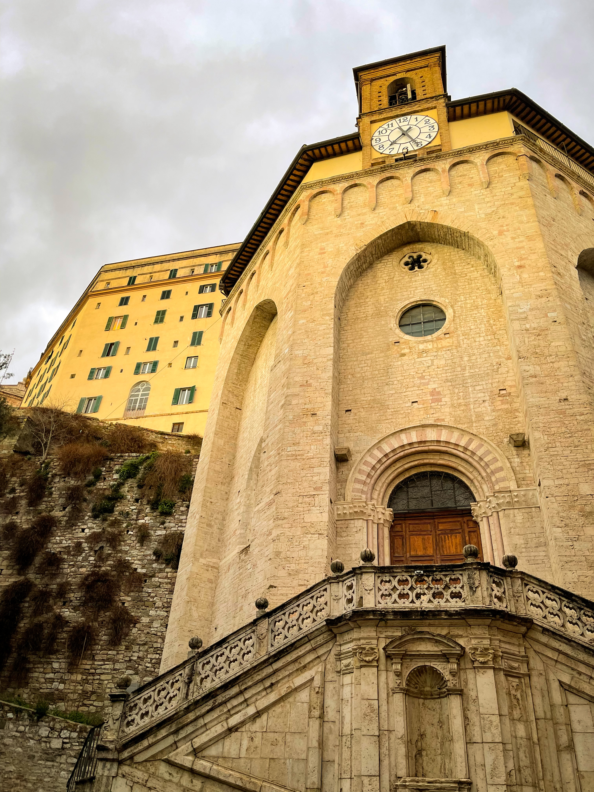
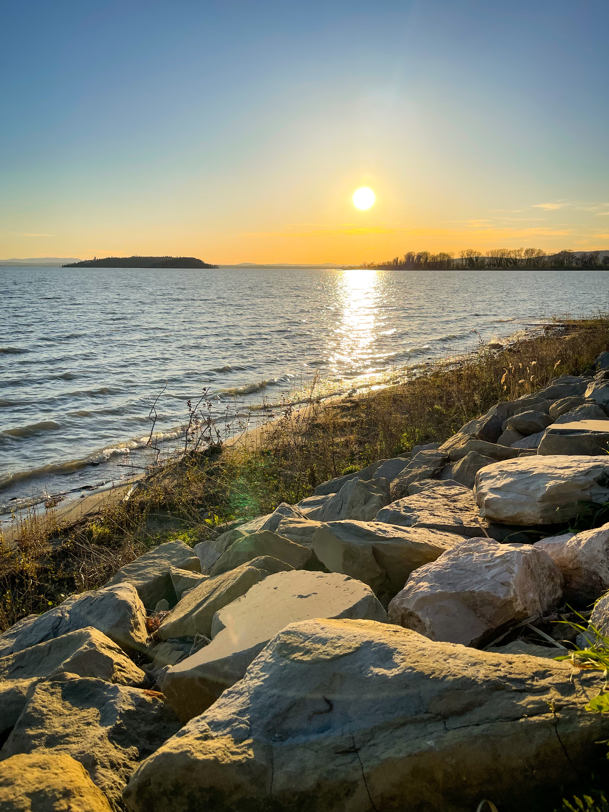
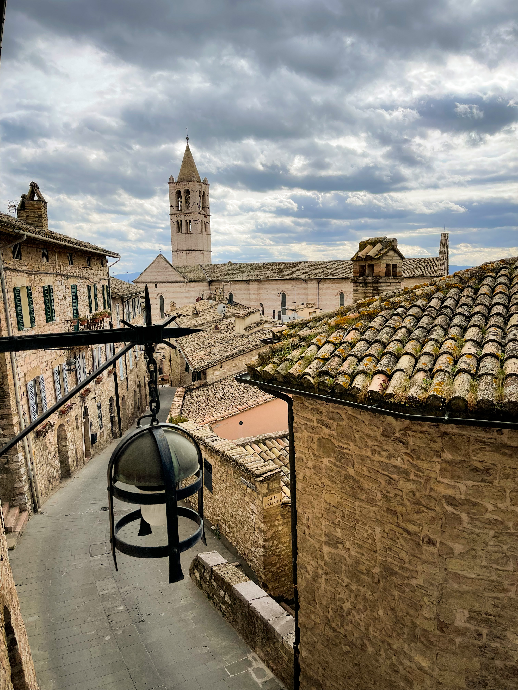

_Photo by Silviu Alexandru Avram_

It was a lovely day of spring, on the 19th of March to be exact. I am a very big
fan of the lazy Sunday concept, but somehow I always manage to ruin it in a
spectacular fashion. And this one was no exception. It was a great day for
science and productivity in general, or at least that's how I felt. As I closed
my laptop after finishing a PR for
[downshift](https://github.com/downshift-js/downshift), I took a last sip of my
Starbucks matcha tea latte and decided to check the horoscope (skyscanner.net).

Fueled by the warm sensation of accomplishment, I submitted a search for all the
flights in the remainder of March, without any specific destination. And just
like that, the stars aligned, the planets made love, and the horoscope whispered
that I should book a flight to Perugia, from the 26th to the 30th, for a total
price of 40 bucks.

Intriguing, I know. The horoscope gave me the answer I was looking for, but I
had to find my own answers to questions like ... what is Perugia anyway? So
after a bit of google google guess what I found out. Perugia is a lovely city in
the middle of Italy, the capital of the Umbria region, at equal distance between
Florence and Rome, two beautiful cities that I enjoyed very much in the past.

And this wasn't the best part. Right next to Perugia there is this big lake
called Trasimeno. And if you enjoyed history in school as much as I did, you may
remember about a certain
[battle of Lake Trasimene](https://en.wikipedia.org/wiki/Battle_of_Lake_Trasimene),
where the Romans got their butts kicked by Hannibal's Celtic mercenaries. A bit
of history always works well with coffee and tiramisu, if you ask me.

Oh, and there's also this other town near Perugia called Assisi, full of big
churches and with a castle, a bit of a mix of Sighisoara and Brasov.

It was looking good so far, as far as I saw it. Plenty of stuff to do for a 4
day trip. First 2 days aperol spritzing in Perugia, one day for a Lake Trasimeno
bike ride, and one last lazy day for church visits and lazy walks. To be sure
about everything, I checked the second horoscope (booking.com) and Mercury was
generous there as well. Found a decent apartment close to the train station,
booked everything and I was all set for one of my spontaneous Italian trip.

## Perugia Day #1

I passed trough a few small airports in my life, but San Francesco airport is on
another level. It's like a small train station. The airplane pulls up right next
to the airport. Because it's most likely to be the only plane in the airport at
the time. You just hop off and walk inside, go through the immigration room, and
directly outside. If it's your first time there and you're looking for an
obvious way to get a bus into town, you're in the wrong place. It became
immediately obvious that renting a car would have been a good idea.

That aside, we got to Perugia by bus eventually, and while the apartment was
getting ready, we made for the city center. Not ideal when you have bags, but we
were excited to walk the city for the first time and not take public transport
just yet. And it's not a long walk, 25 minutes max. As we realised that the walk
was more like a climb and we also had the bags with us, public transport
suddenly sounded like the better alternative.

So there we were in the city center, which was the only place with people. We
found nobody on our way there, and we started wondering if the town is dead or
if there was a holiday. Once in the center, we went for Piazza IV Novembre and
visited the National Gallery in Palazzo dei Priori. The place looked good on the
outside, but the gallery itself was a bit disappointing. Do you know those weird
medival religious paintings usesd to make memes out of? Yep, that was the place.

As the tour was over, we left our bags at the apartment and went back to the
center to do some exploring and content creation for the gram. This time, we
used a public transport called the Minimetro, which is an automatic train cabin
that serves a few stops, including the city center and the train station. Never
used anything like it before, it was actually very exciting!

|           Cloudy skies over Perugia           |              Church of Sant'Ercolano               |
| :-------------------------------------------: | :------------------------------------------------: |
|  |  |

We found Terrazza del Mercato with a gorgeous view of Umbria and the mountains
to the East. Great place to sip your aperol and enjoy the graphics of life. We
also found a few places to eat, obviously, and the most important were the O
Sole Mio pizzeria and the Lick gelato place. Top tip: if you go to Italy,
always, always, locate the take away pizza place conveniently situated, where
you can enjoy a few slices of great pizza and a beer. Italian restaurands are
very (VERY) picky about their time of serving lunch and dinner, so if you're
caught off hours, the pizza place is your ultimate salvation. It saved us 4
times in total, with great pizza, arancini and Ichnusa. And I'm not even slighly
mad about that.

## Perugia Day #2

Still hungry for instagram content, as the first day was not very productive, we
went full on exploring the next day, even though the rainy weather was better
fit for sensual bachata. We found some very good places such as the Garducci
Gardens, the Acquedotto Medievale, the Chiesa di San Michele Arcangelo, and the
Chiesa di Sant'Agostino.

In order to be able to walk, visit and take pictures, good coffee plays an
important part, and the Pinturicchio Cafe did not disappoint. Caffee Arco was
fine as well, but did not compare.

Overall, it was a good day for visiting and content creation. We felt that we
saw enough of Perugia and we were satisfied about it. The next day was supposed
to be sunny, which was necessary to achieve our next objective.

## Lago Trasimeno

After a short train ride we were in the town of Passignano sul Trasimeno, the
starting point of what was supposed to be our Trasimeno lake bike ride. We
rented the bikes and off we went, towards the almost middle point of the
journey, Castiglione del Lago. According to Google Maps, we had enough time to
perform a full circle around the lake in our time frame of 7 hours, lunch and
cofee stops included. Consequently, we started our journey full of optimism and
joy, like Gaius Flaminius and his friends.

As we got closer to a checkpoint, namely Campo del Sole, lunch hour was drawing
to a close, so we decided to abandon the main road, and head over to the town of
Tuoro sul Trasimeno and have something to eat. We were the only people in the
town when we arrived, along with a couple of others, probably the mayor and some
people at the local bar. Everything else looked deserted and closed. Eventually,
we found one open restaurant, Osteria dell'Accademia, which had really good food
and service, with the best bread I had for a while. Coperto well spent.

|         Silviu riding a bike near Lago Trasimeno         |              Sunset over Lago Trasimeno               |
| :------------------------------------------------------: | :---------------------------------------------------: |
|  |  |

Back on the road, we resumed the journey, with a few stops along the way, one of
which was a field of daffodils. No, not your usual Instagram rapeseed photos,
this was with actual daffodils. Glorious. Eventually, we arrived in Castiglione
at about 16:30, 4 hours after leaving Passignano. Unfortunately, we did not
visit the town, as it required us to leave the bikes and climb, because,
obviously, the town was on a steep hill. Climbing would not have been a problem,
but as we were doing the math, it would have been impossible to go round the
lake and reach the end point by 19:30, the time we had to return the bikes.

Either Italian Google Maps tricked us, or we were just outrageously slow,
because it turned out that the actual time it took us to reach a certain point
by bike was two times the one estimated by Italian Google. And on that
bombshell, we had to abandon the original plan of doing a full circle around the
lake and go back the way we came. Italian Google clearly said it would take 1
hour to get back. It took us 2, _like the priest_.

With a bit of disappointment and much hunger, we dined in Passignano and got the
(last) train back to Perugia. It was not all negative though. The weather was
great, we took many pictures, and no army ambushed us along the way.

## Assisi

The third and final stop of the trip was the town of Assisi, a few kilometers
from Perugia. There isn't much to tell about the town, to be honest. Just your
usual medieval town full of churches and a castle on top of a hill. The weather,
this time, sucked big time. There were gusts of wind that reminded me of the
Grozavesti intersection.

|             Assisi Castle             |            View from Assisi            |
| :-----------------------------------: | :------------------------------------: |
|  |  |

On the (brief) bright side, the churches were very beautiful, especially the
main one, Basilica of San Francesco d'Assisi. Apart from them and the view point
near the castle, the town was cute, but it did not blow our hats off. The wind
did that.

## Final Thoughts

Overall, I enjoyed the trip, the towns of Assisi and Perugia are definitely
worth visiting. Also, if you plan to go to Lago Trasimeno and intend to do a
full circle, make sure you are really fast, or maybe stop for the night along
the way. I'd go woth the second option, as a romantic stop at a hotel with a
lake view is probably a good idea.

If I would do it all over again, I would also rent a car, and buy accomodation
in multiple places: two nights in Perugia, one in Assisi, one or two at the
lake, and so on. You would probably get more out of the Umbria trip like that,
instead of having your accomodation in a single place and take trains and buses
to the other points of interest. Just make sure to heed advice #1: pizza place
that is conveniently situated.

Allora, that's all folks. Wrapping this one and will publish it. It has been a
productive Sunday, on the 2nd of April, I am pretty happy about everything, to
be honest. Hmm, I wonder what the horoscope has to say about it.
