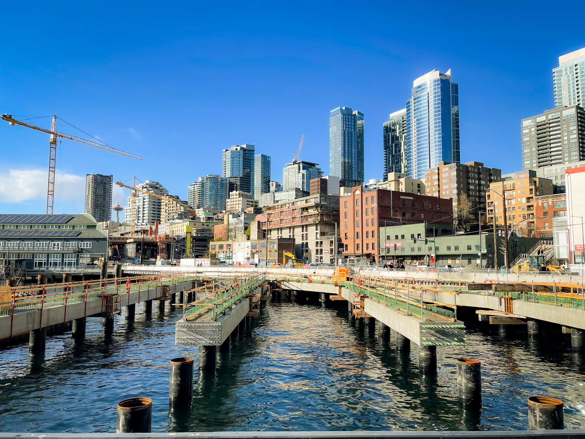
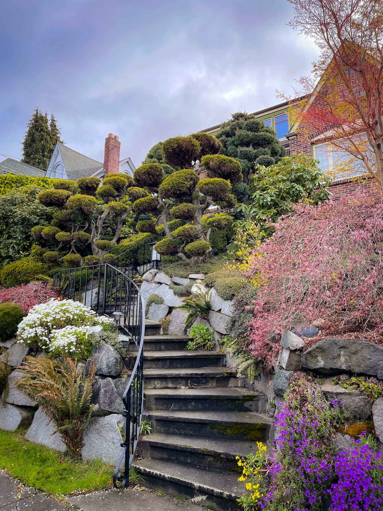
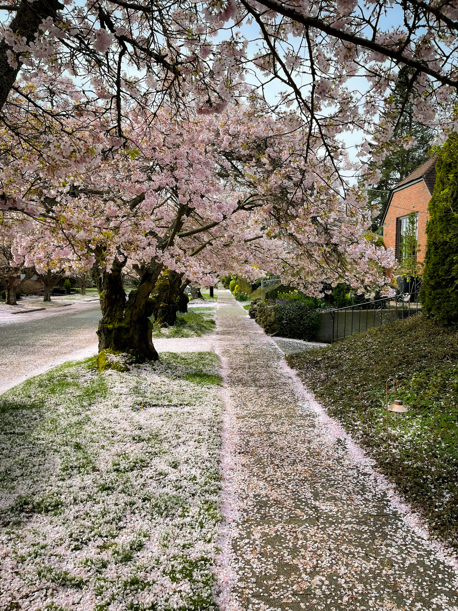
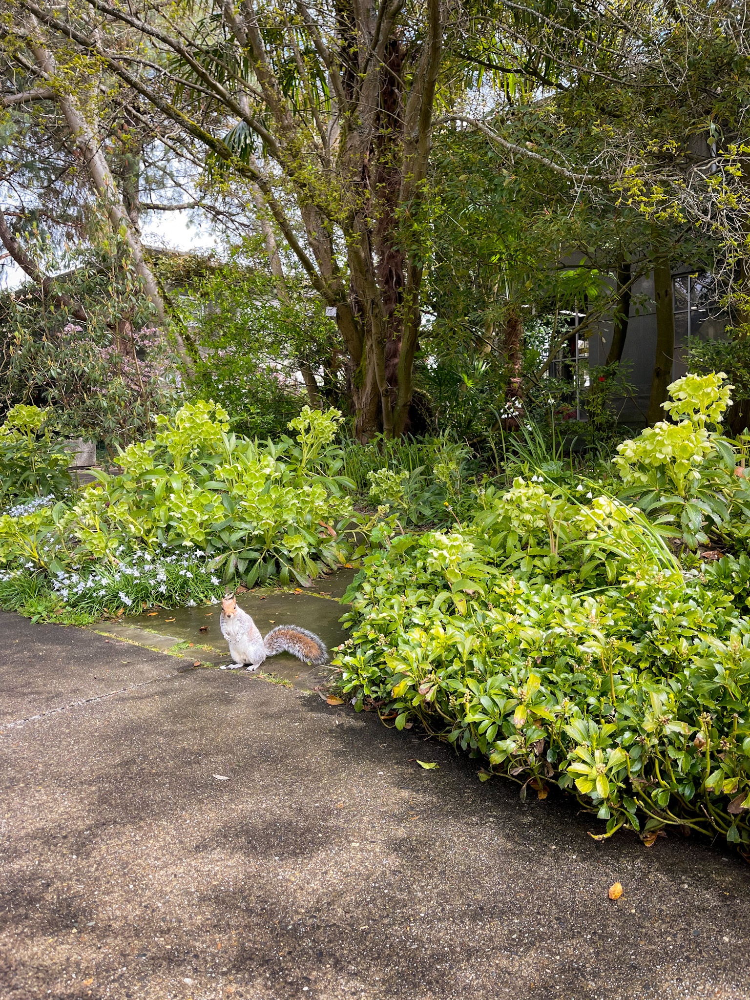
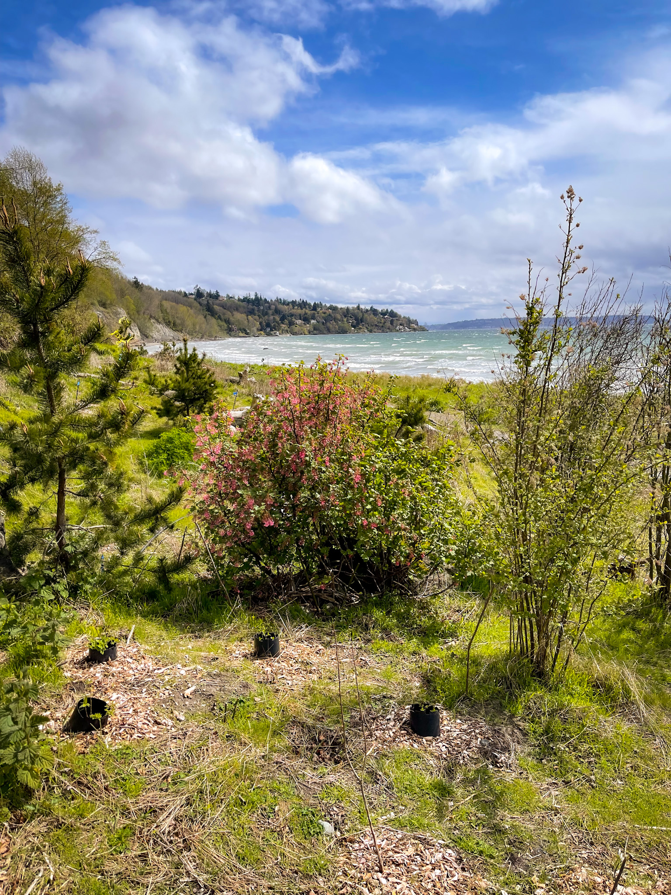
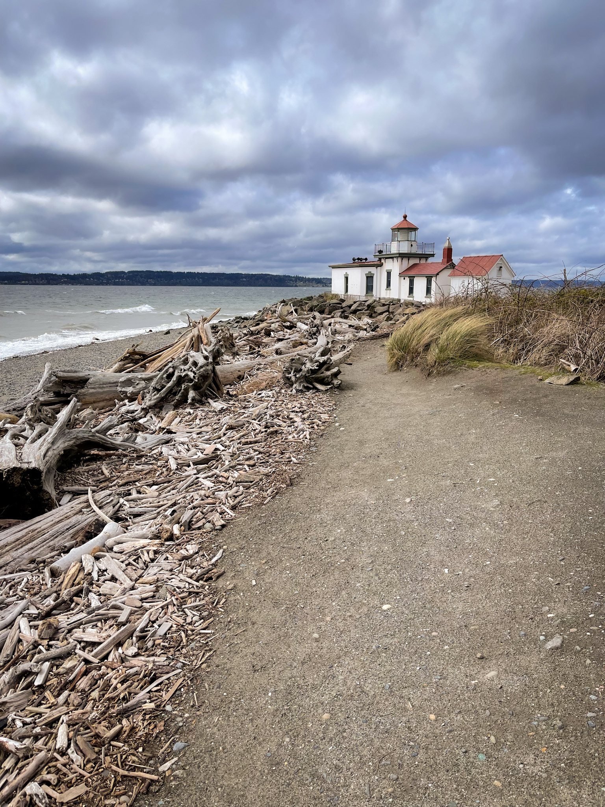
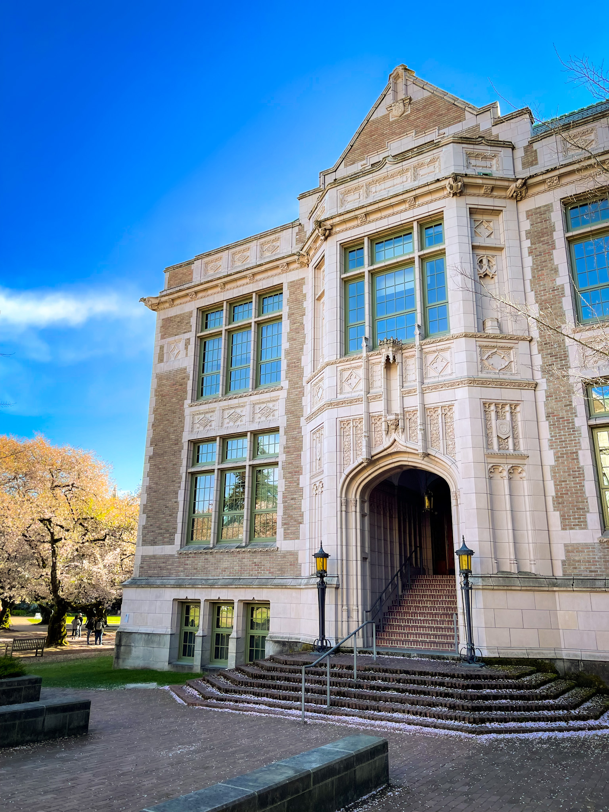
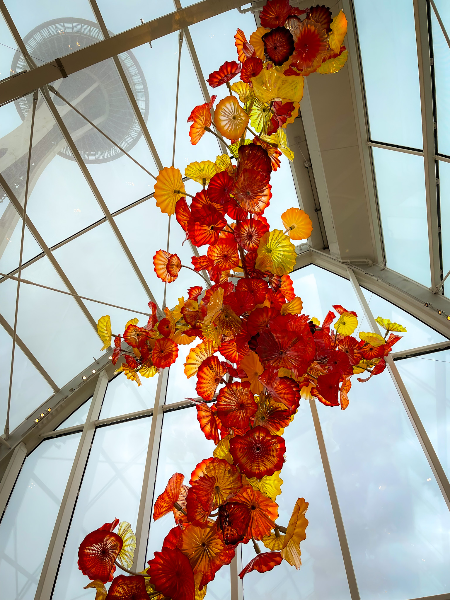
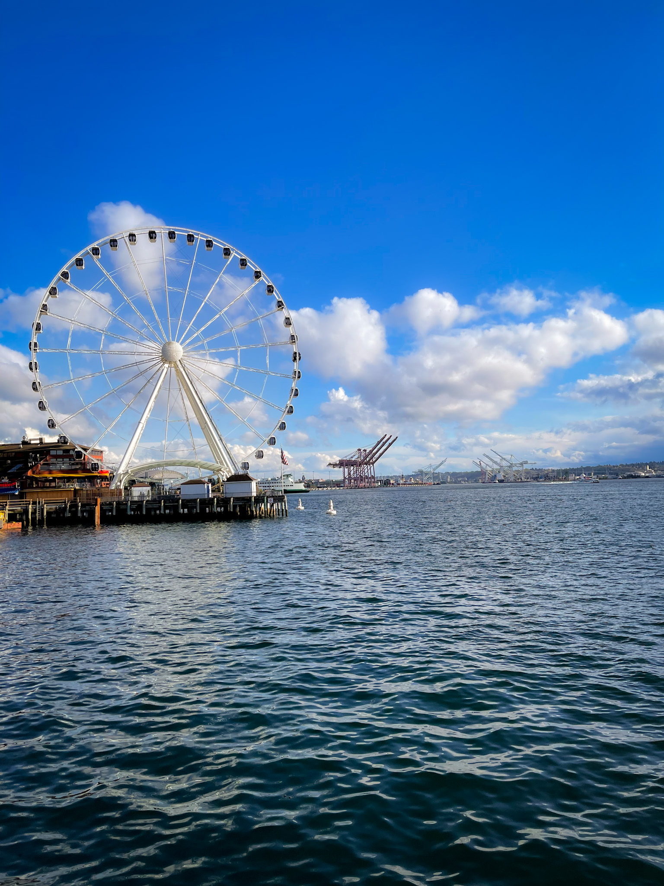
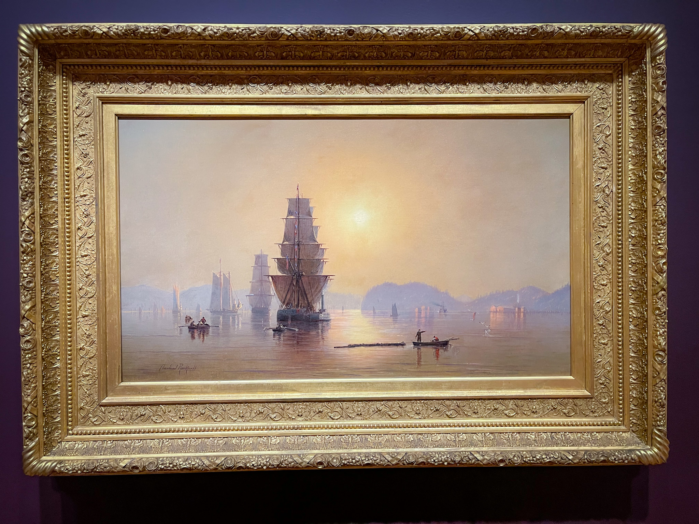

_Photo by Silviu Alexandru Avram_

We're back in Seattle, baby, and this time we're spending a full week here, not
just some silly 3 business trip days. And the best part is: it's only vacation.
A full week in tech heaven #2, the land of Amazon, Microsoft and, of course,
Starbucks. I just wish I packed un umbrella.

## Ballard

Ballard neighbourhood was going to be my home for the week, and a change of
scenery from Jersey City was to be expected. No more skyscrapers. No
brownstones. Only houses, and lawns, and gardens, and more houses. And that
presented a great opportunity to continue my burger-and-fries-burning morning
runs, which, by now, turned from optional to necessity.

Situated on a hilly landscape, with Shilshole Bay to the west, Ballard is a nice
and cosy place to live. I explored it quite a bit, reaching its outskirts with
long runs and walks: the bay to the west, Whitman School and Golden Gardens to
the morth, Carl S. English Jr. Botanical Garden to the south and Woodland Park
to the east. The neighbourhood is a low density residential area, with many
great looking houses. Most of them had thoughtfully arranged gardens in front,
and none were identical. Because of the rainy temperate climate, the place is a
greenery, with an abundance of cherry trees, magnolias, shrubbery, flowers and
even succulent plants, where the soil became rocky.

|             Ballard House             |                Ballard Cherry Trees                 |
| :-----------------------------------: | :-------------------------------------------------: |
|  |  |

In Ballard downtown I found a few places to enjoy a coffee or lunch out, even
though the area is pretty small. There was no queue at the local Salt&Straw, to
my surprise. Unfortunately, after I had my double scoop cone, I immediately
understood why. It wasn't really like the one I had in LA or San Diego, or maybe
gelato tastes better in California. I don't know. It was not all negative
though, as I discovered a very good tea place, Miro Tea, and, most importantly,
a local bakery, Tall Grass Bakery. As a result, mornings became very sweet.

Outside the center, there is also Ballard Coffee Co. with pretty decent coffee,
and Un Bien, a Caribbean Restaurant, which is not really a restaurant, more like
a counter to order food from, and a couple of wood benches where you could
choose to "dine in". But the food was absolutely amazing. I ordered a Caribbean
Burrito and only half of it was enough to make me feel full, which is not
something that happens often. Also great is Mainstay Provisions for coffee, and
The Dish, a classic American Diner but with a Central America twist to it.
Blueberry pancakes with butter and maple syrup? Yes, please!

## Outside Ballard

Even though I was expecting to rent a car in order to get around, I found that
public transport is actually good enough, both for going to the airport and for
moving between the downtown and back home. However, most of the time, I chose to
walk between Ballard and other objectives, especially when going back, since
there was no need to rush.

|              Carl S. English Botanical Garden               |             Discovery Park              |
| :---------------------------------------------------------: | :-------------------------------------: |
|  |  |

One of the places I enjoyed most is Discovery Park, which is bordering Ballard
to the South, next to the coast. In order to reach it, I walked through the Carl
English Botanical Garden and, since the weather was pleasant and the garden
quite nice, I spent some extra time strolling its quiet alleys. Continuing the
journey, I crossed Salmon Bay by Ballard Locks, then the train tracks by a
suspended bridge, and headed through the woods towards Discovery Park. I was
fortunate enough to pass through woodlands when, inevitably, it started to rain.
Eventually, I reached the park and went for a very long and chaotic walk until I
reached the coast. It stopped raining, for the moment, but the wind made it
impossible to relax for more than 2 consecutive minutes. Nevertheless, the coast
is a sight to see, with Mount Olympus in the background, and the lake in
between. Equally beautiful is the West Point Lighthouse, which was used, as I
later found out, as the logo for the Lighthouse Roasters coffee shop in Fremont.

Speaking of Fremont, I crossed it a few times on my way from Downtown or when I
went to visit the University of Washington campus. The neighbourhood is pretty
similar to Ballard, althouth a bit more hilly. Right next to it, there's
Woodland Park and, at the end of it, there's Green Lake. The park itself is, as
its name suggests, a stretch of woodland, without much human intervention,
except some alleys. The lake is pretty big, big enough to be used as practice by
rowing teams. I popped up just in time for such a session, and it was great to
watch them train while the coach was providing motivation using a loud tone.

|                 West Point Lighthouse                 |               University of Washington Building                |
| :---------------------------------------------------: | :------------------------------------------------------------: |
|  |  |

After a long walk westward through Wallingford, I eventually reached University
District and the University of Washington campus. I was curious to see the
difference between it and the Columbia campus back in NYC. Not surprinsingly,
this campus was bigger, with plenty of space for buildings, dormitories and
parks. Luckily, the cherry trees theme continued here as well, and I bet I was
not the only imposter in the campus taking pictures. I made a relaxing round
tour of the campus, decided I was too cool for school, and headed back to
Ballard via the 45th Street.

Other places worth mentioning are the Myrtle Edwards and the Centennial Parks,
both on the coast of Elliot Bay, and the Volunteer Park, where Bruce Lee is
buried. Finally, there's Snoqualmie, where we went for a short road trip to the
Snoqualmie Falls, a pretty popular stop outside Seattle for both locals and
tourists.

## Downtown

Honestly, Seattle Downtown was my least favorite part of the city, but I enjoyed
a few places nevertheless. Of course, there's the number one attraction, the
Space Needle, but I have already been there in 2019, so this time I went
straight for the museums. They are, without doubt, worthy of visit, as they
display impressive art collections. My first visit was to the Chihuly Garden and
Glass Museum, and it was a blast. The colorful glass works are trully
remarkable, and the level of detail for every piece of art is incredible.
Luckily, I arrived just in time for a live demonstration, where a couple of
artists were creating a glass in front of an audience. It wasn't a Margarita
glass, but very good looking nonetheless.

|             The Chihuly Garden and Glass Museum              |             The Seattle Great Wheel             |
| :----------------------------------------------------------: | :---------------------------------------------: |
|  |  |

My second visit was to the Museum of Pop Culture, which features collections
from so many areas that makes pop culture, such as rap music, horror movies,
indie video games and rock bands. The horror movies section was pretty cool,
since it contained props from many popular movies, such as the axe from the
Shining and the Alien costume from, well, the Alien movie.

Last museum for me, but not least, was the Seattle Art Museum, with the good old
established array of pieces such as paintings, pottery and sculptures, from
different locations and time periods. My favorite piece was a painting from 1882
by Cleveland Rocknell, the Smokey Sunrise, Astoria Harbor. Probably the first
painting, so far, that I wanted to look at for more than 2 minutes.

|              Smokey Sunrise, Astoria Harbor, by Cleveland Rocknell               |
| :------------------------------------------------------------------------------: |
|  |

Apart from the museums, there isn't much of Downtown that stuck into memory.
Sure, there's the Pike Market, with the first Starbucks, and its queue that
really made me how much did I really want the same cold brew that I could order
from any other Starbucks that wasn't crowded. Talking about Starbucks, I
discovered the Starbucks Oleato Iced Cortado, and though I was skepticap about
the use of olive oil, it was one of the best drinks I ever had. Going back to
the sights, there's also the Cal Anderson Park, one of the few small parks of
Downtown. The area around the park is actually nice to go for a stroll, and
Analog Coffee is a very good place to stop for a short break with a
non-Starbucks Cortado.

## Final Thoughts

And that's all, folks. The end of my _almost three week_ trip to the US. It was
one of the best trips I took so far, with hundreds of kilometers walked or ran,
many fascinating museums and parks visited, tens of cold brews, hopefully not as
many burgers and donuts, and, most importantly, the feeling of being happy.

I'm happy to have chosen Seattle for this trip, and I'm considering coming back,
but next time I will bring some hiking gear with me, since I'm thinking to try
some trails. Looking forward to that, soon!
