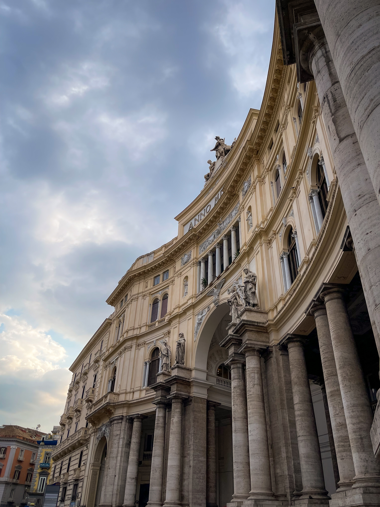
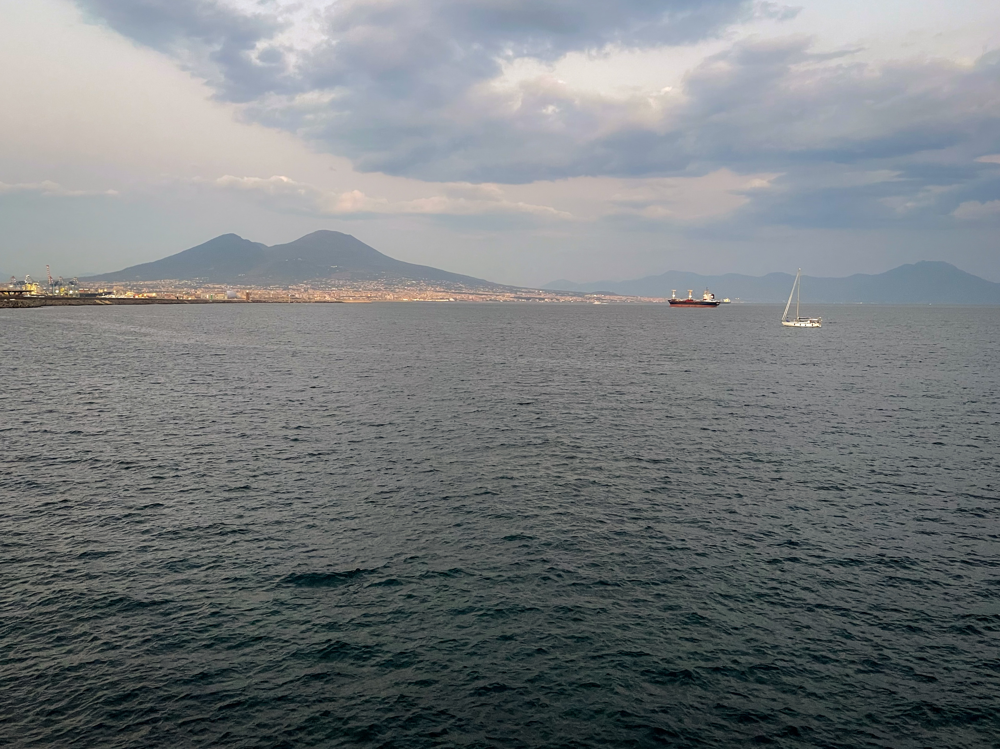

<em style={{textAlign: "center", display: 'block'}}>View of Naples and Vesuvius
from the Sant'Elmo Castle.</em>

 

_There's something about this town and football._

If you've read my
[travelling plans for 2023](https://silviuaavram.com/my-2022-in-review#wrap-up--plans-for-2023),
I mentioned only a couple of places that have been on the top of my list. As
2023 went by and I travelled quite a lot until now, I added Sicily to the top of
my list, so I started to look for tickets during the summer. Since both the
tickets and the accomodation were great value for money, I decided to go ahead
and seal the deal for the trip to Naples. Just as I was getting ready to pay, I
realised that I wasn't actually going to Sicily at all. In my mind, Naples and
Palermo sounded to be the same thing, and that sparked a great deal of
confusion. After I paused for a few minutes, I realised "what the hell", and
bought the trip anyway. Yolo.

## Naples

I was expecting the city to be a little different from the other cities I've
been so far in Italy, and I was not disappointed. Naples is not boasting the
same architectural wonders as Rome, and it certainly does not have the ritzy
attitude of Milan. It's not very clean, either, and the traffic can become quite
a nightmare, if you're not used to that. All things considered, I believe Napes
is a city that should be on everyone's bucket list, with a small tip, which I
will share towards the end.

I don't know about others, but when I choose to travel to Italy, it's not only
for the sights or the history, even though there's a lot of that to choose from.
I also go for the food, for the coffee and, overall, for the laid back
lifestyle. A lifestyle filled with espresso shots, drank alongside a croissant
con crema (if there's pistacchio, even better) in a busy coffee shop where
everyone just orders pretty much the same thing, s a quick chat, and leaves
after 5-10 minutes to handle their business. It's also about great local food,
served alongisde glasses of Aperol Spritz and with a Tiramisu to top it off. As
we left our hotel room in Naples, somewhere close the central train station, the
first thing I did was to check out the nearby coffee shop, which was marked on
the map ahead of our arrival. Caffeteria I Servino has great Italian coffee and
one of the best croissants I ever had, which provided a great start to the trip.
After this quick stop, we made our way towards the city center.

Staying near the central train station is very convenient if you consider taking
the train to nearby destinations. For the Naples area, there are sp many places
to choose from, like the Amalfi Coast, Capri and Pompeii. However, the
neighbourhood itself is not really quite the most exquisite. It's nothing to be
afraid when going out, anyway. On the other hand, the area between the central
train station and the city center is maybe worse. There's garbage everywhere,
many people on the street, and I've seen some buildings that could easily belong
in the Ferentari. Not a great sight, to be super honest. We eventually found Via
dei Tribunali, where things became a bit better.

|                   Museo Del Corallo Ascione                   |                      Via dei Tribunali                      |
| :-----------------------------------------------------------: | :---------------------------------------------------------: |
|  |  |

This very long street sums up a lot about the city. It's quite narrow, so they
made it a one-way street, although it could be easily be designated for
pedestrians only. It's filled with bars, shops, and an array of flags, coats and
signs of the local football team, Napoli FC. There's something about this town
and football. Actually, Via dei Tribunali isn't the only street where you can
see references of the team. There's football everywhere, it's just that Via dei
Tribunali has way more. Naples is literally a Papal State, where the pope is
Maradona and the council of cardinals are Osimeh and the Napoli players. The
previous season they just won the championship, and they are really proud about
that.

We followed Via dei Tribunali all the way to Via Enrico Pessina, and then went
south towards the coast, through Toledo. The Spanish Quarter is definitely
something different than the neighbourhoods we walked through so far, even
though it was way too crowded. The main street, Via Toledo, is what you would
normally expect from an Italian street with stores, and we stopped in a few
places to check normal Italian things, like sunglasses. What we definitely
missed along the way were the Murales Maradona, which would have been the icing
on the football cake we had up until that point. Completely forgot about the
place, but you always a need a reason to go back, right?

Eventually, we reached the Umberto I Gallery, which resembles the Vittorio
Emmanuele Gallery in Milano, miinus the high end stores. After a brief photo
session, we exited the gallery and went towards the San Carlo Theatre and
finally arrived in Piazza del Plebiscito, with the Royal Palace right next to
it. The square has quite a pretty view of the Basilica Reale Pontificia San
Francesco da Paola _\*inhales_, even though when we arrived there was a concert
setup in place and it marred the sight a little bit. It was quite late when we
got there and the palace was about to be closed, so we had to satisfy for the
palace gardens. This park with a free entry is a welcoming green oasis in a part
of the city that is pretty crammed with buildings, streets and concrete in
general.

|                   Naples Waterfront View over Vesuvius                    |
| :-----------------------------------------------------------------------: |
|  |

As we left the park, we arrived in the San Ferdinando neighborhood, which is
significantly different from the neighbourhoods we've seen so far. It's near the
shore, its buildings are all beautifully restored and the streets offer great
places to enjoy dinner or a few drinks at sunset. However, probably an even
better idea is to just grab a few drinks from a supermarket and go straight to
the shore. When we arrived there, the sun was close to setting and the light was
absolutely gorgeous. We took a seat on one of the stones that were above the
water and enjoyed the picturesque view of the Vesuvius volcano. Happy and quite
tired, we walked back home by the waterfront and prepared for next day's trip.

## Sorrento

In order to reach te Amalfi Coast, things are not so straightforward, as you
might expect from such a notorious place. There is the option of renting a car,
although the road along the coast is said to not be quite narrow and full of
twists and turns. Consequently, the remaining option is to take the train to
Sorrento and, from there, take one of the boats to Capri, Positano or Amalfi.
Apparently, there is also a bus that goes along the Amalfi Coast, but we lost
quite some time trying to find it. In the end, we decided to take the boat to
Positano. Since the train to Sorrento took an hour, and we lost at least another
hour searching for the bus, it became quite late to reach Positano that day and
come back to Sorrento, as each boat trip takes 45 minutes. As a result, we
decided to stay in Sorrento for the day and visit Positano the next day. And it
turned out to be a great call.

This small town on the coast, in addition to being a transportation hub for the
region, is probably one of the most beautiful towns I visited so far, on par
with Portofino and the Cinque Terre. Sorrento sits quite high on the coast but
it also features a few beaches on its shore, so it can definitely be a spot to
relax by the sea. Its streets are a joy to walk through if you like to lazily
stroll around and enjoy coffee and ice cream along the way. You should also
definitely try the Limoncello, since the region claims to being the birthplace
for the drink.

|                 Sorrento Vesuvius View                  |               Sorrento Hills               |
| :-----------------------------------------------------: | :----------------------------------------: |
|  |  |

We had a great lunch at the Fuoro51, went for an aimless walk through the
streets, then headed towards the beach and enjoyed the views towards the town
from down below. As we arrived on the beach, we bought drinks from a local
grocery store, opened them on a bench and enjoyed the sea view with the boats.
That evening, we happened across what seemed to be a formal event that took
place right on a pier, in a place called Bagni Sant'Anna. The whole setup made
the evening perfect, and we enjoyed it right until it was time to leave and
catch the last train to Naples.

Sorrento is impressive, and since the town looked so good, you could imagine our
expectations for Amalfi and Positano. But, make no mistake, Sorrento is a gem,
and you should not miss it. Actually, given the views, the places and the
transportation options, I believe that Sorrento is actually the better place to
book accomodation when going to Naples and the Amalfi coast. It's conveniently
situated in case you want to go anywhere, as you can take the train to Naples
and Pompei, or the boat to Capri, Positano and Amalfi. It's also a great spot to
just relax on the beach, enjoy the views and have a nice dinner on the
waterfront. Our friends chose to stay in Sorrento instead of Naples, and it was
a much better decision. On our next trip in the area, lesson learned, we will
definitely do the same.

## Positano

Finally, the cherry on top, Positano. We were quite enthusiastic about the town,
and our hopes were quite high, given that we enjoyed Sorrento very much. Even
with these expectations, Positano did not disappoint. It's simply stunning. It's
also quite crowded, at least around the harbour area, so the first objective was
to escape and head up towards the hills, in order to find great viewpoints
towards the sea. We found quite a few, really fast, and took great photos of
both the city, the sea, the hills and boats. Everything matched perfectly and it
was hard to take bad shots, honestly. We still went uphill, for even better
views, but the shots were not as good, so if you're aiming for the perfect view,
higher is not necessarily better here.

|             Positano Hills              |                        Positano View from Above                         |
| :-------------------------------------: | :---------------------------------------------------------------------: |
|  |  |

The second objective was to have lunch, so we went to the Casa e Bottega
restaurant, which featured a meanu that was quite brunchy for the location, but
nevertheless it has probably the best Tiramisu in the world, so definitely worth
going there. Re-energised, we resumed our uphill journey and headed towards the
final objective, Le Tese di Positano, a hiking trail that starts in the
Northwest part of town. We did not go very far on the trail, unfortunately, as
we had to return back to the coast and catch the boat back to Sorrento, but I
think it would have been a vey nice hike. We also did not have any water, which
was quite a huge mistake, given that it was also quite hot during the day.
Overall, not much more to say about the town, but it's definitely a great spot
to relax for a few days, just like Sorrento, so maybe an option for the future.
We took the boat back to Sorrento, the train back to Naples, and, needless to
say, we were exhausted.

## Back in Naples and Final Thoughts

During our final days in Naples, we took it easy given our accumulated fatigue,
so we went for some easy strolls throughout the city. We went to the Botanical
Garden and then to the Royal Palace, since we missed it during the first day.
Both attractions are pretty good, especially the palace, which has an impressive
collection of art. For dinner, we went to Pizzeria Pavia, which is quite popular
in Naples, although the place does not look flashy in any way. As we waited for
our flight, we went to Caffè Sansone for some speciality coffee, and since we
thought that we still had time until taking off, we visited the Sant'Elmo
Castle, which was pretty close to the coffee shop. The castle has really great
views over Naples and Vesuvius, and it's not very crowded. It does not boast any
art collection or something of the sort, but the views are really worth it.

Overall, it was quite a long trip, and we visited quite a few places. We would
still do it again, but next time we will heed our own advice and stay in
Sorrento, since it's definitely the better option. There's still Capri on the
list, along with Amalfi and Pompei, so there is still lots to do in the area.
The flight from Bucharest is short, cheap and direct, so there's absolutely no
reason not to return. So, until next time, happy travels!
