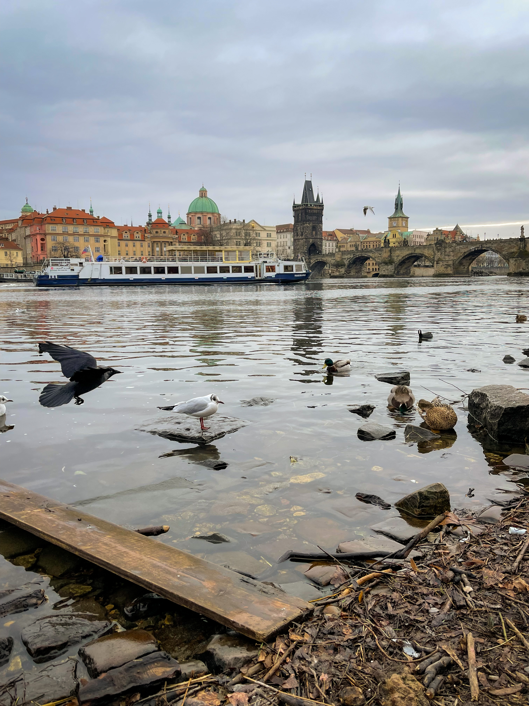
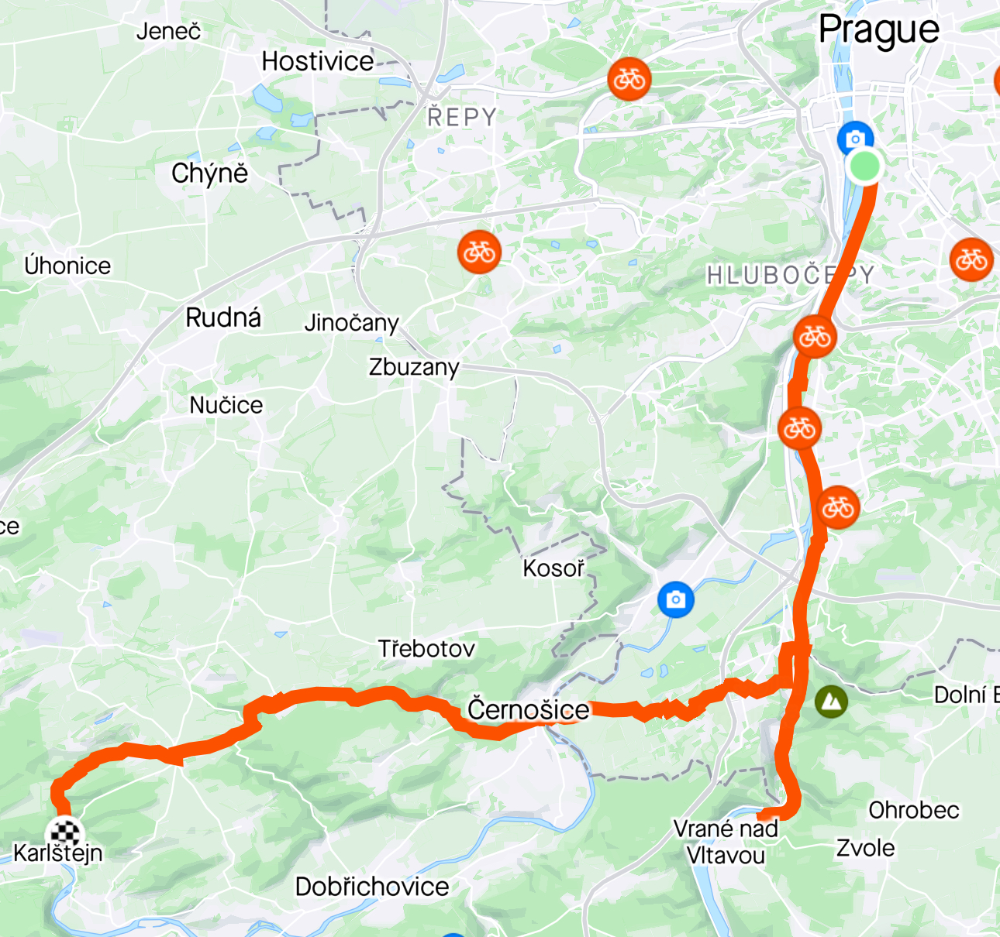

 <em
style={{textAlign: "center", display: 'block'}}>View of the old town from the
Prague Castle.</em>

 

_So, picture this. Silviu, one protein bar, some water, 25% phone battery, no
waterproof jacket, pink bike with a basket, soaking wet, in a God forsaken town
called Roblín, where the only bus station was served at some point during that
day, towards some destinations I had no interest in._

Prague is special to me. It's the city I lived in for almost 3 years, and in
many ways, it has shaped me into the person I am today. It's a great city to
live in as an expat, with a mix of eastern, western and central Europe, pretty
much a melting pot of cultures. Some people choose Prague to be their home,
others will move to a different city after a few years, and there are also some
who choose to return to their home country. I met all of them, and I am not
aware of anyone regretting their experience of relocating to the Czech Republic.

I am not going to focus on what Prague means to me as an experience, although
there is a lot to say here. Instead, I am happy that I've visited the city 3
times this year, mostly because most of my team at work is based in Prague, and
there have been quite a few occasions to visit. My first visit was in January,
which is probably the least recommended time of year to schedule a visit. The
subsequent trips were in June, which is way better weather wise, and the last
one was in October, which turned out to be better than expected. All in all, I
would probably recommend visiting Prague during the summer, as it's not very hot
during that time, and you would get the most out of your trip. You don't want to
be in Prague when it's cold, or when it rains, or both. Trust me on that one.

## Prague City Center

It's no surprise that the City Center is the main stop when going to Prague.
Even when I was living in Prague, most of my walks were done in this area. The
reason? It's gorgeaus. Almost all the buildings in Stare Mesto, but also around
it, are old buildings that have been beautifully restored, and the result is
incredible. Everything you see just looks as if it belonged there for a very
long time, with a successful blend of many architectural styles, such as Gothic,
Baroque, Art Nouveau and even Moorish Revivial. It's not just the monuments
themselves, but everything really, including the streets and sidewalks, where
they stubbornly insist in using cobblestone.

I try to avoid staying in the city center, given the constant noise, so most of
the time I book accomodations next to the center, either around the I.P. Pavlova
metro station, which is a great connection hub for public transport, or
somewhere in Vinohrady, which is a pretty popular neighbourhood right next to
the center, usually preferred by expats with better financial means.
Consequently, my first stop on my way to the city center would usually be
Václavské náměstí, with the Národní Muzeum at its start. It's a great museum to
visit, with an impressive minerals collection, a prehistory collection with
mammoths and all the usual art museum stuff. They shot the first Mission
Impossible movie inside the building, then closed it for what it turned out to
be a long time of restoration. It was still closed when I lived in Prague, so I
only got to see it last year for the first time.

|             Narodni Muzeum              |                    View of the Narodni Divadlo from the Vltava                     |
| :-------------------------------------: | :--------------------------------------------------------------------------------: |
|  |  |

After crossing the square, I usually take a right on the Jindřišská street,
until the Náměstí Republiky square, and admire some impressive buildings, such
as the Prašná brána, the Obecní Dům and the façade of the Palladium mall. Quite
close to the square are some of my favorite places in Prague, such as the EMA
Espresso Bar or the Vinograf Senovážné. If you go to EMA, make sure to also take
a _buchta_ along with your coffee.

Going towards the mall and then making a right on the Dlouha street, we are
suddenly in the party part of town. Prague is a pretty famous party destination,
especially for stag or hen parties, and most of them are happening in Dlouha, in
places such as James Dean, Moonclub and others. After crossing Dlouha, you end
up in the Staroměstské náměstí, probably Prague's point zero, with the famous
Prague Astronomical Clock and the Municipal Library. It's also very close to the
other point zero, which is Karlův most (Charles Bridge). There are so many other
places to check out in this area, such as the Rudolfinum concert hall or the
Klementinum library. The tour continues on the Charles Bridge, obviously, or if
you already been there, I recommend also the Mánesův most, which is the next
bridge across the Vltava and offers great views over the Charles Bridge.

Once we cross the river, there's again a lot to do and a lot to see. Welcome to
the romantic part of town! If you're in luck, there's going to be swans in Park
Cihelná, and that's probably on of my favorite places in the city. Once we're
done admiring, the next most important things to see are the Waldstein Palace,
which is actually the Czech Republic Senate building, and if you're not visiting
during the winter, you will find the gardens open to the public. Don't miss the
gardens as they are quite pretty, with Baroque statues, pools full of giant fish
and pleasantly groomed shrubbery and flowers.

With this final checkpoint acquired, it's time to make the climb to the Prague
Castle. Inside the castle there's nothing spectacular to see, so you could
totally miss visiting it, but there are some garden views that make the tour
worth it, and there's also the St. Vitus Cathedral, which is the actual
attraction to see. After exiting the castle, I always like to take a few moments
and enjoy the Hradčanské náměstí, as it's probably one of the most impressive
places in the city, featuring the Šternberský Palace and many other beatiful
palaces and churches all around the place. Also here it's my favorite view point
in Prague, right next to the Starbucks, where you could enjoy a coffee in the
garden if you happen to find an empty table, as the view is totally worth it.

|                    Old Town View from the Petrin Tower                     |    View of the Charles Bridge from below, in Park Cihelná    |
| :------------------------------------------------------------------------: | :----------------------------------------------------------: |
|  |  |

Going further on the Loretánská, we eventually reach the Strahov Monastery and
the Brewery, and both of them deserve a visit, for different reasons. The
monastery features an impressive library, but unfortunately you are not allowed
inside, and can only just look at it from the door. Quite unfortunate. And you
are probably aware that Czech beer is pretty good. There are many beer varieties
in the Strahov Brewery, and all of them are worth trying. Maybe not in the same
sitting, or hey, why not, be a hero. Supposing that you don't plan to be a hero,
once we exit Strahov, the next point of interest is the Petrin Tower, which
offers great city views, since it sits quite high and the tower itself is quite
tall. And no, it's not shaking because of the wind. It's the beer.

Once we take all 100 Prague view photos, it's time to descent through the Petřín
Gardens. There's also a tram that takes you down back to the city, but I would
not use that, and instead just walk and enjoy one of the best parks in Prague.
There's also the Kinsky Garden nearby, which is the park that was closest to my
place when I lived in Prague and one of my favorite running tracks. Most likely,
after the descent, we will end up in Ujezd, and here you must try the artic
bakehouse, with the best pastry stuff in town. Don't miss my favorite, the
Cherry Bomb. Also nearby there's Cantina, another favorite place, with the best
Fajitas that I never manage to finish, and believe me, I tried. They also serve
another personal favorite, the Strawberry Frozen Margarita. Try to book before
going and have cash at hand. We can now cross the Vltava again via the Most
Legií, and here we have the Střelecký and the Slovansý ostrovs. If you are
lucky, apart from swans, you will meet a few cuddly river rats on the river
banks. Once we cross the bridge fully, we arrive at the Národní divadlo, and
from here, we could pretty much go anywhere. We just finished the essential
Prague City Center Tour, congratulations! As reward, go for coffee and waflles
at the SmetanaQ Café.

## Around the City Center

Prague has a lot to offer outside the city center as well. It would be a shame
to keep your walks focused around the Charles Bridge. One of my favorite
pastimes was to grab a drink and sit on the bank of the Vltava River, called the
Naplavka. It's a great meeting spot for people especially in the summer, and all
the ships that are docked are going to be open either as terraces or as bars.
Sitting on the river bank is also nice, since the area is very lively. As we're
in the area anyway, make sure to take a picture with the Dancing House, one of
Prague's landmarks. After a small walk upstream on the Vltava, we will find
another Prague landmark, Vyśehrad, a fortified castle overlooking the river,
which offers great views towards the old city center, but also to the communist
parts of Prague, to the south and southeast. If you like beach volleyball and
happen to be in Prague for the summer, you're in luck, since the sport is
actually quite popular in Prague, and you can play it right next to the river,
in Žluté lázně. Oh, there's also a pretty large swimming pool right next to the
complex, the Podolí swimming pool.

|                   Charles University Botanical Garden                   |                 Vyšehrad                  |
| :---------------------------------------------------------------------: | :---------------------------------------: |
|  |  |

I did mention Vinohrady as the perfect place to book a hotel or an apartment,
and it's true for many reasons. First of all, it's quiet. Second of all, it's
right near the city center. Last, but not least, it's quite chic and very
upmarket. This is one of the expensive neighbourhoods to rent, and your
neighbours are probably going to be expats working in tech. It's also very well
connected by tram and metro, so it's easy to reach I.P. Pavlova then you could
go pretty much wherever you want. It's not just about having a place to stay and
leave immediately, as the area is quite nice to explore for a few couple of
days. You get one of the best parks in Prague, Riegrovy Sady and Havlíčkovy
sady. Actually, to be perfectly honest, all parks in Prague are beautiful, and
the city shines in the green area per capita statistics.

Apart from the parks, there are the coffee shops and restaurants. All the good
places are here, whether you are craving for coffee, brunch, lunch or dinner.
Some of my favorites are Happy Bean, Coffee Corner Bakery, Chilli & Lime and Per
Te, for great Italian dishes. To the north of Vinohrady there are also the
Žiżkov and Karlín neighbourhoods which are both worth exploring. The theme of
great places to hang out continues here as well, although the neighbourhoods
look a bit different from Vinohrady. Žiżkov has a more of a working class vibe,
but it has more pubs per square kilometer than any other place in the world.
Make sure to check out Tiky Taky Bar. Karlin, on the other hand, is a mix of old
and new, since much of it is being redeveloped after it suffered from heavy
flooding a few years back. Across the river from Karlinn is Holešovice, another
neighbourhood that has a lot to offer, like the Stromovka park, the Planetarium
or the DOX Centre for Contemporary Art. If you are in the area, make sure to go
to Letna for another gorgeaus view of Prague, from the Prague Metronome. This
one's another very good meeting place in the summer, with a lot of people
gathering for a drink and music, sometimes with DJs performing.

## Even Further from the Center

The further you go from the city center, the more you realise that the city has
gone through many years of communist rule. However, due to the rising cost of
living, many people choose to live here or even further, on the outskirts of the
city. It's not just communism towards the outskirts, however, and there are many
places which are worth visiting. One of my favorite places is Troja, an upscale
neighbourhood, where apartment buildings give way to premium houses and
vineyards. Two of best places to visit are here, and I highly recomment both of
them: The Botanical Garden and the Prague Zoo. Both of them are placed on large
swathes of land and you will most probably spend the whole day in both, so be
prepared for that. They are organised like parks, and it's a pleasure to walk
and admire so many varieties of plants and animals that are very well taken care
of.

|                    Prague Zoo                    |                          Vltava near Zbraslav                           |
| :----------------------------------------------: | :---------------------------------------------------------------------: |
|  |  |

Now, of course it's not just Prague. The Czech Republic has so much more to
offer. It's a very nice country with an abundance of scenery and beautiful
places, and the people take very good care of it, so it's well preserved. The
most popular day trips from Prague include Kutna Hora, Brno, Karlovy Vary, Česky
Krumlov and, the one I will ellaborate on, Karlstejn. This town is pretty close
to Prague, at about 30km, and it's easily reachable by car, by train or, the
best one in my opinion, by bike. I did the trip twice using the Rekola bikes,
which you could rent in Prague like you would rent scooter. Once you reach the
town and enjoy the scenery, you could come back by train, if you are pretty
tired from the trip.

Once upon a time it was a not so beautiful morning of Monday, on the 5th of
June, I had a gread idea of a bike trip to Karlstejn. I rented a Rekola for a
full day quite close to the Karlovo Namesti. Armed with my phone, a couple of
protein bars, some water and high hopes, I started my journey on the Vltava
River upwards towards Zbraslav. I was too lazy to set up the proper bike map
beforehand, and would was very soon to realise my mistake, since I was supposed
to cross the river near Zbraslav, but I ended up in Vrané nad Vltavou, paused
for a few minutes, and performed a Gandalf "no memories of this place". No
biggie. I turned around, crossed the river at Zbraslav, but it seemed that it
was a totally different road from the one I picked a few years back. The Gandalf
feeling was still strong. Anyway, time was ticking, so I went on through some
not so beaten tracks of countryside, like I was chasing a band of orcs on my
pink bike.

I enjoyed a coffee, a cake and a proper Czech hospitality in the town of
Černošice, and continued on the road to Karlštein. This road was properly called
Karlšteinsk, but, as I found out in the meantime, it was a road actually meant
more for agricultural purposes, rather than recreational ones, and I suddenly
found myself in the middle of rural Czech country, still with a lot of road to
cover. To add the cherry bomb on top, it just started to rain, and I was in the
middle of the road with no waterproof anything. Not good.

So, picture this. Silviu, one protein bar, some water, 25% phone battery, no
waterproof jacket, pink bike with a basket, soaking wet, in a God forsaken town
called Roblín, where the only bus station was served at some point during that
day, towards some destinations I had no interest in. And I had two options, to
either continue on the normal road, or take a shortcut through the woods, on
some sort of a hinking trail, that would shorten the way by quite a bit. It was
still raining quite a lot, and, looking at the weather app, it was not going to
stop until the next day. Maybe I should have checked the app in the morning,
that might have helped.

|                   Prague to Karlštejn bike trip which you should not take                   |
| :-----------------------------------------------------------------------------------------: |
|  |

But mom didn't raise no quitter, so I took the short route, through the woods.
Everything was wet, I was on a pink bike, with a basket, on a slippery dirt
road, riding downhill. Was it dangerous? It was outright stupid. I soldiered on
through the woods, it was quite dark all around, the rain was not stopping, and
I somehow reached Mořina, from where there was a straight road to Karlštein,
surrounded by woods, a very nice road to ride on, if it wasn't for the rain. I
was not feeling the rain anymore, actually, as I was wet all the way to my skin,
and I really did not care for anything, except to reach the town and hope that
one tavern would receive out of sheer mercy. I arrived in Karlštejn, after the
most terribly planned trip in my life, in the most terrible state, and some nice
people offered me a table at Karlštejn 34, where I enjoyed some hot soup, the
best pizza in my life, and a cup of coffee that managed to ressurect my soul.

There would not be any sightseeing that day, since it was still raining quite
heavily. I actually intended to visit the Castle and the Velká America pit, but
that had to be saved for another day. I went to the train station, bought a
ticket for me and my pink bike, with a basket, and went back to Prague.

Now, should you go to Karlštejn from Prague by bike? Absolutely. Should you be
utterly careless about the trip like I was? Absolutely not. Set up the proper
route beforehand, check the weather, and have a rainproof coat. You're in the
Czech Republic, it's famous for it's rainy weather. I should have known better,
but I survived, and what does not kill you makes you wiser. Or not.

## Wrapping Up

I will always be grateful to Prague and everything about it, and I will always
return there with the warmest of thoughts. And if you hadn't been there yet, it
should definitely be on the top of your list. It has so much to offer for
everyone, and it's a great place to live abroad, if you're considering such an
experience. It was life changing for me. It helps a lot that most of my team at
work is based in Prague, so there will be plenty of opportunities to return in
the future, but, honestly, I don't really need an excuse to go. And you
shouldn't need one either. Happy travels!
