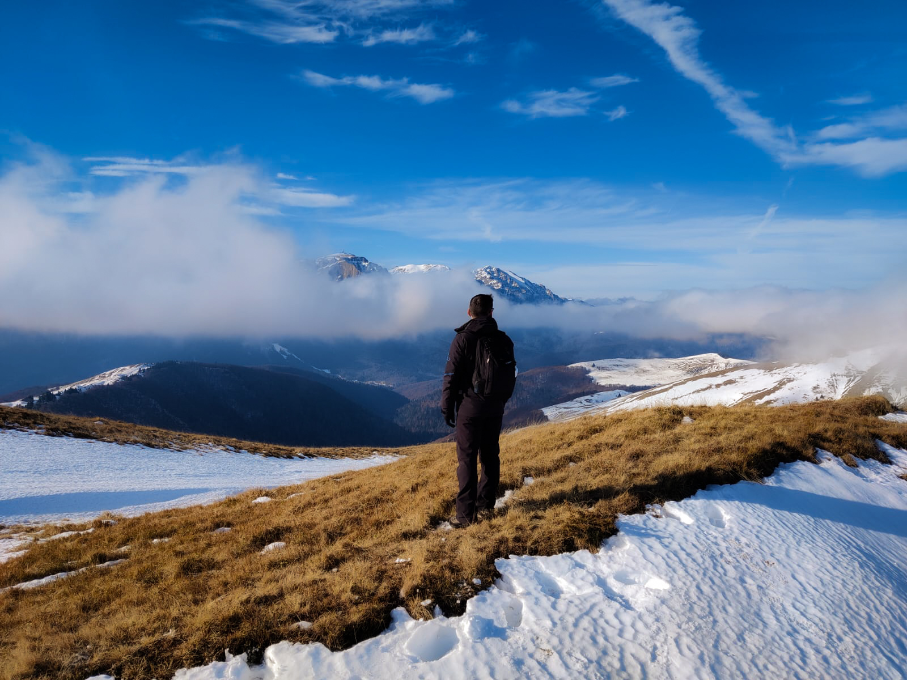
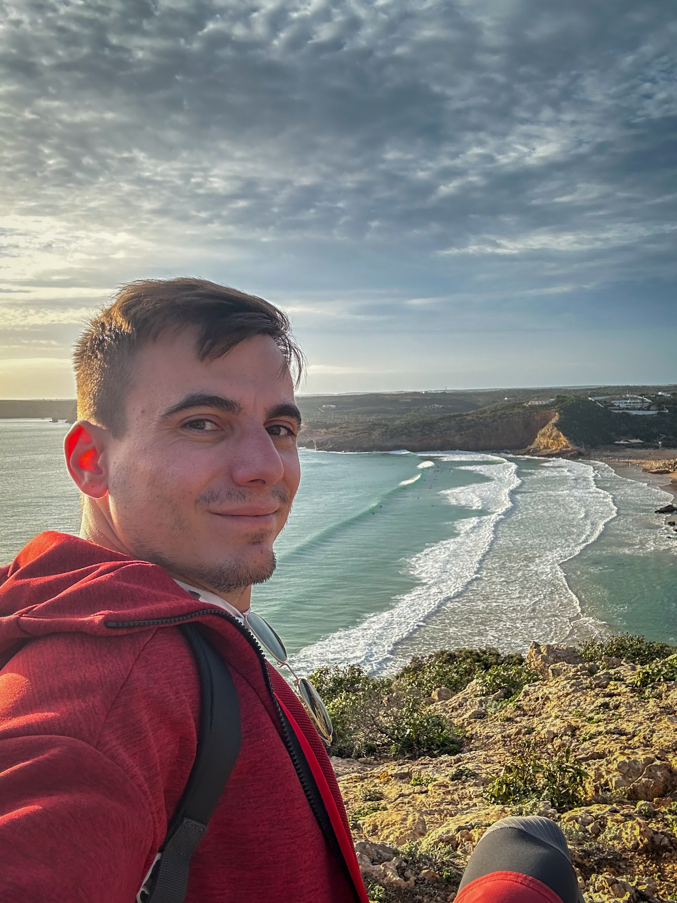

 <em
style={{textAlign: "center", display: 'block'}}>View over the Baiului
Mountains.</em>

_I've learned to do the Corpse Reviver #2 and the Paloma._

I plan to write each of my year in review articles at the end of December. This
one lands at the end of February, so things are not really going as planned so
far. To be honest, during the whole year I felt that I've pushed many deadlines,
and at times it felt quite overwhelming, but, looking back, my 2023 was not as
bad as I thought it would be. Motivation was low throughout the year, sure, but
consistency did help quite a lot, and I'm thankful for the habits that helped me
decisively.

## Goals for 2023

In my [2022 year in review](https://silviuaavram.com/my-2022-in-review), I set a
list of goals for myself, and I am curious how many did I manage to accomplish.
Let's start this article with a disappointment, shall we?

- update Downshift to v8
  > Actually, we're at v8.3.1 and, even though we still have some important
  > things to fix, we are React 18 compatible, we support fully the ARIA 1.2
  > pattern, we have TS type support for the getter props (a long time coming)
  > and overall API improvements. Actually, I'm not very mad with the current of
  > the library.
- finish Marcy's course and 2 more Frontend Masters web development courses.
  > The biggest fail for 2023 was in fact the learning aspect. I did not finish
  > Marcy's course, I still have a lot to go, and, obviously, the Frontend
  > Masters courses were out of reach.
- read at least 10 books, starting with Don Quixote.
  > I fell short of the number 10, but not by far, and the books I've read were
  > actually quite impressive. More on that later.
- improve to 3 times per week gym schedule.
  > Done. Big win. Not that big gains, but still fine.
- attend at least one dancing congress.
  > I am going to my first salsa congress in Brasov at the end of January, so
  > let's consider it done.
- visit the south of Spain and New York.
  > 2023 main achievement was travelling, and yes, I did check Spain and New
  > York, among many others. More on that, later.
- revive the Tab Order Testing library I worked at in Adobe.
  > I reviewed the current state of the art in Microsoft and decided that the
  > library is not going to be useful anymore.

Overall, not half bad. Yes, motivation was not my gratest 2023 asset, but it
wasn't motivation that helped me achieve my initial 2023 plans, or the things I
achieved on top of them. It was consistency, it was habit. Motivation comes and
goes. Habit is there once it's built. I heard about it in most motivational
content, and 2023 helped me actually understand why it is so valuable.

## Coding Stuff

I've enjoyed quite a successful year at Microsoft, and so far I'm quite happy
with the projects I'm contributing to. Microsoft Teams is a very used product,
and even though it does have its reputation, it's packed with features and it
became better through the years, and I'm happy to contribute to that effort. My
favorite part was the March hackathon when I successfully presented my project
to the leadership, which got very favorable reviews and we might even see it one
day fully implemented in Teams. Super excited about that.

Apart from my normal job, I also continued to code for open source, and updated
Downshift to include React 18 and ARIA 1.2 pattern support, among many other
fixes. What I'm also proud about is that I continued to write on this blog, and
not just tech related articles, but also from my trips, and everything is coming
along nicely. Oh, and I also achieved something quite big in the work
department, but, at least for now, it's classified.

## Hobbies

Quite a few updates here as well. I've started to go 3 times a week to the gym,
and it feels so good. I've also resumed basketball once per week and also
running, even though it became mostly a once per week event as well. Overall,
I'm quite satisfied with my current active shape, and I look forward too keeping
it. I only wish that I've been more times on hiking trails, as 2023 was not my
best, so I hope to improve the hiking frequency in 2024.

A big change for me was giving up bachata classes, but, on the flip side, I
continued my salsa classes, and I'm having a blast. I'm super happy at my
current dance school and I feel that I'm improving. To top it off, I went to my
first salsa congress in Brasov in January 2024 and, even though I dislike
staying awake at night, doing only that while not doing anything else during the
day is, let's say, manageable. The congress itself was super fun, I feel like
going again next year.

|                        Algarve Beach Hiking                         |                      Guns 'N Roses Concert                       |
| :-----------------------------------------------------------------: | :--------------------------------------------------------------: |
|  |  |

Another event worth mentioning for me was the Guns 'N Roses concert from July at
the Arena Nationala. I was lucky to receive tickets for the concert and wow,
what a show. It was an incredible experience, and a top notch performance from
the band. I won't forget it anythime soon. Even though the sound from their
microphones was annoyingly cut out many times, the event was unlike anything
else.

Oh, and did I mention that my banana bread is probably the best in the world? I
perfected my technique quite a bit. Also, I added the lemon and like cakes to my
portfolio, so the coffee shop does not sound like a bad idea at all. Oh, and
cocktails! I've learned to do the Corpse Reviver #2 and the Paloma.

## Books

I aimed to read at least 10 books during 2023, and I fell short of that number,
but not by far. Here's my list:

1. Don Quixote, _Miguel de Cervantes_. I had so much fun reading this, even
   though it was quite a long book. It wasn't only fun, but a great insight into
   human nature, idealism, and reality versus imagination. The other stories
   inside the book are fun as well, especially the one with the husband that
   used his friend to check on his wife's loyalty.
2. The Little Prince, _Antoine Saint-Exupery_. This tiny book is a great opener
   into subjects such as human relationships, love and innocence.
3. Augustus, _Adrian Goldsworthy_. I'm a sucker for ancient history and I've
   previously read _Caesar_ from the same author. _Augustus_ did not disappoint,
   as it tells the story of Octavian, with his early blunders and not so many
   achievements, as he took advantage of his situation in the context of the
   late Roman Republic and became the de facto ruler of the Roman world.
4. Lord of the Flies, _William Golding_. As with _1984_, it reminds us of what
   human nature really is when left unchecked.
5. Myth of Sysyphus, _Albert Camus_. I'll be honest, I got nothing here.
6. Invisible Man, _Ralph Ellison_. I've enjoyed this one quite a lot, as the
   narrator grappled with racism, injustice and political manipulation as he
   endlessly searches for his personal identity.
7. The Richest Man in Babylon, _George S. Clason_. It was a very useful read to
   refresh my own ideas related to wealth and budgeting.
8. Jane Eyre, _Charlotte Brontë_. A very refreshing book, as it goes beyond the
   love story into feminism, the search for identity and social justice.

So, not really 10 books, but not very far off. My favorite was probably _Jane
Eyre_, given the main character's complex journey and the very deep insight of
her thoughts. The _Invisible Man_ was not very far off.

## Travelling

If there was a personal highlight of 2023, travelling would have been that one.
I love travelling, but 2023 was on a whole different level for me, and, to be
honest, it felt really good. I enjoy spending both a few days in a different
place, as well as a full 2 week vacation far from home. It helps me clear my
thoughts, re-energise and even become more creative within my daily work. I only
wish 2024 to be quite similar in this regard. Here it goes, the list of all the
places I've been to:

- Prague, January. It "happened" for me to be in Prague for Microsoft's Winter
  Party. What a coincidence.
- [Perugia, March](https://silviuaavram.com/perugia-2023). One of those random
  destinations you pick because plane tickets are cheap, and it proved to be a
  very good idea. The biking along the Lago Trasimeno was the highlight, for
  sure.
- [New York](https://silviuaavram.com/new-york-2023) &
  [Seattle](https://silviuaavram.com/seattle-2023), April. Best vacation for a
  while, maybe the best ever. I now have a new favorite city and can't wait to
  go back there. Seattle is also great, given its laid back atmosphere, greenery
  and nearby hiking spots.
- [Oslo](https://silviuaavram.com/oslo-2023), April. Another random destination,
  can't wait to go back to Norway for a more hiking & nature oriented
  experience. Oslo was quite nice as well, and it has great museums too.
- Prague, June. Business trip with a little bit of fun. The biking trip to
  Karlstejn was, well, quite something.
- [Malta](https://silviuaavram.com/malta-2023), August. It was so hot, but
  everything else was great. Can't wait to go back to the island, it's full of
  fun stuff to do. Need to book that Katamaran experience in advance, though.
- [Naples & the Amalfi Coast](https://silviuaavram.com/naples-2023), September.
  Naples is a great city to visit, as it has a quite strong personality. Also,
  the beauty of the Amalfi Coast is unrivaled. Can't wait to go back there
  again, as Capri and Amalfi are next on the list.
- [Prague](https://silviuaavram.com/prague-2023), October. Yeah, it's my
  favorite place to visit. This time there was no hardcode bike trip, just
  coffee, food and walks. And I finally went to visit the Prague Castle.
- [Lisbon & Algarve](https://silviuaavram.com/portugal-2023), November. The
  other long 2 week trip, and what a trip it was. Everything was perfect, I
  hiked on the sea shore, I climbed on top of castles, I rested on the beach
  surrounded by dramatic cliffs. I also missed Web Summit this year, but really,
  whatever. I made the most out of it. Oh, and that entrecote, oh my.
- [Catania](https://silviuaavram.com/catania-2023), November. Maybe my hopes for
  this one were quite high, and it was maybe a bit disappointing, but I would
  still return to Sicily, maybe in the spring is better.
- [Malaga](https://silviuaavram.com/malaga-2023), December. I'm going to return
  to the south of Spain, for sure. This place is marvellous, the weather is
  incredible, the people are smiling, and I loved it.

|                           Central Park Selfie                            |
| :----------------------------------------------------------------------: |
|  |

11 trips in total. Not bad. I want more. More is better.

## Goals for 2024

Let's see.

- Finish the A11y course and do 2 more courses on Frontend Masters. Same as last
  year, but I'll actually do it.
- Read at least 10 books. Again, same as last year.
- Go on a trip to Asia. Anything really, Japan, China, Thailand. All three. I
  don't care, but I want to go there.
- Bump Downshift to v9. We do have in plan some API changes, apart from the
  fixes we want to implement.
- Cook 3 new recipes.
- Hike at least 6 times. Once every couple of months. Should not be too
  difficult.
- Make a big move. It has been quite some time since I did not do anything
  radical, ever since I came back from Prague in 2020. I feel that it's time I
  changed something dramatically about myself.
- Start doing yoga.
