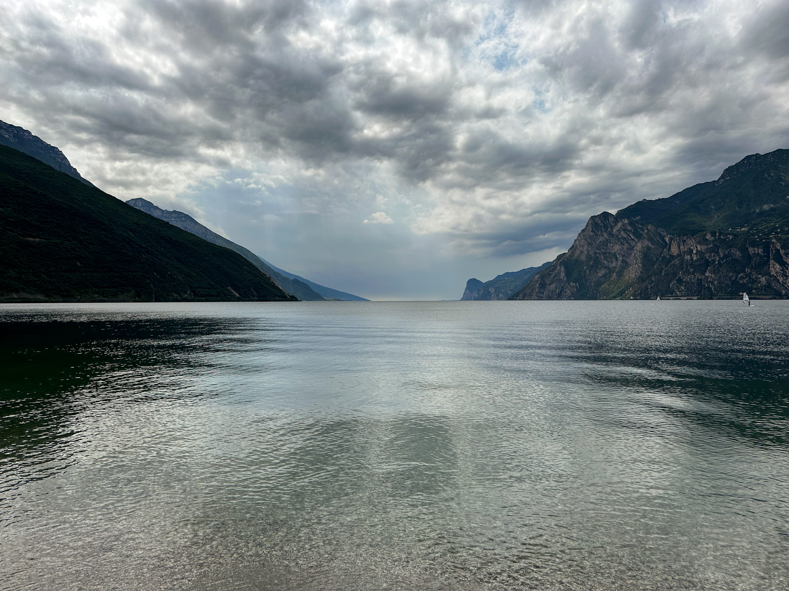
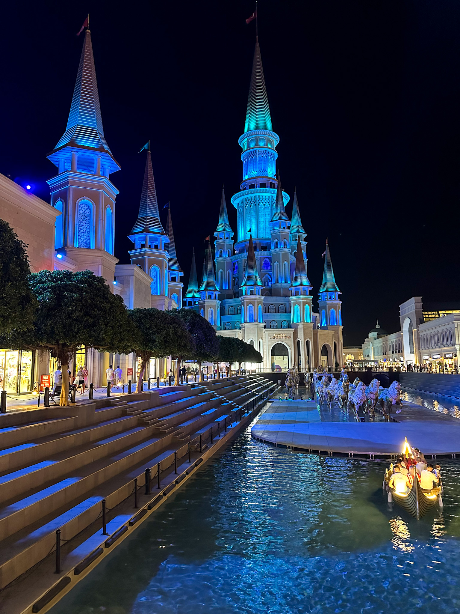
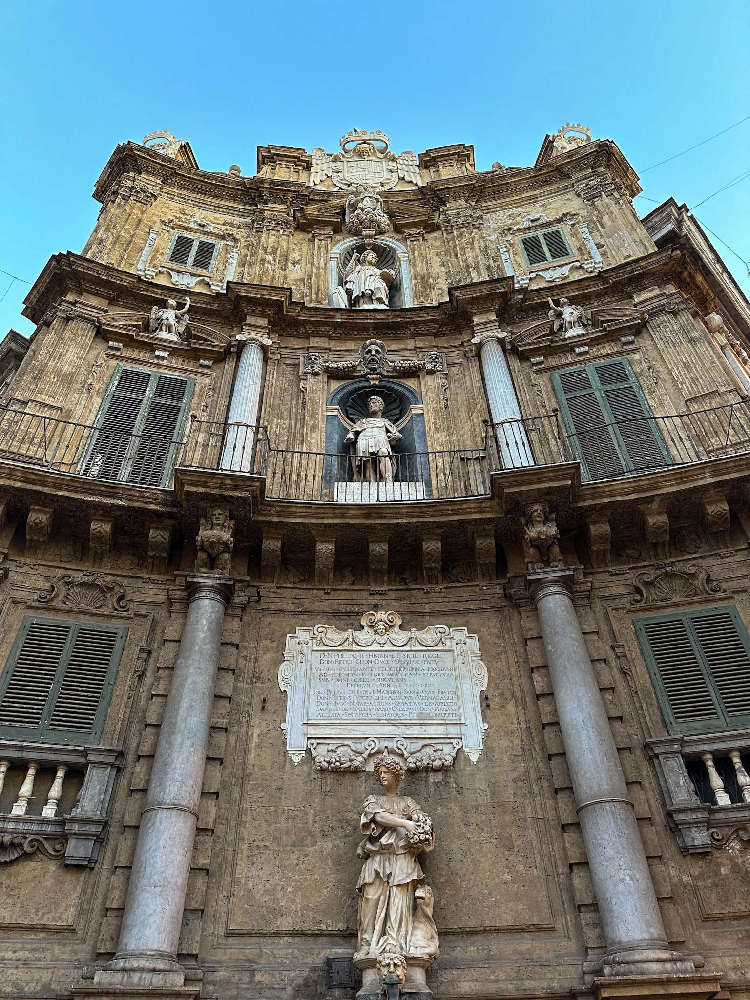
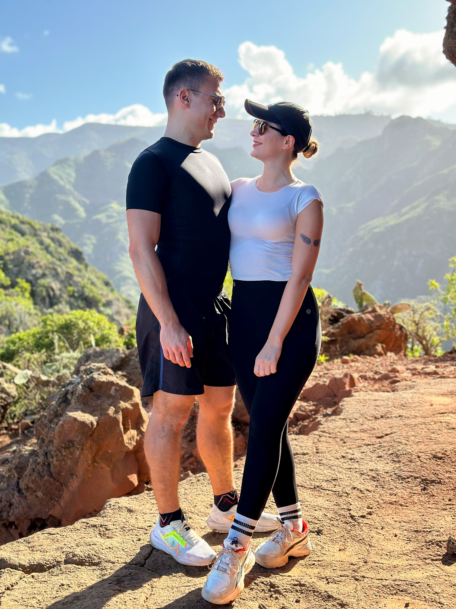

 <em
style={{textAlign: "center", display: 'block'}}>View over Lago di Garda from
Riva.</em>

_(...) it's the place I will remember for the rest of my life._

I've been meaning to write a yearly review, and I aim to stick to the plan. It's
already June 2025 and 2024 came to a close quite a while ago. What can I say?
I've been a bit busy, and maybe a bit uninspired. However, 2025 has been for me
one of the best years in my life, and I've wanted to share a bit about it. There
were some good parts, some not so good, and some that were actually amazing.
I've met the love of my life, and for the first time ever, things have beginning
to feel as they should have. I feel I'm in the right place and I'm excited for
whatever comes next. I'm happy.

## Goals for 2024

In my [2023 year in review](https://silviuaavram.com/my-2023-in-review), I also
set some goals for myself, and there were some successes.

Let's see.

- Finish the A11y course and do 2 more courses on Frontend Masters. Same as last
  year, but I'll actually do it.
  > Did it, it's done. It was a good course, but not as useful as others to be
  > honest. I would recommend it for accessibility beginners, not so much for
  > experienced.
- Read at least 10 books. Again, same as last year.
  > Fell short, unfortunately. How short? Keep on reading.
- Go on a trip to Asia. Anything really, Japan, China, Thailand. All three. I
  don't care, but I want to go there.
  > Nope. But I feel 2025 has something in the works.
- Bump Downshift to v9. We do have in plan some API changes, apart from the
  fixes we want to implement.
  > Yep, we're at v9, and we improved the API and Typescript.
- Cook 3 new recipes.
  > I didn't. But I "helped".
- Hike at least 6 times. Once every couple of months. Should not be too
  difficult.
  > Exceeded it, by one, and most of the trails were in Tenerife!
- Make a big move. It has been quite some time since I did not do anything
  radical, ever since I came back from Prague in 2020. I feel that it's time I
  changed something dramatically about myself.
  > Unfortunately nothing to share here.
- Start doing yoga.

  > I'm still struggling to do things at home, whether it's yoga, reading,
  > dancing.

It's a mix of things, no doubt. I believe my morning routine suffered a bit,
and, as a consequence so did some of my goals.

## Coding Stuff

I became more confident in my role as a Senior Engineer in Microsoft, and led a
few critical initiatives, which are now in production by the way. It feels great
to see your work used and useful, and I would like this to continue in the
future. I am lucky to be able to choose what I would like to work on, and even
though these are becoming quite uncertain times for software engineers, I'm
confident that my dedication to deliver a great experience for users, build
things the right way and learn continously will help me be successful in the
future as well.

My Downshift continued, and now I plan to refactor it to Typescript, while also
improving its API offerings. The refactor is not a trivial one, given all the
generic functions we use, but it's a great challence and I enjoy working on it
so far. As part of the developer experience I was able to write an
[article](https://silviuaavram.com/calling-mandatory-getter-props) about how we
inform our cosumers about calling the API correctly.

And Downshift was not my only OSS contribution. I'm happy to say I successfully
pushed a change in
[jest-dom](https://testing-library.com/docs/ecosystem-jest-dom/) and also wrote
an [article](https://silviuaavram.com/delivering-the-feature) based on this
contribution.

## Hobbies

I continued taking salsa classes and feel that I improved quite a lot. I'm not
going out as much as I used to, but still joined a couple of dance festivals, in
Sunny Beach and Brasov. However, I miss bachata to be honest, but there is
literally so much we can do. I am going to the gym 3 times per week, with an
extra day which is either basketball or body bump. Working out became a priority
since I fell it's becoming more difficult to stay in shape. Maybe it's because
I'm not running as much as I used to, and I believe that cardio helped me
significantly to lose fat and just feel better.

|               Land of Legends Antalya                |                  Palermo Architecture                  |
| :--------------------------------------------------: | :----------------------------------------------------: |
|  |  |

I'm happy that my girlfriend supports my hiking hobby directly, and we went on a
few trails both in Romania and in Tenerife. When I went to Tenerife by myself I
also included some trails in the itinerary, and they were so spectacular. I will
always remember the Mount Guajara trail where I kind of had a heat-stroke, or
the trails around Punta del Hidalgo in the Anaga natural park. It always feels
great to climb stuff, it helps clear the mind and the sights are always
incredible.

## Books

Same as before, 10 books at least, but this year, wow, it has been quite bad.
I'm not proud of it, and 2025 feels the same unfortunately. In any case, the
books I managed to read were not bad at all.

1. The Great Expectations, _Charles Dickens_. It was a great tale, a
   bildungsroman, of Pip, and how he perceived family, friends, love, and
   society in 19th century England. I might re-read David Copperfield after
   this, since I remember nothing since I've read it in childhood.
2. The Intelligent Investor, _Benjamin Graham_. Filled with a lot of terminology
   and graphics and studies, it actually proved to be quite useful to my amateur
   investor mindset. Or should I say passive?
3. Animal Farm, _George Orwell_. Probably my favorite out of the whole list, it
   opens up a lot of doors of thinking about politics, work and the world in
   general.
4. The Da Vinci Code, _Dan Brown_. I had little expectations from it, given that
   I'm not really a fan of the genre, but it impressed me by the pace of the
   story, as well as the plot itself. Really good!

That's it, that's the list. I need to do better next year, damn.

## Travelling

I thought 2023 was crazy. 2024 was incredible. Take a deep breath, here they
are:

- [Madrid, January](https://silviuaavram.com/madrid-2024). A great start. A
  great city, simply beautiful, everything about it was great. I fell in love
  with it, would definitely return for a Real match.
- [Athens, February](https://silviuaavram.com/athens-2024). A great
  continuation. A trip about coffee, food, long walks, and the Greek
  architecture.
- [Bellagio, March](https://silviuaavram.com/bellagio-2024). Biking around Lake
  Como is always a good idea!
- [Tenerife, April](https://silviuaavram.com/tenerife-2024). This is paradise.
  So much to see, so much to do, 2 weeks is simply just not enough. It needs at
  least one more trip. Oh wait ...
- Palermo, May. It was a great follow up to the Catania trip, and it's the place
  I will remember for the rest of my life. Will come back for an opera show.
- Prague, June. Working trip, but always great to be back over there.
- Lago di Garda, July. Biking around the Garda lake is always a good idea. It
  was refreshing to see the lake again, this time on 2 wheels, after a previous
  cruise we did a few years ago (also a biking trip). Definitely a place to
  visit again and again.
- Vienna, August. Despite the hot temperatures, the city is a gem, and we
  enjoyed both the Schonbrunn and mami im vierten brun place.
- Stockholm, September. Interesting city, a great follow up to Oslo from the
  year before. The cruise around the city canals was really cool, and the pizza
  was not bad either.
- Antalya, September. Shifting gears, enjoying the beach vibes one last time
  for 2024. Or not. Anyway, it's great to grab a pumpkin cream cold brew and
  then go to the beach bar. Antalya probably impressed me the most, apart from
  Tenerife. Definitely a place I will return soon, and not for the all
  inclusive.
- Budapest, October. It's one of the best cities to eat in, period. And the
  sights, wow. The Parliament, Buda Castle, Fisherman's Bastion, and of course,
  Gellert, the legendary place from Hitman.
- Seville-Tenerife-Valencia, December/January. Because Wizz Air direct flights
  are expensive. Anyway, one of the best trips in my life. So far.

12 trips in total. I will take that, thank you very much.

|              Us hiking in Tenerife              |
| :---------------------------------------------: |
|  |

## Goals for 2025

Let's see.

- Get promoted at work.
- 1 course from Frontend Masters done.
- Refactor Downshift to Typescript and release useTagList.
- Read 6 books at the very least.
- Go to Thailand.
- Travel at least 6 times.
- Keep doing sports at least 4 times per week.
- Start waking up at 6 AM again.
- Start running again, at least once a week.
- Decrease my phone screen time to 1 hour and 45 minutes per day.

Until next review folks! I hope you also had an amazing 2024, and 2025 will be
better!
