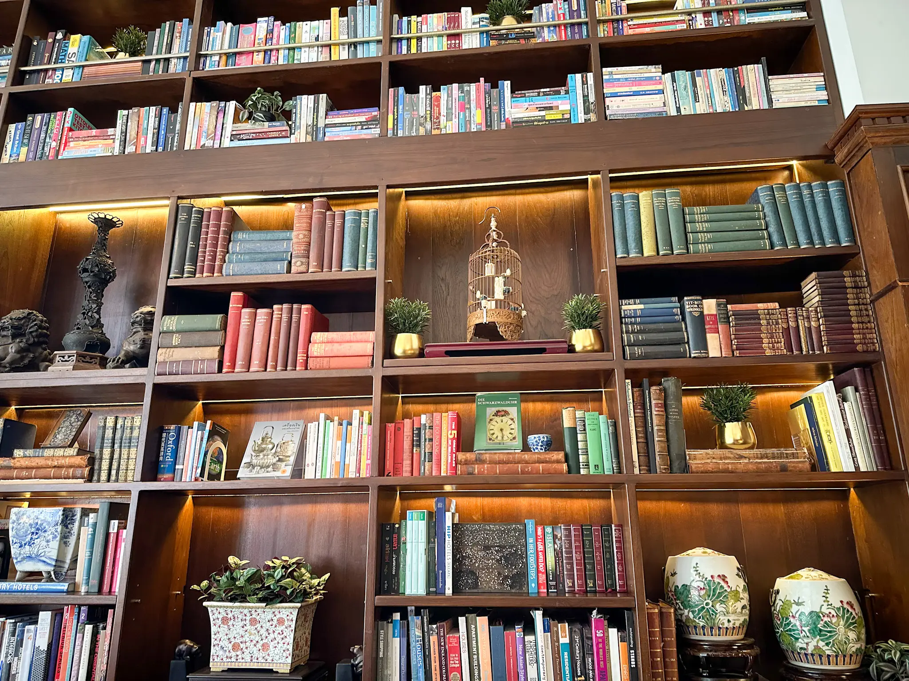

 <em
style={{textAlign: "center", display: 'block'}}>A library inside a cafe in
Chiang Mai, Thailand.</em>

_3 trips instead of 12, but I would not change a thing about that._

Here we go again. This time only with a 2 month delay, so definitely
improvement. 2025 has been for me a great year, even with a small setback that
felt like a huge one at a time. Looking back, I am very grateful about
everything that happened last year. It challenged me. It made me ask more
questions. It made me know more about what's actually important to me. And it
rewarded me far more than I ever hoped for.

First and most important: I'm getting married to the love of my life and my best
friend! 3/10/2026 save the date! I cannot describe in words what this means to
me as I look forward into the future. Feeling lucky is a big understatement.

I am also moving to a new place, which should be done in 2026, and I look
forward to having more space for us and for our hobbies, as well as more light
for my plants!

Overall, I ticked a lot of goals when it comes to my role as a Software
Engineer. I worked on my hobbies, my routine and, of course, my trips!

## Goals for 2025

In my [2024 year in review](https://silviuaavram.com/my-2024-in-review), I again
set goals for myself. Let me review them, in order.

- Get promoted at work.

> So happy to have achieved this. Even if it did not involve a title change, it
> gave me the confidence that I was relevant in my work, I improved Teams and
> learned to own features and outcomes.

- 1 course from Frontend Masters done.

> Done! Angular fundamentals was indeed helpful, even though the course did not
> cover the latest way to use Angular, via signals. But still, it allowed me to
> understand some things that were completely alient at the time.

- Refactor Downshift to Typescript and release useTagList.

> Almost done. Releasing _useTagGroup_ at the beginning of 2026 and, as part of
> the work, commenced the migration to Typescript. Cool stuff!

- Read 6 books at the very least.

> Here it's not so good, I really need to get my reading velocity back up.

- Go to Thailand.

> And what a trip that was ... 25 days of pure sunshine, fantastic beaches,
> spectacular islands that were part of the Avatar landscape, and more coconuts
> that I could count.

- Travel at least 6 times.

> Only 3 times, but the length of each trip was significantly larger than in any
> previous years.

- Keep doing sports at least 4 times per week.

> Yes! And some cardio in between. Installed _Freeletics_ and their routines
> fill the gaps where my previous training schedule completely missed. I dread
> Bulgarian splits, damn.

- Start waking up at 6 AM again.

> Work in progress. Managed about 6:30 AM and I think, for now, it's fine.

- Start running again, at least once a week.

> If it's not running, it's gym cardio. Still not consistent, but it's better
> than before.

- Decrease my phone screen time to 1 hour and 45 minutes per day.

> This is so hard ... now I also get shown the _Freeletics_ usage. But overall
> it's still around 2 hours and 30 minutes. I need to pursue this goal harder.

Overall I believe it's quite good, honestly.

## Coding Stuff

So, got promoted to 64 at Microsoft, which involves being a seasoned Senior
Engineer. I delivered very high profile initiatives for Microsoft Teams and
improved the fundamentals of the app, improved transparency and helped with the
hiring effort.

In spite of this success, I decided to try something new, and I joined UIPath in
September. Even though the goal sounded like something that will help me grow
further, it turned out to be mistake. The work environment was not something I
could thrive, and it was obvious from my first weeks that I will not succeed
there. Luckily, my friend working at MUI reached out in the meantime and
convinced me to apply for the MaterialUI library maintainer role, just in case
things might not work out with the current role. It was divine intervention, and
it saved me from piling more frustration than I already did.

This role allows me to focus on the same kind of work that I'm doing at
Downshift, but with a way broader scope. Speaking about Downshift, I doubled
down my effort in order to improve both the library offering (useTagGroup) and
also the fundamentals. By working on these great libraries, and potentially
others such BaseUI and MUI-X, I look forward to improving myself and the
products, and come up with subjects that are worth presenting at tech
conferences, which is something that really excites me.

## Hobbies

I stopped taking salsa classes with a heavy heart, but with at lesat 4 days per
week in the gym, it's really hard to just stay at home and appreciate some time
not doing much, or just cooking something and hanging out. I just had to do it,
and I'm not sure if I will resume going again, even though I miss it very much.

Another hobby that suffered is hiking, but I plan to pick this up back in 2026.
It always helped, me both physically and mentally, and I see no reason why not
doing it more again. When it comes to nature, I confess that many of my plants
decided to die, after they were barely surviving with not much sun exposure.
Nothing I could do about it, yet.

I did not ready that much last year, so the list is quite tiny:

1. Lost Illusions, Balzac. Always liked his literary style, and one of his
   favorite subjects: the coming up of a character that, due to their
   superficiality and lack of spine, ended up in a tragic downfall.
2. The Beautiful and Damned, F Scott Fitzgerald. Great book, but, again, like
   the first one, a very sad story.
3. The Bhagavad Gita. Interesting poem, meant to explore the feelings before
   making tough, but necessary choices.

## Travelling

This year, there were far fewer trips, but they were longer.

- Milano, Lago Maggiore and Cinque Terre. The Easter trip was great in spite of
  the weather not being the best. It did not allow us to fully explore Maggiore
  by bike, and when we went to Cinque Terre, it rained all day.
- Zakynthos and Bari. The Greco-Italian trip was a perfect combination betwen
  beach holiday and a city break. It involved a great cruise around the
  Zakynthos Island, the perfect Italian cuisine of Bari and a series of road
  trips to Matera and Monopoli.
- Thailand, Singapore and Kuala Lumpur. That trip that was absolutely perfect.
  A trip of 25 days of exploring in Southeast Asia, that took us from the
  temples and skyscrapers of Bangkok, to the elephant parks and nature of Chiang
  Mai, to the pristine beaches and incredible island landscapes of Krabi and
  Phuket, to finally to the city of the future, Singapore and, at the end, to
  the very modern city of Kuala Lumpur, which also has food to die for.

I can't wait to write about each and every trip, since they were absolutely
stunning. 3 trips instead of 12, but I would not change a thing about that.

## Wrapping up & Goals for 2026

2025 for me was a great year. I achieved a lot, and received more than that in
return. I am grateful for it in every single way. It's hard to top it, but I
will do my best in 2026. I'm writing this on board of my flight to Geneva, my
second to last stop for the MaterialUI team event in Flaine, one of France's
most beautiful ski resorts. I'm happy with how everything turns up, and that
only motivates me further to achieve more in 2026. If I could think of a list of
goals:

- 2 courses on Frontend Masters, one to improve my fundamentals and one to learn
  something new.
- Improve MaterialUI suite of libraries and be recognized for my contributions.
- Remove Downshift's useMultipleSelection hook.
- Refactor all Downshift hooks to use Typescript.
- Improve the library's perf and quantify it.
- Write 2 blog posts about tech and what I've learned.
- Create a presentation and submit it to a conference to be accepted.
- Decrease my mobile screen time to 2 hours.
- Read 6 books.
- Get in better shape, target is around 78kg.
- Hike 6 times.
- Go to a concert.
- Snowboard 3 times.

I have set quite a few goals for 2026, as I feel that I want to use the momentum
I have in order to improve the discipline that was partially lost along the way.
I believe 2026 is going to be a great year, I look forward to fulfilling my
plans and, most importantly, spend more time with the people I care about the
most.
