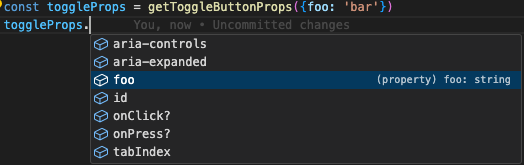
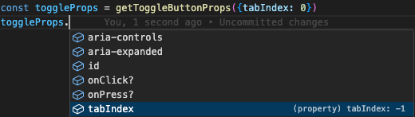
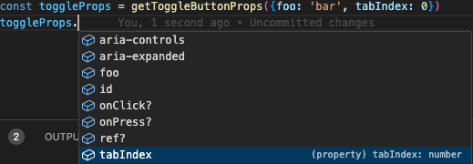
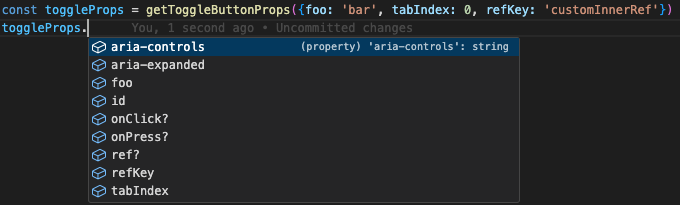

 <em
style={{textAlign: "center", display: 'block'}}>The Morgan Library Museum in New
York. Photo by Silviu Alexandru Avram</em>

TypeScript is a great alternative to JavaScript if you feel the need for that
extra safety net of strong typing. Most of the tyme, TS is pretty
straightforward, as we are familiar with strong type languages like Java.
However, when we do require a tiny bit of dynamic type magic, things can stop
being straightforward, and we can end up being very creative. But when we
actually get the job done and even improve on the result, we realise how strong
TS can be, and we are super thankful for its existence.

In this article, we are going to touch concepts like TypeScript as a language in
general, but also Generics and some TS utilities that are available globally.
Solving the problem below helped me understand TS better, and I hope it helps
you as well. Let's begin.

## The Use Case

The JS code below is the one that required some creativity from my part, when
[improving Typescript types for downshift](https://github.com/downshift-js/downshift/pull/1482).
For simplicity, I removed some React specific details, since they are not
relevant to the topic.

```js
function getToggleButtonProps({
  onClick,
  onPress,
  refKey = 'ref',
  ref,
  ...rest
} = {}) {
  function toggleButtonHandleClick() {
    dispatch({
      type: stateChangeTypes.ToggleButtonClick,
    })
  }
  const toggleButtonProps = {
    [refKey]: handleRefs(ref, toggleButtonNode => {
      toggleButtonRef.current = toggleButtonNode
    }),
    'aria-controls': elementIds.menuId,
    'aria-expanded': latestState.isOpen,
    id: elementIds.toggleButtonId,
    tabIndex: -1,
  }

  if (!rest.disabled) {
    if (isReactNative || isReactNativeWeb) {
      toggleButtonProps.onPress = callAllEventHandlers(
        onPress,
        toggleButtonHandleClick,
      )
    } else {
      toggleButtonProps.onClick = callAllEventHandlers(
        onPress,
        toggleButtonHandleClick,
      )
    }
  }

  return {
    ...toggleButtonProps,
    ...rest,
  }
}
```

Our function, `getToggleProps`, receives some props as an `Object`, which is
destructured directly.

- we are using an empty object as default parameter (`= {}`), otherwise our
  destructuring will fail for `undefined`. Extra safety.
- we are grabbing a few properties from the object, such as `onPress`,
  `onClick`, `ref` and `refKey`, as we are using them in our function.
- we are using a prop without grabbing it from the object, `rest.disabled`.
- we are returning our computed props as `toggleButtonProps`, along with `rest`,
  which are the rest of the props we did not change. We bundled them together by
  object spreading and returned them.

## The Goal

Since this function is written in JS, in order to convert it to TS, or at least
provide TS types for it, we need to define the types for both the function
parameter and the function return value. The function's purpose is to return
attributes that are going to be applied to a HTML button element, but not
always. It could be a React Native button as well, or a custom React button
component from any UI Library. Consequently, our types requirements are the
following:

1. The parameter should accept HTML button props, in the case of an HTML button,
   or any custom UI component that also accepts HTMP button props.
2. The parameter should accept _refKey_, a string prop used for those rare cases
   where the component we are passing **toggleButtonProps** to has a different
   name for the ref prop, for instance _innerRef_.
3. The parameter should also accept an optional _onPress_, in case we are in the
   context of React Native.
4. The parameter should also accept any prop that needs to end up on the
   element, by being passed through with the `rest` object.
5. The return value needs to return the props that are being computed and
   guaranteed to be returned in **toggleButtonProps**: _aria-controls_,
   _aria-expanded_, _id_ and _tabIndex_.
6. The return value needs to optionally return either _onClick_ or _onPress_,
   depending on whether we are on React Native or not.
7. The return value needs to return those props from #4 that could be anything,
   but we should also include their type in the return type.
8. In case there is a type overlap between a prop from the parameter and the one
   from the return value, the parameter prop type wins.
9. We cannot do anything for _refKey_, since that can be any string, with a
   _'ref'_ default, so the most we could do here is an optional _ref_ prop.

## Implementation

Let's nail the easy static types first, then we will work towards the dynamic
override aprt.

### HTML Button Props

> The parameter should accept HTML button props, in the case of an HTML button,
> or any custom UI component that also accepts HTMP button props.

For this first part, the implementation is really simple, we just need to make
the parameter accept HTMLButtonProps.

```ts
function getToggleButtonProps({
  onClick,
  onPress,
  refKey = 'ref',
  ref,
  ...rest
}: React.HTMLProps<HTMLButtonElement> = {}) {
  // implementation
}
```

The generic-based `React.HTMLProps<HTMLButtonElement>` is a great way to achieve
our goal, since it will return all the props that could end up on an HTML
button. And all of them are marked as optional.

Very easy so far, but there's one problem. TypeScript will complain about
_refKey_, since the prop is not part of `React.HTMLProps<HTMLButtonElement>`.
And there's also _onPress_. That's not part of the HTML Button either, since
it's a prop specific to React Native. Let's fix that.

### The refKey Prop

> The parameter should accept _refKey_, a string prop used for those rare cases
> where the component we are passing **toggleButtonProps** to has a different
> name for the ref prop, for instance _innerRef_.

In order to fix our code, we can just add the two props with a type
intersection, like so:

```ts
function getToggleButtonProps({
  onClick,
  onPress,
  refKey = 'ref',
  ref,
  ...rest
}: React.HTMLProps<HTMLButtonElement> & {
  refKey?: string
} = {}) {
  // implementation
}
```

Done! Now the props are the intersection between the button props and the ref
type we just created, the only thing we need to accept is _onPress_.

### The onPress Prop

> The parameter should also accept an optional _onPress_, in case we are in the
> context of React Native.

The most obvious fix would be to add _onPress_ to the type we just created to
support the refs.

```ts
function getToggleButtonProps({
  onClick,
  onPress,
  refKey = 'ref',
  ref,
  ...rest
}: React.HTMLProps<HTMLButtonElement> & {
  refKey?: string
  onPress?: (event: React.BaseSyntheticEvent) => void
} = {}) {
  // implementation
}
```

For simplicity, we are using `React.BaseSyntheticEvent`, which is goint to be a
common interface for both web and native event handler props in React, since we
don't plan to also import React Native types.

The errors are gone and we handled the first 3 use cases, which is great. Since
we may want to support other functions as well, not just for toggle buttons, we
may want to split the above type into several, which could be used
independently. Also, we may want to extend these types, so we should consider
using interfaces instead of types. Consequently, our code will become:

```ts
interface GetPropsWithRefKey {
  refKey?: string
}

interface GetToggleButtonProps
  extends React.HTMLProps<HTMLButtonElement>,
    GetPropsWithRefKey {
  onPress?: (event: React.BaseSyntheticEvent) => void
}

function getToggleButtonProps({
  onClick,
  onPress,
  refKey = 'ref',
  ref,
  ...rest
}: GetToggleButtonProps = {}) {
  // implementation
}
```

Now the _refKey_ part is abstracted away in `GetPropsWithRefKey`, and can be
used by other functions, while the button specific types are bundled together in
`GetToggleButtonProps`, along with the _refKey_ part, through extension.

### Pass-through Props

> The parameter should also accept any prop that needs to end up on the element,
> by being passed through with the `rest` object.

Now comes the hard part. We want to accept anything else the user may need to
pass through our function, but still keep our previous `GetToggleButtonProps`
definition for the props. Since we have no idea what the user is going to pass
in addition to the types we already defined, we will use a generic type, which
we will intersect with `GetToggleButtonProps`, such that it will include stuff
from both. Let's actually write it down:

```ts
function getToggleButtonProps<Rest>({
  onClick,
  onPress,
  refKey = 'ref',
  ref,
  ...rest
}: GetToggleButtonProps & Rest = {}) {
  // implementation
}
```

`Rest` can be anything, and it does not have to be specified directly when
calling the function. For example, this call will be considered correct:

```ts
function onClick() {
  console.log('clicked')
}

const toggleProps = getToggleButtonProps({onClick, foo: 'bar'})
```

_onClick_ is part of the `GetToggleButtonProps` interface, while the _foo_
string property is part of the `Rest`, and, according to the
[function implementation](#the-use-case), it will be passed directly to the
return value. The `Rest` generic will be super valuable when defining the return
value type, as we shall see in a moment.

### Guaranteed Returned Props

> The return value needs to return the props that are being computed and
> guaranteed to be returned in **toggleButtonProps**: _aria-controls_,
> _aria-expanded_, _id_ and _tabIndex_.

Of course, this part is the easy one, and we will create an interface that
defines the props above and their types, according to the implementation.

```ts
function getToggleButtonProps<Rest>({
  onClick,
  onPress,
  refKey = 'ref',
  ref,
  ...rest
}: GetToggleButtonProps & Rest = {}): {
  'aria-controls': string
  'aria-expanded': boolean
  id: string
  tabIndex: -1
} {
  // implementation
}
```

Each property is defined as non-optional, since it is guaranteed that we are
returning it in the returned object. We can also be super specific with our
types, for instance _tabIndex_ is _-1_ instead of _number_, as we are going to
always return _-1_, while the other properties are dynamic.

### Optional Event Handler Props

> The return value needs to optionally return either _onClick_ or _onPress_,
> depending on whether we are on React Native or not.

Let's also add the couple of optional handler props and also abstract the whole
return value prop into an interface.

```ts
interface GetPropsWithRefKey {
  refKey?: string
}

interface GetToggleButtonProps
  extends React.HTMLProps<HTMLButtonElement>,
    GetPropsWithRefKey {
  onPress?: (event: React.BaseSyntheticEvent) => void
}

interface GetToggleButtonReturnValue {
  'aria-controls': string
  'aria-expanded': boolean
  id: string
  onPress?: (event: ReactNative.GestureResponderEvent) => void
  onClick?: React.MouseEventHandler
  tabIndex: -1
}

function getToggleButtonProps<Rest>({
  onClick,
  onPress,
  refKey = 'ref',
  ref,
  ...rest
}: GetToggleButtonProps & Rest = {}): GetToggleButtonReturnValue {
  // implementation
}
```

Looks great! We now have interfaces for both the function parameter and the
return value. We are almost at the finish line.

### Rest in the Return Value

> The return value needs to return those props from #4 that could be anything,
> but we should also include their type in the return type.

Now it's time to use again the `Rest` generic we defined previously, and include
it in the return value, since it contains the pass-through props. We will use
the intersection here, again.

```ts
function getToggleButtonProps<Rest>({
  onClick,
  onPress,
  refKey = 'ref',
  ref,
  ...rest
}: GetToggleButtonProps & Rest = {}): GetToggleButtonReturnValue & Rest {
  // implementation
}
```

Now, everything extra that is passed as rest will be reflected in the type for
the return value.



We just crossed the finish line with half a leg.

### Prop Overrides

> In case there is a type overlap between a prop from the parameter and the one
> from the return value, the parameter prop type wins.

Suppose that we want to make our toggle button focusable and add it to the tab
order of the page. We will need to pass _tabIndex_ as _0_, or any other positive
value (big anti pattern, but you can). With our current type definitions, if we
pass _tabIndex: 0_ as a prop to the function, the return value type of
_tabIndex_ will stay as _-1_, since that's what we defined in the
`GetToggleButtonReturnValue` interface.



Sure, we can just make the type to be _number_ and move on, but that's not what
we are actually returning by default. And it's not just about the _tabIndex_. We
can have, for instance, another prop returned by default, such as
_aria-haspopup_, with a _listbox_ default value. But what if the user needs to
display the popped out menu as a modal? They would need to pass _aria-haspopup:
'dialog'_ to the function, and the return type for _aria-haspopup_ should
reflect the parameter type.

For this reason, we need to create a type that overrides the type we define by
default for the props that are passed as parameter and have a different type. Of
course, this is not required if those props passed as parameter are destructured
away from _rest_, and in this case we can keep our own type, as the value won't
be overriden by pass-through. It's not the case for _tabIndex_, so we need to
override the type here. And the type definition I found to solve the issue is
the following,
[from this thread](https://stackoverflow.com/questions/54770310/how-can-i-overwrite-a-property-type):

```ts
type Overwrite<T, U> = Pick<T, Exclude<keyof T, keyof U>> & U
```

Whoa, whoa, what? Ok, let's try to remember what we want to achieve. If we pass
a prop with the same name as the function parameter, then it should override the
type from _GetToggleButtonReturnValue_.

Let's consider `GetToggleButtonReturnValue` to be `T` and `Rest` to be `U`.
Overwriting `T` with `U` means _picking_ from `T` only the prop types that are
not common between `T` and `U`. We _exclude_ from `T` the props from `U`, which
means there will be no common props as a result of this exclusion, and then we
_pick_ these exact props from `T`. Finally, we _intersect_ these non-common
props with `U`, giving us back the common props (if any), but this time with the
types from `U`. Remember, `U` is `Rest`, our pass-through props type.

Consequently, our return type will become:

```ts
type Overwrite<T, U> = Pick<T, Exclude<keyof T, keyof U>> & U

function getToggleButtonProps<Rest>({
  onClick,
  onPress,
  refKey = 'ref',
  ref,
  ...rest
}: GetToggleButtonProps & Rest = {}): Overwrite<
  GetToggleButtonReturnValue,
  Rest
> {
  // implementation
}
```

And voilà, the result:



Also important to point out, due to the current type of the parameter
` GetToggleButtonProps & Rest`, you cannot pass just any type to the properties
that are statically defined, such as `tabIndex`, `onClick`, `refKey` and the
others. Passing a number for the `onClick` prop will fail since it's clearly
defined in the `React.HTMLProps<HTMLButtonElement>` as a function with certain
parameter types. You could pass `tabIndex` as _0_ due tot the fact that it's a
number type in the `React.HTMLProps<HTMLButtonElement>`, even though we made it
_-1_ in our return type, as a result of our function implementation.

### The Ref Prop

> We cannot do anything for _refKey_, since that can be any string, with a
> _'ref'_ default, so the most we could do here is an optional _ref_ prop.

This is going to be our only limitation. Passing a custom string as a _refKey_
will not reflect a property with the key as that string value in the return
type. There is no way (that I know) to get the string value from an object key
and use that as a key in a type. Consequently:



There's no _customInnerRef_ property in the return value, just the _ref_
optional property that is going to be passed by default, in case we don't pass
any value for _refKey_ (`refKey = 'ref',`).

## Conclusion

In this post, we went through defining static types for a function's paramater
and return value, as well as allowing dynamic types to override previously
defined static types, where such a case was needed. We also defined an initial
set of expectations, starting from a working example, then we went through the
use cases one by one and altered the solution accordingly. We also saw a few
usages of TS helper types, such as _Pick_, _Exclude_ and others.

Improving the Types in Downshift was a great experience, as there were quite a
few use cases to consider for the getter prop functions. I found the experience
so useful that I considered to write in detail about it, and I hope you will
find it useful in some way as well.
