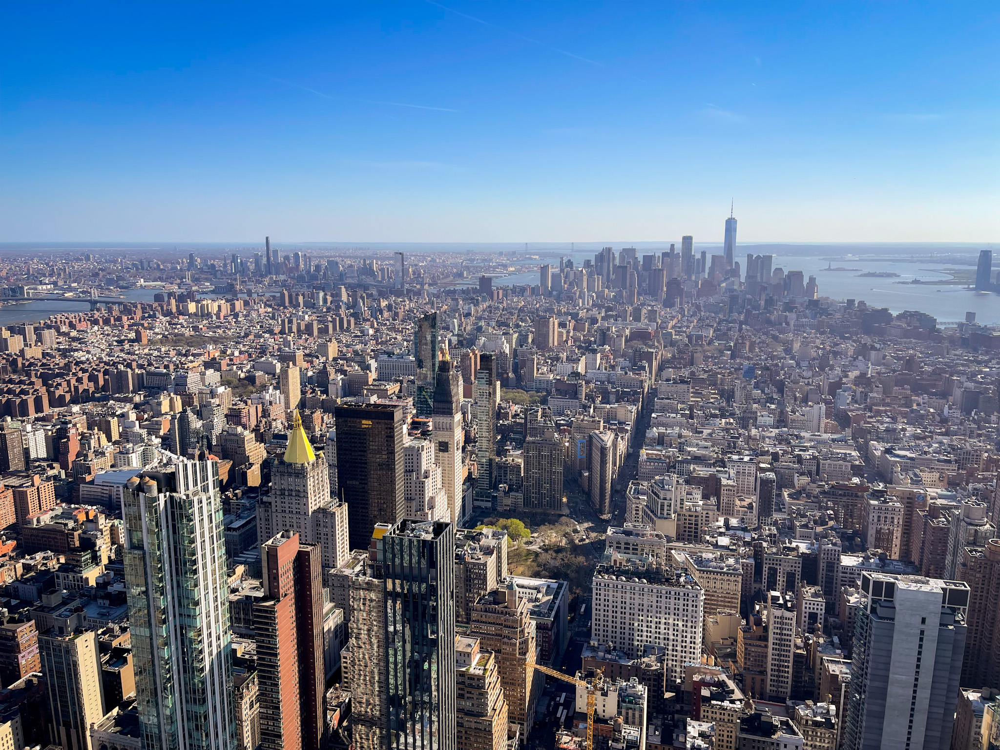
_Photo by Silviu Alexandru Avram_

New York City. The big apple. Jay-Z's city that never sleeps. Batman's Gotham.
Spiderman's home. Call it whatever you like, everyone knows what you are talking
about. It's #1 most popular city for filming movies, topping the likes of Los
Angeles, Paris and London.

Needless to say, I arrived in NYC with big expectations. And I was still blown
away.

## Jersey City

My trip started in Jersey City, across the Hudson, where my friends are based.
The trip from JFK took forever, but alas, I finally arrived at the World Trade
Center, and then took the Path train to Jersey. After "checking in", we went for
a walk to the Hudson River waterfront, overlooking Manhattan. Describing the
skyline is just impossible, I just could not believe I was actually there,
staring at it from across the river. It was late in the evening, or at least
that's how I felt it was after the long flight. It was my opportunity to just
pause and indulge the view. Right in front of my eyes, the World Trade Center.
To the left, in the distance, the Empire State Building. The Hudson Yards,
recently built, also to the left. Helicopters everywhere. Like in the movies,
but better.

As for Jersey City, I found it to be quite a cosy place, especially the hip
downtown, filled with coffee places, craft beer bars and restaurants. It
featured many 19th century brownstone houses which suited the place very well,
along with small shops and a few parks. The place was quite packed after working
hours, and there was always a queue at the ice cream place (ugh...).

|               Manhattan Skyline               |                Jersey City Skyline                |
| :-------------------------------------------: | :-----------------------------------------------: |
| 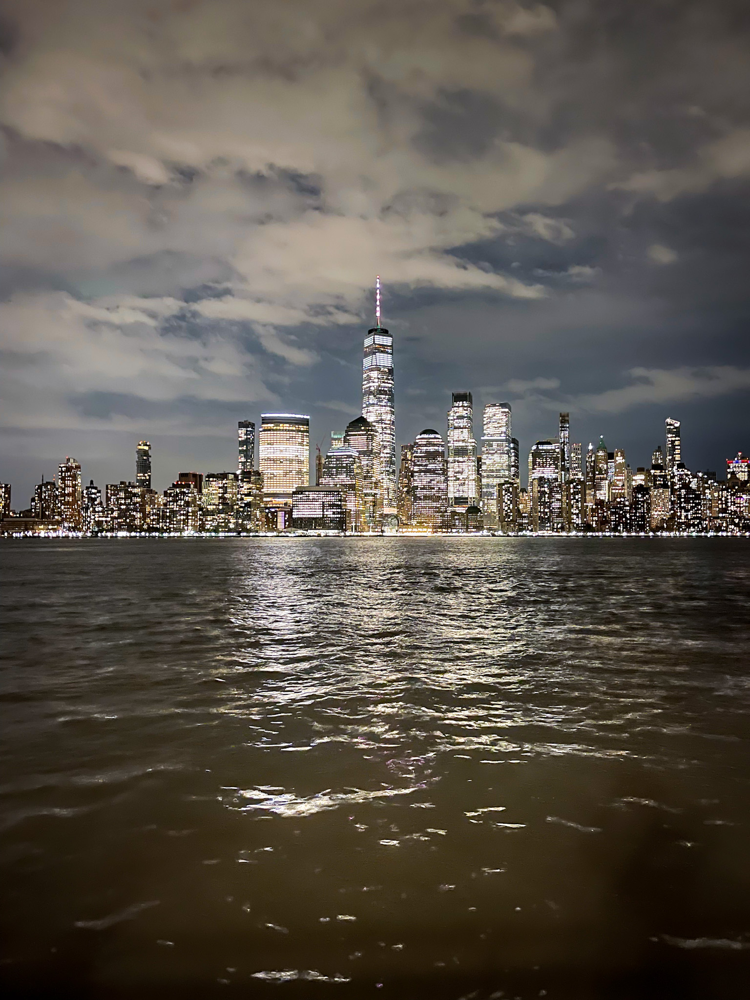 | 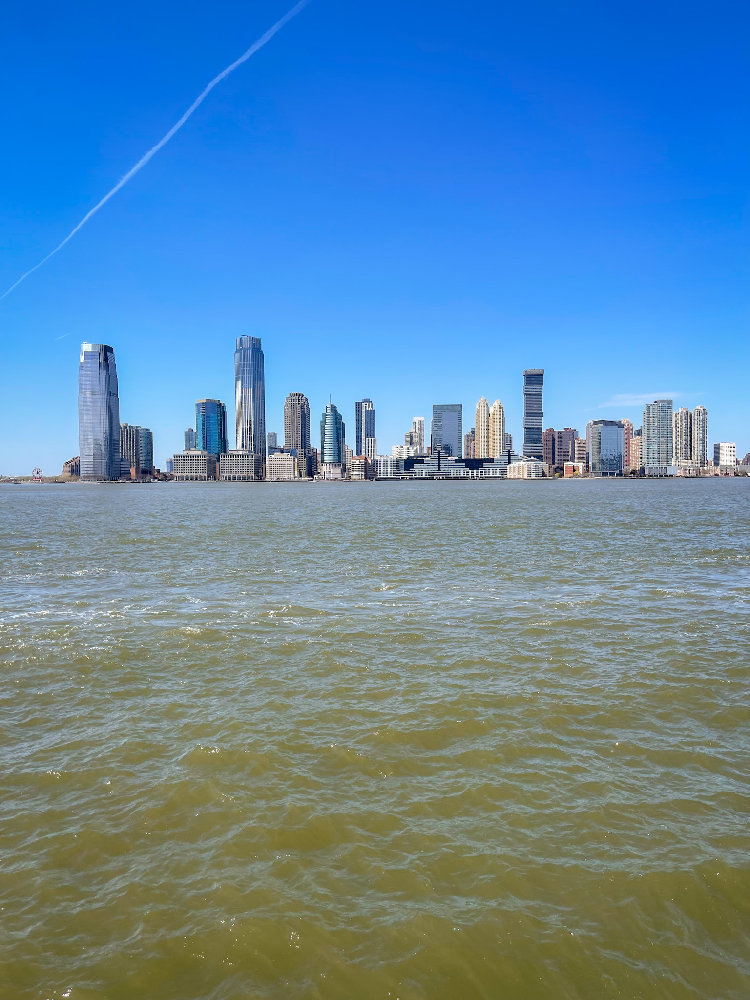 |

On the waterfront, however, there was a different architectural story, as the
brownstones were replaced by the all-too-familiar tall apartment and huge office
buildings, the Goldman Sachs being the most impressive. Right next to it, there
was the Colgate Clock. Familiar words everywhere, really.

The best decision of my life was to pack my running equipment, as it helped me
discover Jersey City even better, not only its downtown and waterfront. I ran
all the way to the Liberty State Park, then along the boardwalk, then closer and
closer to Ellis Island, where I took a break and admired the country's
unmistakeable icon, the Statue of Libery.

On another occasion I also went north of Jersey City, towards Hoboken, and
reached the Hoboken train station and the Hoboken waterfront. From there, the
Hudson Yards and the Empire State Building were closer across the river, so I
could take a better look. This Hoboken part of town seemed to me less impressive
and more impersonal than Jersey City, but the train station's exterior was very
pleasant to the eye. Unfortunately, I did not make it to Hoboken downtown, where
I was told there are plenty of coffee shops as well.

One thing's for sure: when possible, I'll always pack the running shoes.

## Lower Manhattan

It seems pretty hard to divide the trip by time, so I'd rather split it by
location, starting with Lower Manhattan. It's famous for taking a cruise to the
Statue of Liberty and posing beneath the Wall Street Bull. There's also Wall
Street itself, the stock exchange, and plenty of gigantic office buildings,
hence it's name, the Financial District. At the intersection of Wall Street,
Beaver Street and Pearl Street, I came across a building that looked stragely
familiar and realised I was looking at the real life location of the Continental
hotel from John Wick. On Broadway, betwen the buildings, the Trinity Church is
making an impression. Squeezed between so many sky scrapers, it does stand out
with its beautiful Gothic Revival style exterior, stained glass windows and
peaceful cemetery with cherry trees and lots of flowers.

Equally impressive is the World Trace Center subway station, both from the
inside and the outside. It was designed by the Spanish architect Santiago
Calatrava and features white ribs that interlock high above the ground. Next to
the station there's the 9/11 memorial, featuring a museum, a huge pool and a
plaza. Next to them is One World Trade Center, the tallest building in New York.
It's one of the buildings to visit for the panoramic view of the city, along
with the Empire State Building and the Rockefeller Center. Spoiler alert: I
chose Blair Waldorf's favorite.

|             The 9/11 Memorial             |             Trinity Church              |
| :---------------------------------------: | :-------------------------------------: |
| 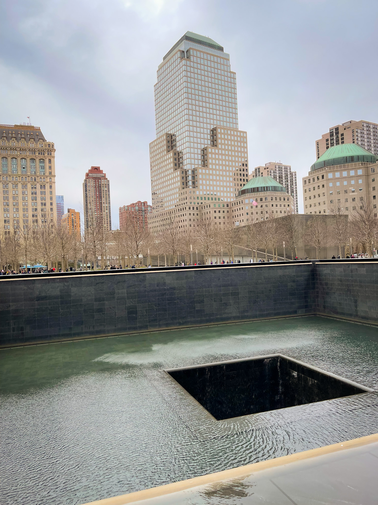 |  |

Of course, I should also mention the Brooklyn Bridge, probably the most crowded
bridge to cross on foot. Even with the crowds, the bridge offers a delightful
walking opportunity, with its neo-Gothic towers, steel cables and pleasant views
over both Manhattan and Brooklyn. I turned around just before reaching Brooklyn,
as I decided to continue my walk back to Manhattan towards Canal Street, and
postpone Brooklyn for another trip. On top of the Dumbo view point, I also have
the Brooklyn Botanical Garden in Prospect Park on my future visiting list.
Anyway, back to Manhattan.

I got off the bridge and turned right towards Chinatown and Little Italy. I took
Center Street and went towards Canal Street. On my right I came across an array
of what it appear to be government buildings, with imposing entrances. Later, I
discovered that the buildings were actually the Supreme Court and the
Courthouse. I continued my walk north, reached Canal Street and wandered a bit
through Chinatown and Little Italy, before deciding to change course and head
towards Soho and, of course, Noho.

|              Brooklyn Bridge              |               World Trade Center                |
| :---------------------------------------: | :---------------------------------------------: |
|  | 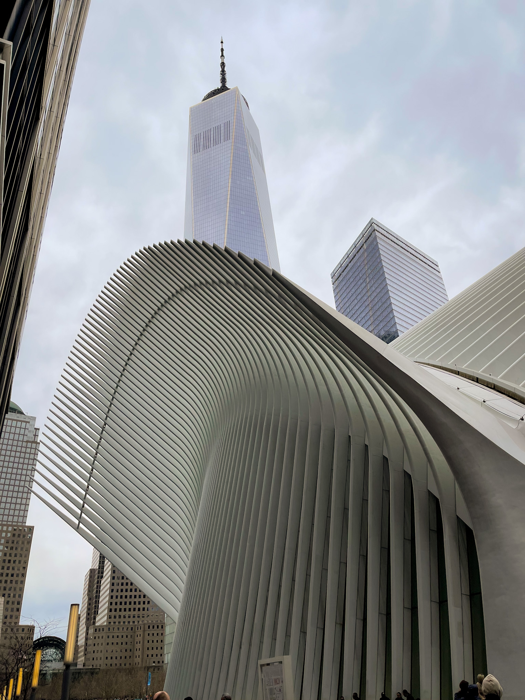 |

Both Soho and Noho offer a stark change of scenery from Canal Street, with a
lovely combination of shops, designer boutiques, chic restaurants and the New
York University buildings. Right next to the NYU buildings we passed through
Washington Square Park, which was always packed, given its location. On the day
I arrived there with my friends, we took some pictures by the Washington Square
Arch and we continued to move northward, towards my friend's favorite building
in New York, the Flatiron Building.

## Middle Manhattan

Probably the part of Manhattan I walked through the most, since my daily walks
involved walking from the WTC to Central Park and then returning back either to
the WTC or any other Path station. I mentioned the Flatiron Building, but
unfortuantely I found it under construction, so there was not much to see. On
the other hand, the Madison Square Park area offers a selection of equally
magical places, and #1 is, of course, the Harry Potter store. I went to the shop
at least 3 times and I was close to buying Severus' wand, but I did not like the
wand stands and decided to postpone my purchase until I figure out where to
place the wand in my home.

Equally magical is Shake Shack, and the Madison Square Park location has tables
outside, right in the park. Double Smoke Shack, regular fries, 6 chicken bites
and a laaaarge Fifty Fifty. 2000 calories and 0 regrets. And that's the magical
part about New York which I liked: wherever I was, there was always something
good to drink or to eat. Just out of any subway, there's a Starbucks. A Dunkin
right next to it. A Chick-Fill-A on the corner. Or a Shake Shack. Popeyes? Yes.
I cannot think of anything more magical than that, besides Disney. Two weeks
getting high on Vanilla Sweet Cream Nitro Cold Brews, Boston Cream Doughnuts and
Double Smoke Shacks. I hope, dear reader, that you're not hungry when reading
these lines.

|               Empire State View               |         New York Public Library         |
| :-------------------------------------------: | :-------------------------------------: |
| 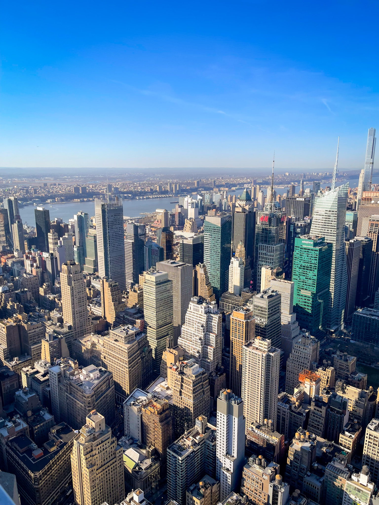 | 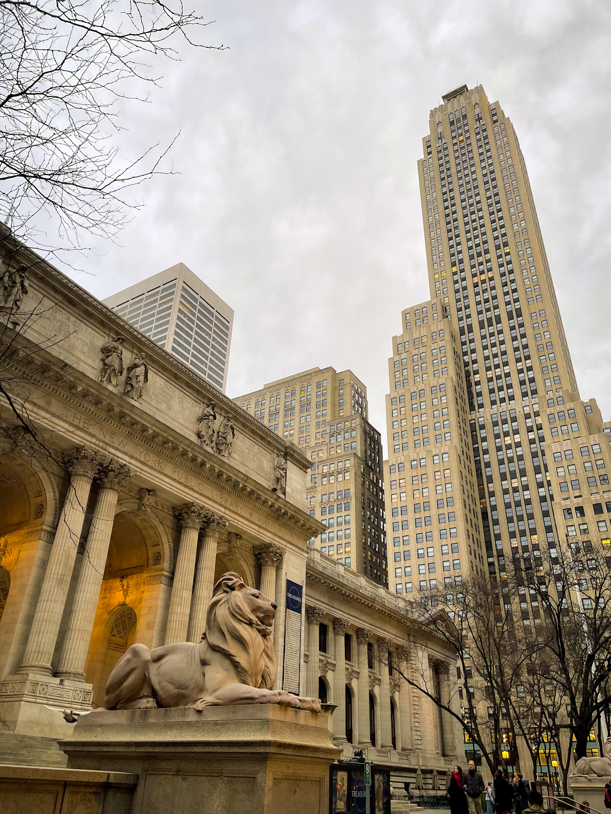 |

A few streets to the north of Madison Square Park, there's the 34th street, with
the Empire State Building, the Macy's store and The Morgan Library & Museum. I
did mention that I climbed on top of Blair's favorite building, the Empire
State, which is what I recommend going for first, given its position and
history. It offers jaw-dropping Manhattan views both to the north and to the
south, and every view is just breathtaking. I went to the Empire State Building
alone, but at the Morgan Museum I went with my friends, since they booked a
visiting slot during an evening. Morgan's collection is impressive, filled with
pieces from all around the world, exquisite furniture, many many books, one of
them being the Gutenberg Bible, one of the few available out there.

It's probably worth mentioning that most of the time I chose the 5th Avenue to
go north, given its popularit and my hopes of seeing Taylor Swift. Other avenues
are nice as well, such as the Madison Avenue, especially upwards from around
55th street. And the 9th Avenue. Other places that I really enjoyed in this part
of Manhattan are the Grand Central Terminal, where John Wick was filmed (and
others, of course), the New York Public Library where I took some pretty nice
pictures, St. Patrick's Cathedral, MoMa, Whitney Museum, Chelsea Market, Hudson
Yards. I think it's my favorite part of Manhattan, given the number of places I
visited.

|             Manhattan West Office Buildings              |            Hudson Yards             |
| :------------------------------------------------------: | :---------------------------------: |
| 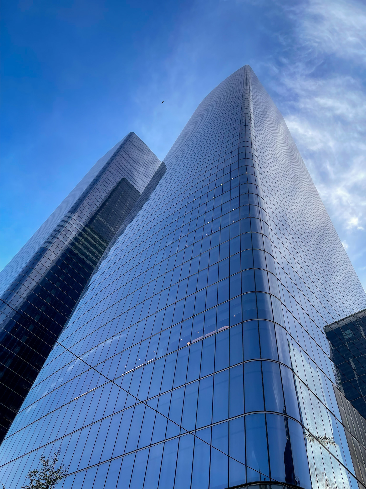 | 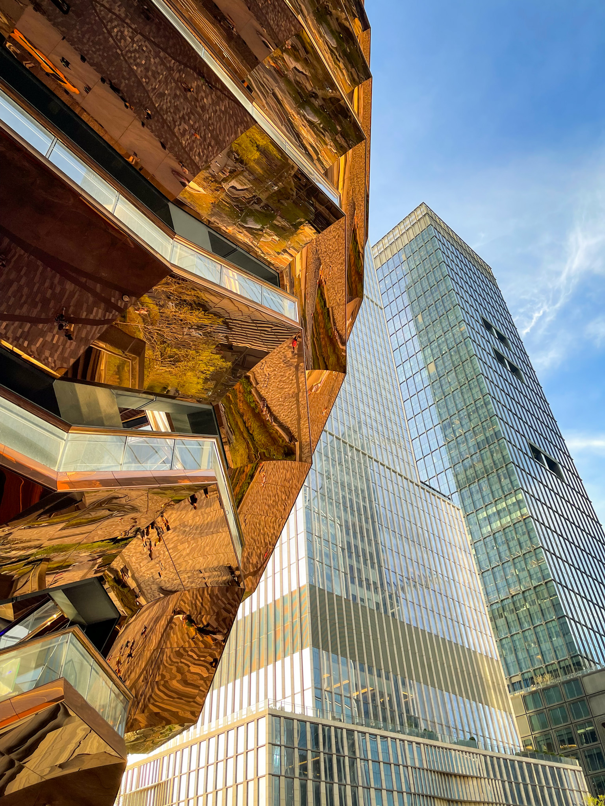 |

Last, but not least, there are three more places worth mentioning in Central
Manhattan. Firstly, there's The High Line, a former New York Central Railroad
that got repurposed into a elevated linear park featuring a beautiful trail
between the equally good looking buildings. It can be quite crowded sometimes,
but it's still a great feeling to go for a stroll and enjoy the views,
especially at sunset. Secondly, there's Times Square, and even though many
considered to be an overrated spot with nothing particularly exciting about it,
it's still a must go for the commercial light show, and for the John Wick
filming location. And thirdly, the Eugene O'Neill Theatre, where my friend
bought tickets for the Book of Mormon. It was the first musical experience for
me, and I think it was the best experience I had in New York, to be honest. I
did not know what to expect at all, and the show was incredible. If anyone has a
todo list for New York, they should add a Broadway show right at the to. Period.

|           The High Line           |       Manhattan Street View       |
| :-------------------------------: | :-------------------------------: |
| 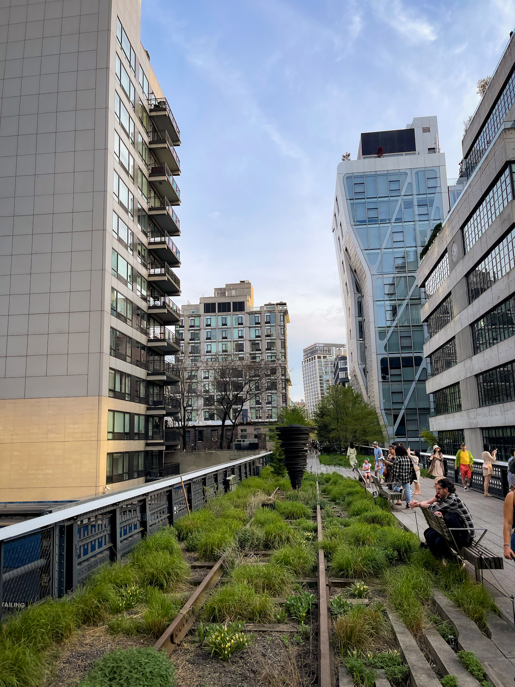 | 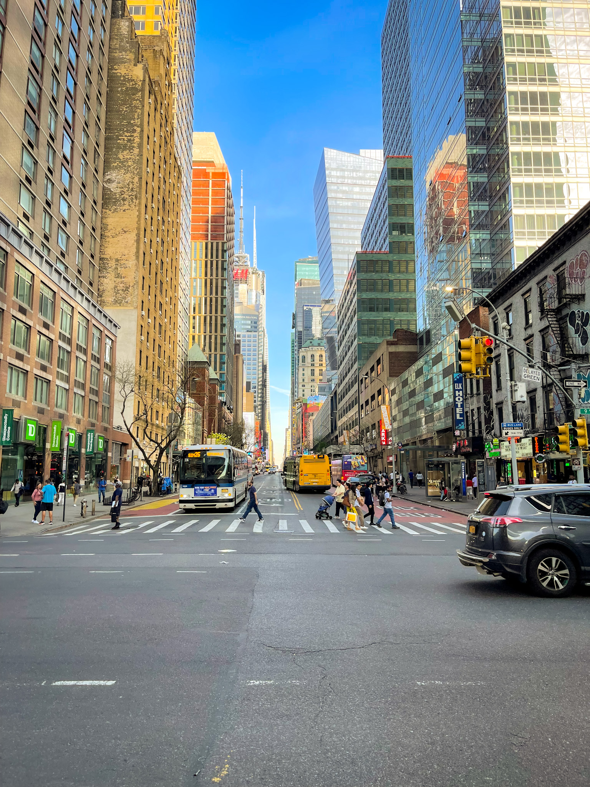 |

## Upper Manhattan

It's not geographically accurate, but I will call Upper Manhattan to be the part
from Columbus Circle to the Columbia University Campus, since the latter is the
most northern point that I explored in Manhattan.

My favorite place here is, undoubtedly, Central park. Even though it was the
beginning of spring, the park still offered pretty landscapes, with enough
greenery to almost forget that you are in the middle of the concrete jungle.
Greenery aside, the magnolias and the cherry trees stole the show, as they were
in full bloom and everyone was competing for the best photos. My Central Park
objective was to reach the Bethesda Terrace, another John Wick film set.
Luckily, I spent a lot of time in the park, from north to south, visiting places
like Belvedere Castle and Cherry Hill.

|            Central Park             |              Columbus Circle              |
| :---------------------------------: | :---------------------------------------: |
| 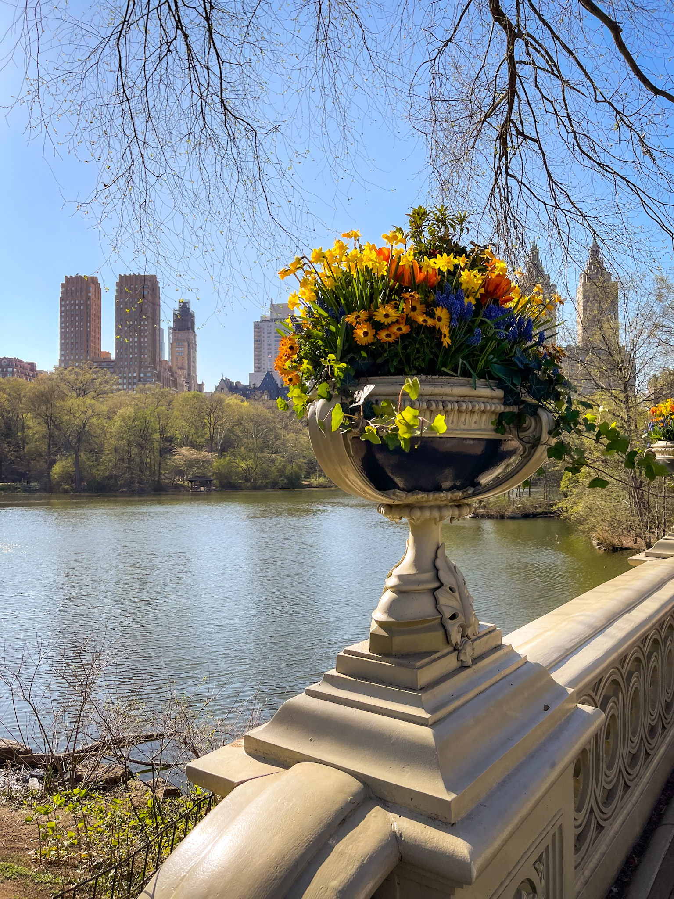 |  |

To the west of Central Park, my friend and I visited the Columbia University
Campus, and just in time too, as the students there were taking graduation
pictures. We blended in perfectly, given the fact that we look studenty
ourselves and spent most of the time taking pictures as well. It was a
refreshing experience to visit a US university campus and compare to what I've
seen in movies. After the photo shoot was over, we descendend through
Morningside Park, grabbed coffee from a nearby Starbucks on the road and went
back to Central Park to continue taking photos, this time with squirrels.

To the east of Central Park is another area that was on top of my list, given
its movies reference: the Upper East Side. The place seemed to me exactly as I'd
expected: fancy. The shops are there. The hotels are there. The restaurants. The
boutiques. Needless to say, I enjoyed the walks very much.

|             Lincoln Plaza             |           9th Avenue View            |
| :-----------------------------------: | :----------------------------------: |
| 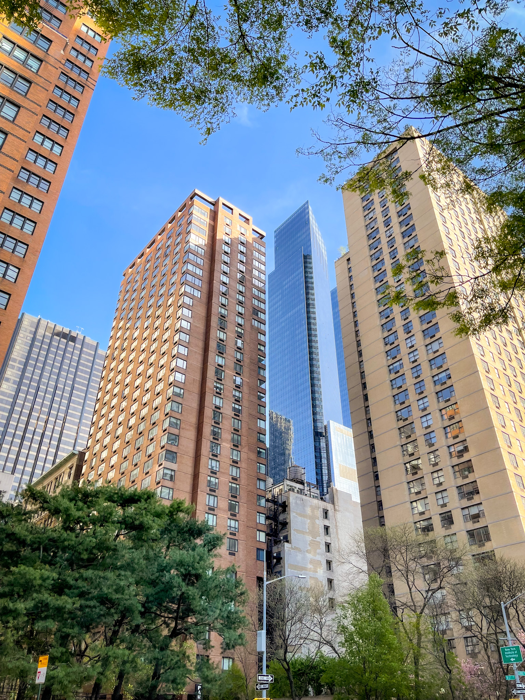 | 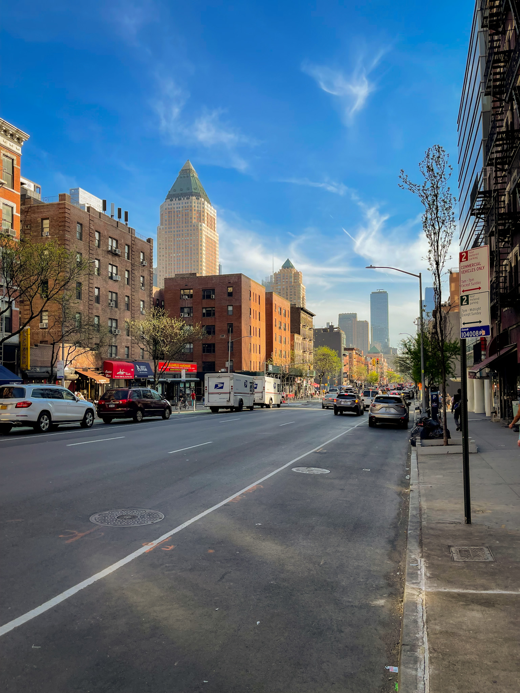 |

Also on the East Side, on the outskirts of Central Park, there's the
Metropolitan Museum, where you probably need to spend a few days in order to
fully experience it. I managed only 4 hours, I felt I was in a constant hurry,
and missed many of its offerings. I went from Ancient Egypt, Rome and Greece, to
Muslim Central and Far East Asia, early United States and everything in between.
Some of my highlights include the Egyptian ruins (yes, actual ruins in the
museum) and the American rooms arranged in the American History corner. But, to
be honest, the whole collection is something to see. Being already familiar with
art pieces from the ancient Mediterranean cultures, from many other European
museums, the American and Asian parts from the MET impressed me the most.

## Final Thoughts

There are also other places that I have been and are not covered in the lines
above, like the Rockefeller Center or Little Island. But if decide to write
about every single place or experience that impressed me in New York, I would
never finish this article, ever.

Without a shadow of a doubt, I can say that I love New York City, and that it
was one of my best ideas to spend 10 days and enjoy it as much as possible. It's
#1 on my favorite cities in the world, and I have a feeling that it will stay
there.

It also helped that my hosts were absolutely amazing, I could not have hoped for
better ones.

I was quite sad to leave, even though my holiday was far from ending. It was
time to change the scenery a bit. Next stop: Seattle.
