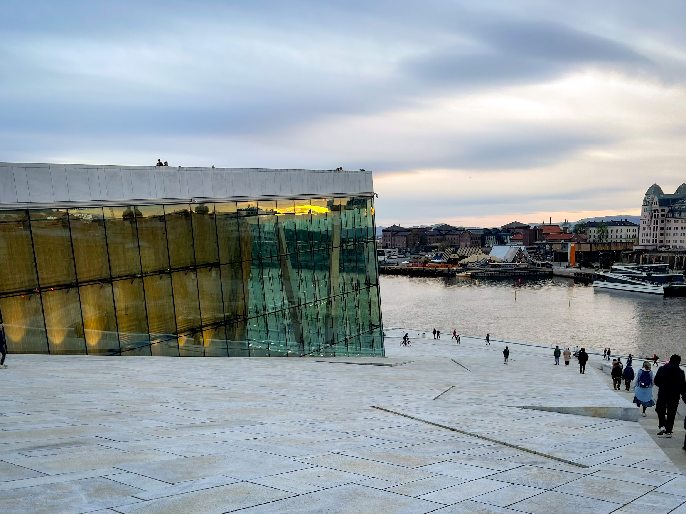
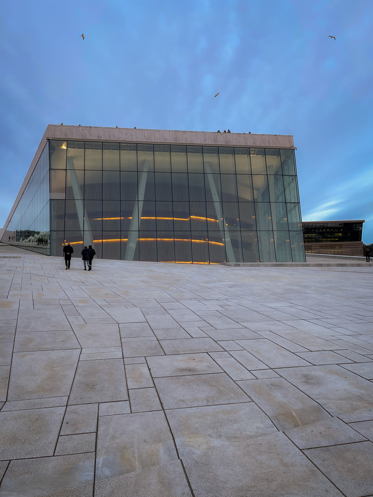
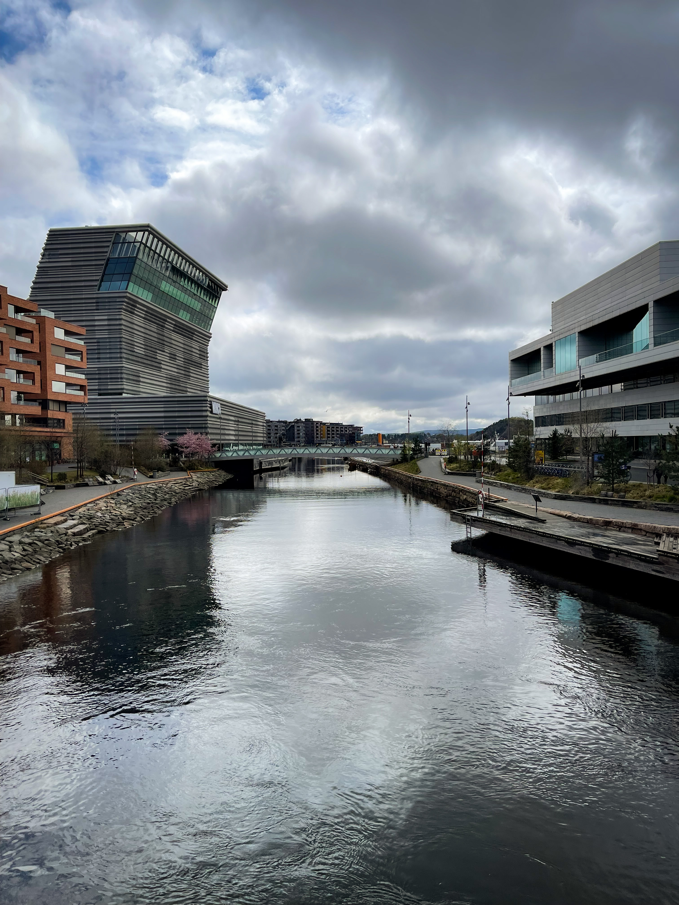
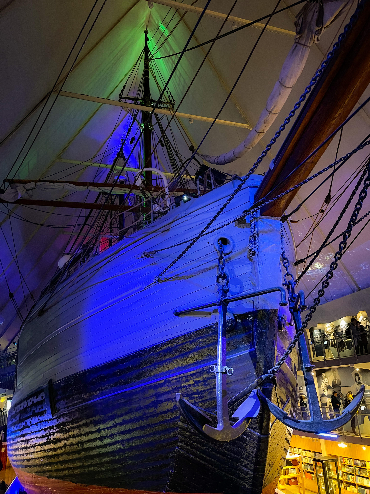
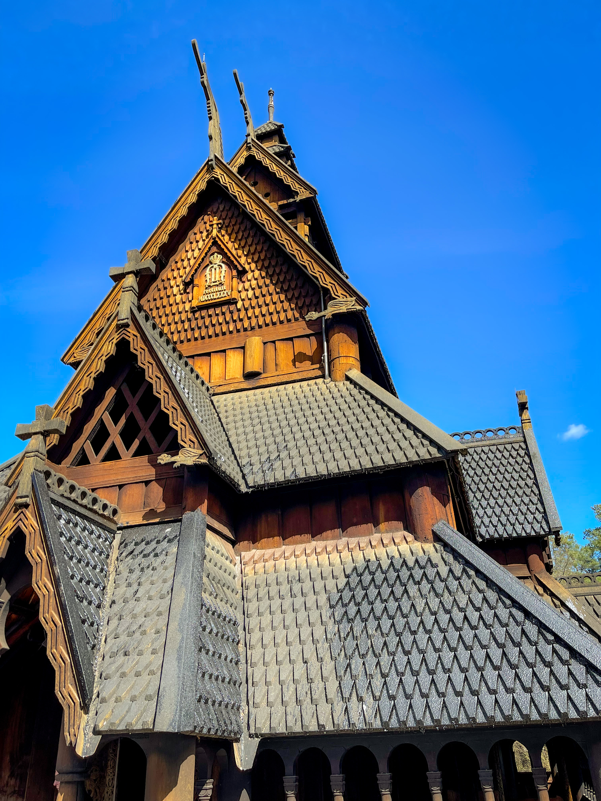

 _Photo by Silviu
Alexandru Avram_

- Q: Do you know what is better than the current trip?
- A: The next one.

It's a very catchy slogan by Delta, used in the commercial you are required to
watch before the movie starts on the flight. The annoying part is that you have
to view it every time a movie starts. The good part is that they are right.

My US trip was coming to an end and I was actually glad to be returning home,
after almost 3 weeks of being spoiled by the American Dream. Snap back to
reality, Marshall.

That being said, the magical date of the 1st of May was inching closer, and it's
very common to celebrate it while on a trip. The most popular way is to do it is
a trip to the seaside, but I was never a big fan of that. Instead, I am a big
fan of city breaks, and even though I was expecting most people to chose the
seaside or the mountains for their mini vacation, I also expected that the plane
tickets to be sold out by that time. Still, it was worth a try, so I checked
Skyscanner and, to my surprise, there were quite a few options with very good
plane ticket prices, the best being Bologna and Oslo.

Both were places I've never been before, so that got me quite excited. But which
one to pick? Sure, Bologna was going to be quite a sure shot, as Italy is always
a good idea, as I've been there so many times and it never disappointed.

On the other hand, I've never been to a Northern country, not even Denmark.
Consequently, the drive to try something new won, and we picked Oslo as the
winner, bought tickets, and breathed easier, knowing that our 1st of May already
planned for.

## Oslo by foot

I prefer walking when I'm on a trip, and Oslo was not going to be any different.
The city is very convenient for walking, with wide sidewalks, coffe shops ,
quite a few parks, and a waterfront. The waterfront areas are very sought-out
places in Oslo, both for walks, but also for living. There are quite a few of
neighbourhoods that were placed directly next to the water. Some areas also had
construction sites going on, with new apartment buildings about to rise tall.

As you would expect, these neighbourhoods have a very modern feel, with
contemporary style apartment buildings and offices, underground parking spaces
and restaurants on the first floor. I would probably not choose to live in these
kinds of places, as they seem to me quite soulless, but that's just me. On the
other hand, I do appreciate the architectural style of modern apartments next to
water canals, like a Venice built in the 21st century. Or Hamburg, even though
it has its own unique architectural flavour, which I found quite impressive.

|           Oslo Opera            |           Oslo Canal View            |
| :-----------------------------: | :----------------------------------: |
|  |  |

One such place is Tjuvholmen, and Tjuvholmen has quite a lot to offer. It has
canals with parking space for boats. It has the modern apartments and offices,
some still in construction. It has a museum. And it has one restaurant that
serves great Norwegian salmon courses, from sushi to grilled. The restaurant is
called, well, The Salmon. You wouldn't want to make any mistake when going
there. We surely did not, as the food was amazing. They know their salmon very
well, so if you're a fan, this should be a non-negotiable stop.

Another neighbourhood is Sorenaga, just behind the Oslo Opera building. It's a
very nice place for a walk during sunset and enjoy the sea view at the same
time. Turning around and going on the 162, there's the Microsoft building.
Hello, dear employer. Turning left and going back towards the Opera house, we
went through Oslo's office district, which, unlike most such districts in other
cities, this one was conveniently placed next to the city center. The modern
neighbourhood theme continues here as well, with a focus on office spaces, even
though there were many apartment buildings as well. The perfect place if you
feel like living right next to your office and and have your commute in your
pijamas.

|               Sørengautstikkeren                |         Oslo City Center          |
| :---------------------------------------------: | :-------------------------------: |
|  |  |

Of course, there's also the city center, with quite a large number of bars,
usually packed in the evening. Overall, it's your usual European city center,
with an abundance of choices for walking, shopping and drinking. I particularly
enjoyed the street leading up to the Royal Palace, Karl Johans Street, with
Norwegian flags hanging everywhere from the buildings, left and right. I did not
enter the palace, but did walk through the surrounding gardens and admired the
various statues and monuments placed there.

Continuing towards the Northeast, through the Uranienborg, a very upmarket
neighbourhood, there's Vigeland Park. Not surprisingly, I found the park to be
quite unusual, given the sculptures laying around, showing different human
feelings and stages of life. These sculptures are impressive, not doubt, but
they may not be everyone's cup of tea, as they show things like people crawling
on top of each other and screaming parents throwing away their toddlers. Life is
beautiful, but it's not all raindows and unicorns, and the Vigeland sculptures
serve as a artistic reminder of that.

## Oslo Museums

Even though we visited Oslo in May, the weather was totally not exactly May-ish.
It rained quite a bit, and the evenings became pretty chilly. Consequently, we
considered going to enjoy some of Oslo's museums, and, fortunately, there is no
shortage of that. The first pick was The Norwegian Museum of Cultural History.
It's the Norwegian equivalent of our own Muzeul Satului in Bucharest, displaying
a large number of buildings that made up rural Norway. The building collection
includes living houses, churches, stables and grain depots. In addition to the
buildings, there is also an exhibition with religious objects, clothes,
furniture and decorations.

Also very impressive is the Fram museum. No, it's not the polar bear, but it's
probably one of the most interesting museums I've ever been to, as it includes
the actual Fram exploration ship. The whole museum is actually build around the
ship, which is restored beautifully on the outside and you can also check it out
on the inside, with living quarters, cabins, kitchen, the main gathering hall
and storage areas. It is probably the most important museum to visit in Oslo, as
I don't believe there are many like it.

|             Fram Museum             |            Museum of Cultural History            |
| :---------------------------------: | :----------------------------------------------: |
|  |  |

On the more convetional side of museums, we went to the National Museum, which
includes a very impressive collection overall, not just works of Munch. It
include a large amount of paintings, architecture and design objects, and it's
definitely worth its ticket money. Of course, there is also the Munch museum,
but, unfortunately, we could not fit it in our itinerary, given the short stay.
Next time it should be number one on the list.

## Final Thoughts

Overall, it has been a very short trip, but, to be honest, it was enough. Sure,
Norway is definitely a place where I would return, but next time it might be
more about nature and less about city breaking. I'm super happy with the trip,
since it was something different and quite refreshing from my usual Italian city
breaks. If you are looking for salmon special, definitely check out Oslo, and
with that bad joke, it's time to end. Happy travels!
