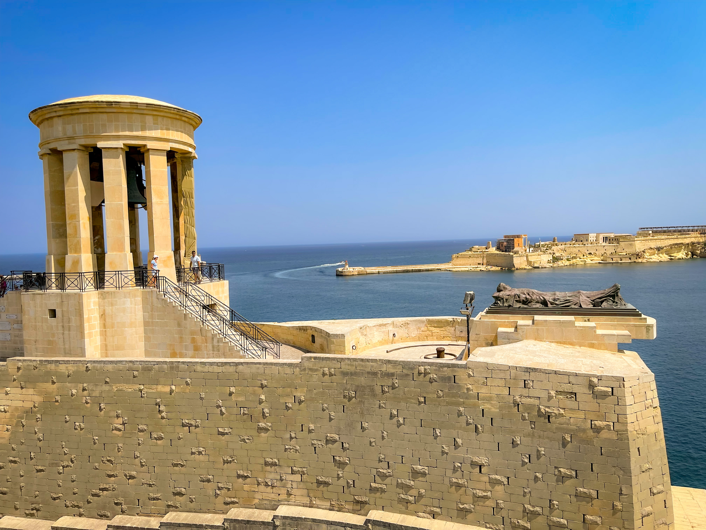
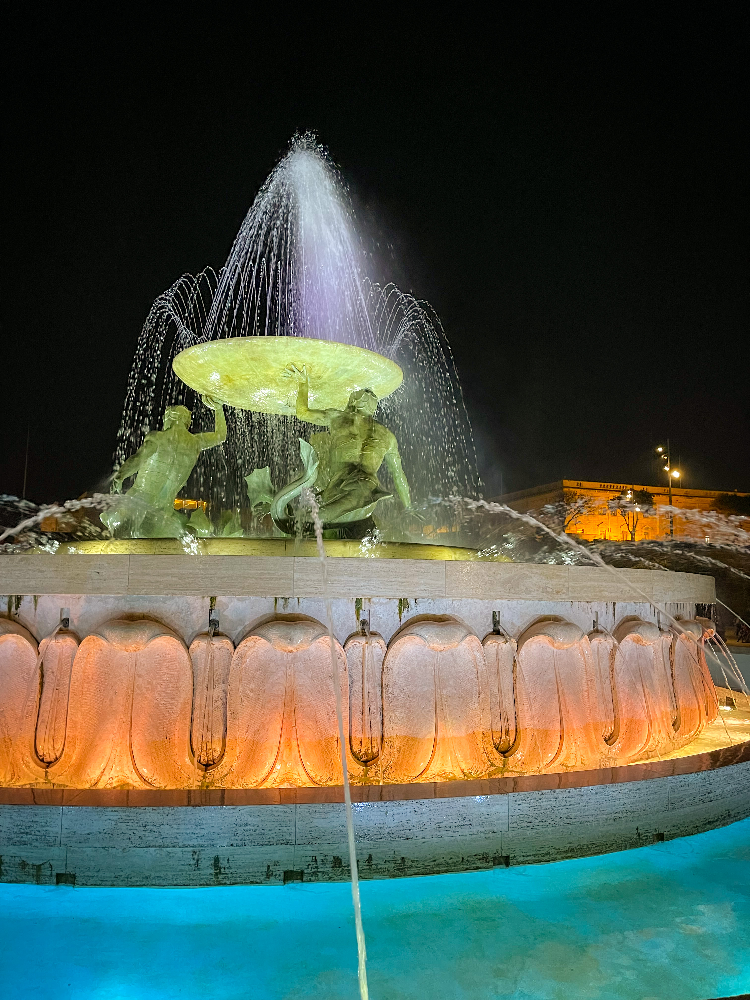
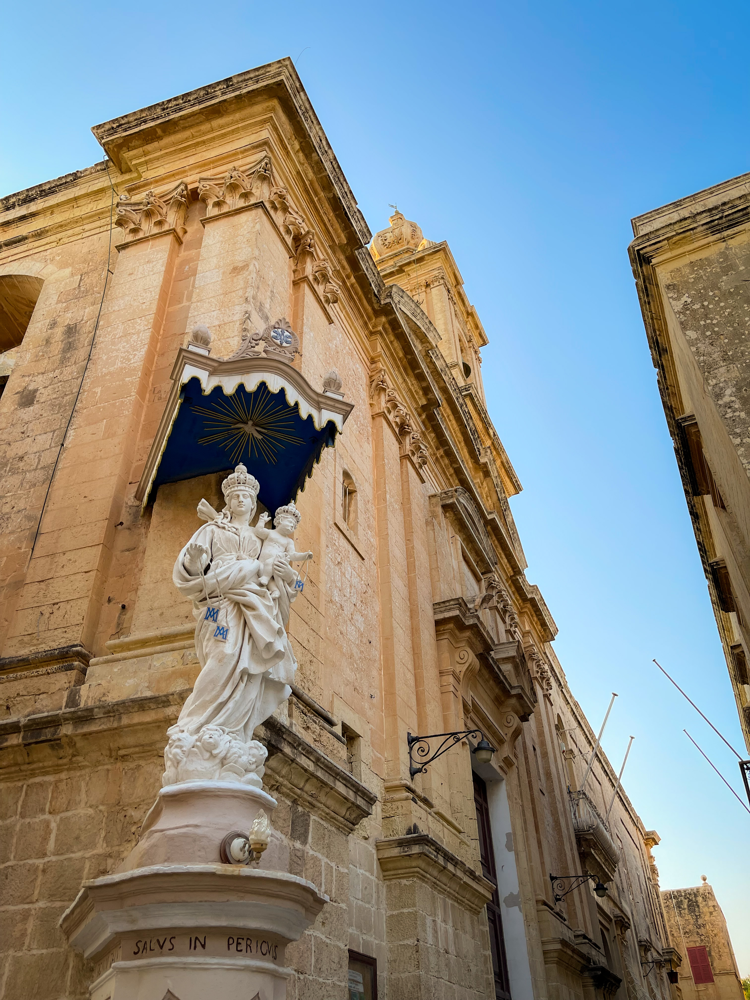
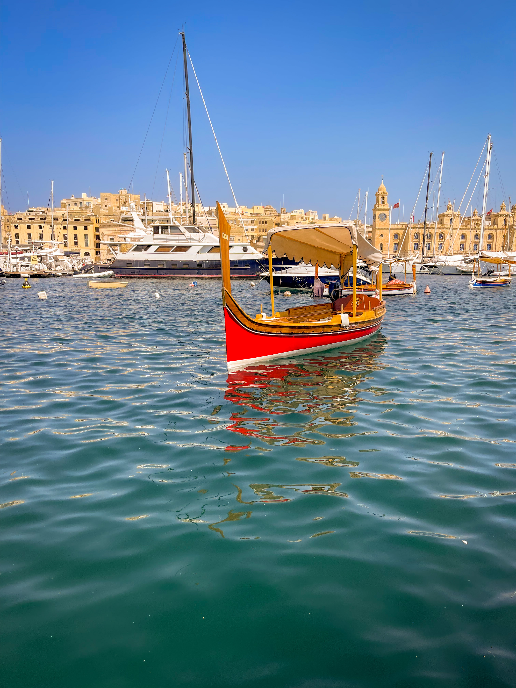
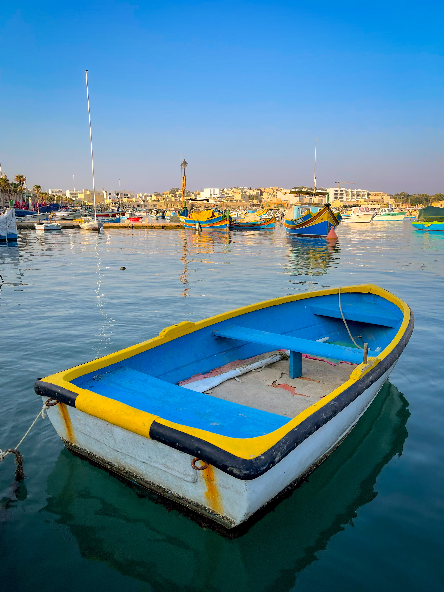

 _Photo by Silviu
Alexandru Avram_

_Who would have thought that Malta during August is so hot and humid? If you
voted "not Silviu", congratulations, 10 points to Gryffindor._

I can't say Malta was on my bucket list this year, or for the next few years.
But hey, I could say the same for Perugia and Oslo, and look how that went. For
lack of better words, 2023 has been _spontaneous_ in terms of travelling. And
it's only just September.

But back to the island in question. For such a small place, Malta is _packed_
with things to do. Wondering through narrow streets in the old towns of Valletta
and Mdina? Checked. Eating seafood on the waterfront of Marsaxlokk? Checked.
Going for a boat ride to ... anywhere, really? Not checked, but you always need
a reason to come back, right? Well, I don't know, it may be so, since I never
got to see the Last Supper and I've been to Milan three times already. The 4th
time's a charm, as they say.

But back to the island in question, again. We only got to see a handful of
places, true, but the trip was really short to begin with. And that wasn't
actually the worst part. Who would have thought that Malta during August is so
hot and humid? If you voted "not Silviu", congratulations, 10 points to
Gryffindor.

And, just like that, my list has ran out of complaints.

## Valletta

The old city is just so beautiful, authentic and unique. I had a feeling that
the whole scenery there just fits the place perfectly. The only other city where
I had this same feeling is Venice. There was nothing out of place, the hustle
and bustle seemed so natural, and it was so easy to blend in. I felt that
everyone had something to do no matter what their purpose or personality. There
were sights to see, ice cream to eat, Starbucks to enjoy, speciality coffee
shops to enjoy arrogantly, stores to shop, restaurants to eat out and bars to
drink. We did most of these things, as there was no more free space in our bags
to buy and pack anything extra.

|               Valletta Sea View               |              Valletta Street              |
| :-------------------------------------------: | :---------------------------------------: |
|  |  |

First things first. The entrance to the old city is spectacular. The Triton
Fountain, followed by the City Gate, is Valletta's way of saying that it was
worth the effort. And it's not just all mouth and no trousers. Once inside the
city, you feel like you're in another world in another century. As I already
mentioned above, it felt unique, and that everything blends in with the island.
Our hotel was just between the city gate and the main attaction, St. John's
Co-Cathedral. Sadly, we had to postpone going inside, since there was a queue
already in front of the church when we arrived, and melting in the sun waiting
was a bit extreme for us. From the outside, though, the cathedral is imposing,
but it is said that the interior is way better. Top of the list for the next
trip, I guess.

What the city lacks is the amount of trees and shade, given the general lack of
real estate. Consequently, the Upper and Lower Barrakka Gardens feel like a
couple of oases on the outskirts of the desert. There are some larger parks near
the old city as well, like the Mall or the Argotti Botanic Gardens, just in case
you need more greenery. There are, of course, more sites to visit in Valletta,
but we tried not to rush for a full day of attractions, given the fact that we
also planned to visit Mdina during the second part of the day. What definitely
won our hearts was the Valletta architecture, with warm honey limestone
buildings boasting ornamental balconies known as _gallarija_.

|              Upper Barrakka Gardens               |            The Triton Fountain            |
| :-----------------------------------------------: | :---------------------------------------: |
|  |  |

I strongly recommend a couple of places to go while in Valletta. Firstly, if you
enjoy cocktails as much as me, definitely check out Kamy Cocktail Bar, and try
some of their own trademark cocktails. The standard ones are not that
impressive, or maybe my Margarita is just out of this world. The owner of place
is a proud Liverpool fan and has a good taste in music, apart from the fact that
he knows his cocktails. And secondly, if you're in love with coffe like myself,
try Coffee Circus Lisboa, for great speciality coffee and Pasteis de Nata. Their
cold brew is fantastic. The Pasteis, I've had better, but only in Lisbon. Which
reminds me of my upcoming Lisbon trip, and I'm going to be all over those cakes.

## Mdina and Rabat

Famous for the castle, the narrow streets and the blue door on Instagram, Mdina
is a must see. The nearby Rabat is also quite nice, as it shares the narrow
streets theme with its fortified neighbour. We explored the cities during the
second part of the first day and it was just so much better outside. I believe
the air is not as humid there, otherwise I cannot explain why it felt
significantly better than the capital. The towns are also a short ride by bus
from Valletta, plus there is always the cab option. The buses have air con, and
the Ubers are not expensive at all, which helps a lot if your itinerary involves
a lot of moving around.

|            Mdina Street View             |           Mdina Blue Door            |
| :--------------------------------------: | :----------------------------------: |
|  |  |

The famous blue door is not the only picturesque spot in Mdina. There are other
colorful doors as well. And the buildings are also well maintained and
tastefully built. It's the kind of place where James Bond would get away from
his job with Madelaine. Just go through the gate with the Aston, drive casually
by St. Paul's Cathedral, park outside the house near Wesgha Ta' Sant' Agata,
grab ice cream, and enjoy life. Speaking of the cathedral, we happened across a
wedding there, and we waited to see the bride as it brings good fortune.

## The Three Cities and Marsaxlokk

The second day was hotter than the first, so we made the obvious decision and
went for a walk to the Three Cities. Vittoriosa, Senglea and Cospicua are also a
must see while in Malta, and they are only a short bus ride away from the
capital, just across the Valletta harbour. We got off in Cospicua and went by
foot towards Senglea until we reached its northern end and the Safe Heaven
Gardens. There are quite a few scenic spots here, where we could admire Valletta
in all its splendor. Senglea is particularly beautiful and has a romantic
gateaway kind of vibe, with small boutique hotels, restaurants by the waterfront
filled with boats, big and small, old and new.

The third city, Vittoriosa, is actually the peninsula next to Senglea, boasting
the impressive Fort St. Angelo, the fortified city of Birgu and its harbour full
of luxury yacths and super boats. The walk was very relaxing, and if the weather
would have been cooler, I think it would have been absolotely perfect. Not sure
if I mentioned this, but maybe not go to Malta in the summer. We went for a
coffee break at the Cafe Riche and then ordered a Bolt to Marsaxlokk.

|                    Senglea Harbour                     |                      Marsaxlokk Harbour                      |
| :----------------------------------------------------: | :----------------------------------------------------------: |
|  |  |

This small fishing town on the Western Malta coast is a great place to go for
dinner and enjoy a fish or a seafood course right next to the sea. The harbour
offers great views, but this time it's mostly filled with fishing boats rather
than luxury yachts. There is also one of those big LNG ships anchored here, and
it's quite visible from the shore. It's the first time I've seen one in real
life, and I immediately recognised it, due to its recent popularity. As the sun
set, we went for dinner, then took a walk to the beach, and in the end waited
for the bus to Valletta and called it a day.

## Final Thoughts

Malta is a great place and I am super happy to have been there. Without a doubt
it deserves at least one more visit, since it has so much more to offer. There's
also the Blue Grotto, the town of Zurrieq, the catamaran ride to the Blue
Lagoon, the megalithic temples and the list continues. Apart from the weather in
the summer, there was absolutely no inconvenience whatsoever, there is always
something to do, somewhere to go, public transport is great and overall it's not
very expensive. Definitely a place worth checking out, by all means.
