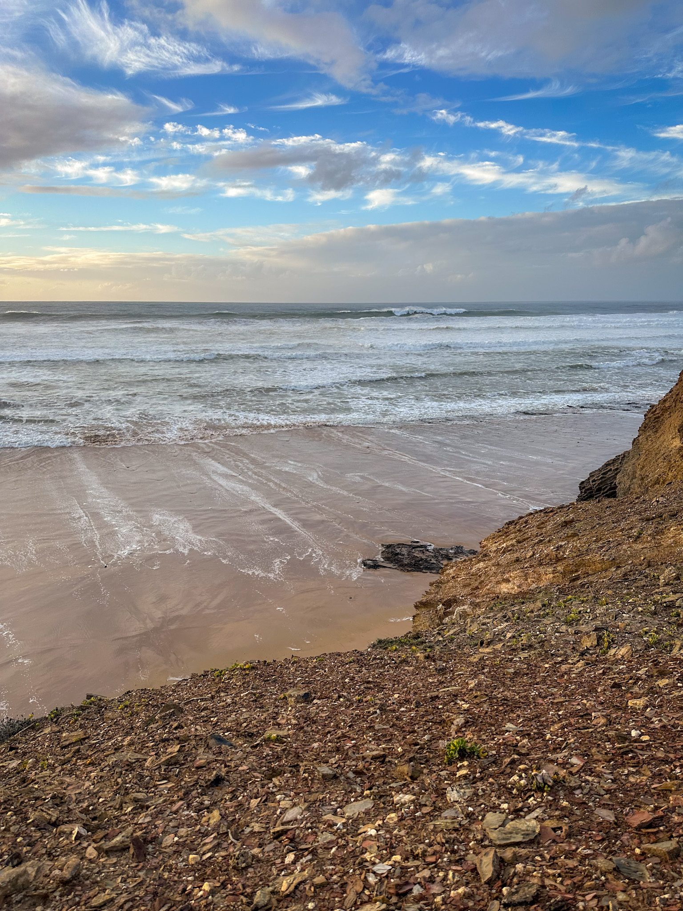
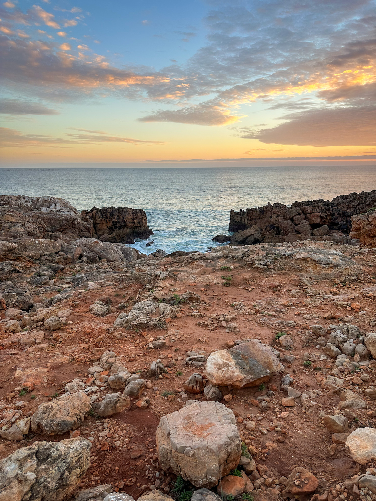
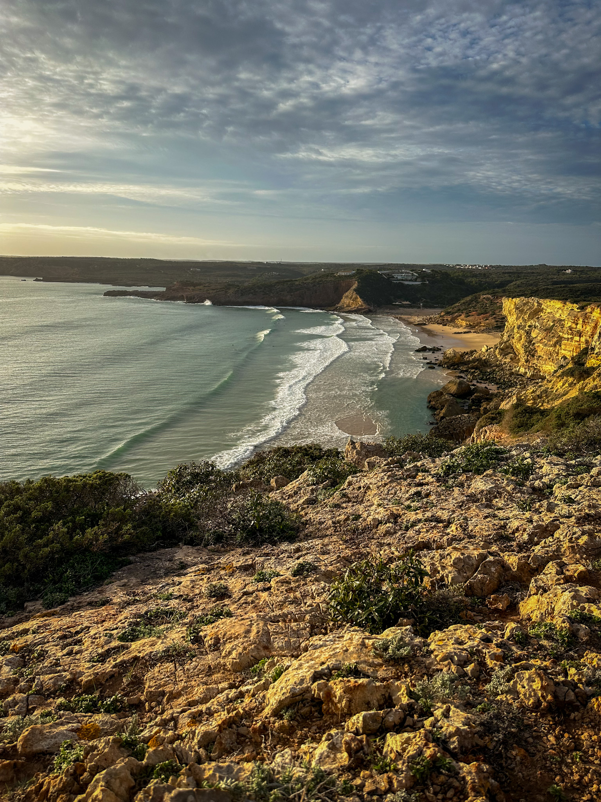

 <em
style={{textAlign: "center", display: 'block'}}>Praia de Vale Figueiras at
sunset.</em>

 

_I deserved the pizza for dinner that evening._

Portugal in November has already become a tradition for me. It's the third time
in a row when my friend and I use the Lisbon Web Summit as an excuse to go
surfing in Lagos, visit Lisbon and its surroundings, and just enjoy everything
that the south of Portugal has to offer. This year was no exception, and we had
a blast of a time spanning a couple of weeks, full of surfing, visiting, hiking
and just laying on the beach. Are we going to continue the tradition in 2024?
Probably.

## Lagos Surfing

This is the main spot where we spent most of our two weeks, in the middle of the
Algarve, one of the most beautiful areas I've ever seen, with spectacular
scenery, eye candy beaches, the best food in the world (sorry Italy) and great
weather. My priorities were, of course, surfing, hiking on the Fisherman Trail,
eating the best pancakes in the world and reading on the beach. Not necessarily
in that order.

This year, as in previous years, we chose the Surf Academy surf school for our
surfing sessions during the weekends. They are great and provide a convenient
way to organise the surf sessions, as they will know pretty well which beach to
choose during each day. They also know which spot on the beach is better to
catch waves, and during which times the tide is the best. I, for one, don't have
such expertise, and apparently neither does my friend, as we both found out when
we went one day on the beach on our own. It was terrible, we caught nothing,
except huge waves straight to the face. Never again.

Since it was already mid November, we avoided the West Coast beaches, as the
waves there were pretty huge. The surf school chose a couple of beaches in
Lagos, Porto Mos and Meia Praia, where the weaves were a bit more calm and you
could actually surf. I did catch quite a few green waves, and I think I improved
my technique overall, so next year I actually look forward to be able to also
steer on the wave, not just go straight on to the beach. Fingers crossed!

## The West Coast

|                     Praia de Vale Figueiras View                      |
| :-------------------------------------------------------------------: |
|  |

If you're not drinking, then you're not playing. It's my favorite place in the
Algarve. The beaches there are just out of this world. We went one evening the
Vale Figueiras Beach, and we reached it during the sunset. Wow. Just wow. The
lightning was perfect to take the best shots, and I took quite a few. First of
all, the ocean put on quite a show for us, the spectators with the jaws dropped.
It's probably one of the most relaxing experiences to gaze at the neverending
lines of waves, and each and every one of them performing right down the beach.
The sleepy sun rays made everything even more spectacular, and even the seagulls
seemed to participate in the whole ocean choreography. It was perfect, probably
one of the best experiences of my life.

|                      Praia de Vale Figueiras Rocky Hills                       |                                View towards the Atlantic from the top of the hill                                |
| :----------------------------------------------------------------------------: | :--------------------------------------------------------------------------------------------------------------: |
|  |  |

Another great beach is Praia da Arrifana, and this one was more surfing
friendly, as when we got there it was quite full of people, most of them with
surf boards. However, the beach is quite huge, so I did not feel crowded or
anything. On the hill overlooking the beach there's a small town where we had
lunch and coffee, at the Sea You Surf Café, and the whole experience was
complete. My friend tried to catch a few waves there, but without much success.
I settled just for some beach time and a few pictures on the left end of the
beach, where I found a spectacular terrain with rock formations raising up from
the shallow waters. It was time for some pictures.

|                 Praia da Arrifana Rock Formations                 |                Praia da Arrifana Steep and Rocky Hills                |
| :---------------------------------------------------------------: | :-------------------------------------------------------------------: |
|  |  |

## Trilho dos Pescadores

The Fisherman's Trail was one of my main objectives for the trip. It's quite a
long hiking trail on the West and South coasts, starting at Praia de São Torpes
and ending in Lagos. It consists of 226,5 km of trail that takes you through
breathtakin scenery on the Atlantic Ocean's coast. Theoretically, you need quite
a few days to do it all, maybe 12-15, and pick accomodation in the towns along
the way. It does not sound easy, even if it's not taking you through the high
mountains, but next to the sea instead. I wasn't planning to go from start to
finish, I'm not there yet, but instead I planned to hike specific parts of it,
starting backwards from Lagos, march as much as I could until I ran out of
daylight, and call my friend to pick me up with the car.

|                          Ponta da Piedade near Lagos                          |                   Praia da Luz from near Rocha Negra                    |
| :---------------------------------------------------------------------------: | :---------------------------------------------------------------------: |
|  |  |

I did a couple of such trips by myself, and it was refreshing. Just being on the
trail with only a small backpack full of water, sandwiches, sunscreen and oat
biscuits is both exciting and relaxing at the same time. My first trip started
in Lagos and I managed to go all the way to Praia da Boca do Rio, even though I
was hoping to reach the town of Salema. Unfortunately I ran out of sun, and I
was quite exhausted, so I called it a day just before the city. It's interesting
that this whole trip involves different types of scenery, and no two parts of
the hike were the same. I enjoyed steep cliffs and grottos from Lagos to Porto
Mos and quite arid cliffs up until Praia da Luz. Starting from Luz and all the
way to Burgau, the terrain is still quite arid, but I was delighted to see some
beautiful gulfs, and it was quite something to just sit on top of the hills and
rest while the ocean was throwing its waves towards the land, over and over.

|                Gulf near Praia da Zora                 |                     Uphill view of a climb near Praia das Furnas                     |
| :----------------------------------------------------: | :----------------------------------------------------------------------------------: |
|  |  |

I arrived in Burgau, a very nice town which reminded me of a typical Greek town
on the sea, with similar white houses that exuded the salty air of vacation,
surrounded by palm trees and paperflower vines. After exiting Burgau, the trail
tood me through a field of cacti, and it was pleasant for me to see them out in
the wild, as I also have quite a few at home. This part of the trail was my
favorite, since it had more greenery and a few spots of forest. It also helped
that, being near the end of my trail, the sun was setting and the light became
perfect. However, it's also the time I realised that I need to finish the trail
or at least go to some place where I could call my friend to pick me up, as
ending on the trail during the night, without proper equipment was no joke. So I
raced to the finish line, which was the town of Salema, but it was really too
late, so I settled for Praia da Boca do Rio and called it a hike. I deserved the
pizza for dinner that evening.

|                              Praia das Furnas                               |                    Gulf near Zavial                    |
| :-------------------------------------------------------------------------: | :----------------------------------------------------: |
|  |                  |
|                              Gulf near Zavial                               |             Cactii in the wild near Burgau             |
|                                |  |

A few days later it was time for part two, so I took the bus that left me in the
middle of some road, and I walked from there to Salema and resumed the trail.
The plan was to go all the way to Sagres, but I arrived simply too late to start
the hike and I was unable to reach it. On the flip side, I did arrive to some
great beaches that were absolutely fantastic to look at. The trail also became
even better for my taste, as it was even greener and I started to also go
through forests and shrubbery. Praia da Figueira was quite a sight, and
afterwards the trail had to exit the seaside to go through some countryside
instead. Quite an interesting change of scenery, I liked it. After that part of
the trail I ended on the Praia das Furnas, and I had the chance to enjoy some
art as well. There are some circles made of stone, overlooking a grotto, and the
whole scene is picture perfect. Back on the trail and the scenery simply just
did not stop amazing me. The highlight was Praia do Zavial, and I had to make a
couple of stops to gave upon it, on each of its ends. The lines of waves were
pefect, hence the number of surfers in the water.

|                            Praia do Zavial                             |             Uphill trail near Praia do Zavial             |
| :--------------------------------------------------------------------: | :-------------------------------------------------------: |
|  |  |

After the beach, I went back on the trail and I started to feel the overall
exhaustion. I started to realise I was not going to reach Sagres, so I just
admitted the fact and did not hurry up the pace, as I was content with the
experience up until that point. Nevertheless, I found more spectacular gulfs,
like the Forte e Bateria do Zavial, and more beautiful beaches like the Praia da
Ingrina, where I raised the white flag and stopped for good. It was enough
hiking for one trip, and I enjoyed every bit of it.

|    Sky seemed to be on fire at sunset, near Praia da Ingrina    |
| :-------------------------------------------------------------: |
|  |

## Lisbon

My friend, we meet again. There are some feelings in this wonderful city that
are simply unique in the world. Driving on the Vasco da Gama bridge is one of
them. Climbing to one of the many view ponints, or miraduros, and enjoying the
view of the bay is another. With some pasteis de nata, it's even better. But the
best feeling is enjoying them on the spot, with a dash of cinnamon. You can
confortably skip the coffee, save it for later. It so happens that each time I'm
in Lisbon I discover completely new things about it, and that makes me want to
return again and again. This time, for instance, I used the bay area for jogging
and it was a breeze. Dad joke out of the way, checked.

Since our apartment was located near the Pantheon, my walks were focused in that
area, even though, this time, I did not spend as much time in Lisbon as I din
previously. The Pantheon area might seem a bit strange, but it has one of the
best places to eat in the city. Hear me out. I tried a couple of local, no fuss
restaurants, and the food was delicious. When in Lisbon, always go for seafood
and fish. I ordered octopus, shrimp and tuna steak, and all of them were
fabulous. These couple of places I tried are called O Tasco do Vigário and A
Parreirinha do Paraíso. The people were super friendly and I was treated really
well.

|                 Lisbon Pantheon                  |               Lisbon alley                |
| :----------------------------------------------: | :---------------------------------------: |
|  |  |

However, the cherry on top was actually nothing related to fish or seafood. When
in Lisbon, you must, and believe me, you must go to Affair Restaurante & Bar and
get the entrecôte. I never had one in my life, at least not a full one, I am not
a fan of beef or fat. But this one, oh my Lord. It was pudding of magic in the
mouth. A-ma-zing. The other things I ordered were really good as well. You must
try this restaurant when you visit Lisbon, otherwise the trip is a waste.

Equally great about the neighbourhood were the brunch spots, and my favorite was
Augusto Lisboa. Not that much to choose from, but everything was spot on. And
the coffee, equally perfect. Try the iced latte. Thank me later. Quase Café is
also nice, but not nearly as good. You'll figure this out when you'll see the
queue.

Now, I did mention that I did not spend too much time in Lisbon this time.
That's because I chose to visit a couple of towns near Lisbon that are equally
famous and everyone recommended them to me previously: Sintra and Cascais.

## Sintra

Picture this. You are a noble. You have tons of money, lots of style, blue blood
and you like castles. You also like going to the beach, get a tan, enjoy the
waves. But you also like hiking through forests, maybe go hunting from time to
time. You don't want your castle to be isolated either, you also want to go out
from time to time, greet the crowds and whatnot. And you want some place to have
all of this possible. Welcome to Sintra. It's a hilly landscape, surrounded by
trees, 15km from the Atlantic Ocean. And it has, you guessed it, a lot of
castles.

Fortunately, getting to Sintra is super easy. You just get the train from Rossio
station, and it's a nice ride that lasts less than an hour. Once I got there
myself, I quickly understood why it was such a popular place. It's gorgeaus. The
town itself is not very big, but it's cosy, with stylishly decorated houses on
curvy streets that hug the hills full of forests. The bad news is that the
nobles who commissioned the castled did so on the very hilltops. And the train
station is at the base of Sintra, so you kind of need to go up and climb a lot.
Of course, there's the option of taking a cab.

|              The Park in Sintra on the way to the castles               |              The forest surrounding the Sintra Castles               |
| :---------------------------------------------------------------------: | :------------------------------------------------------------------: |
|  |  |

But there's no fun in that, so I grabbed a bottle of water and went for the
climb. The first part was the trickiest, since it involved trying to correctly
pick the streets in town. I believe at some point the road went straight through
a bar. I'm not even joking. But at some point I made a left and I was out of the
normal roads and on the actual trail. This first part of the hike was very
beautiful, as it went through a botanical garden, and I love them botanical
gardens. Sadly, I could not enjoy the place that much, as I had to reach the
castles as well, so I went further on the trail and took pictures for later.
After a while, the park ended and I found myself in the forest. The trail was
still there, but now the landscape turned out to be more natural, and it was
equally satisfying. Imagine hiking through the woods, and from time to time you
encounter a view point, where there's a clearing, and seeing the castles of
Sintra in the distance. Quite a unique experience, if you ask me.

I reached the first of the two main objectives of the day, the Castelo dos
Mouros. It's more like a fortress, capable of defending the area as it sits
quite high and has great views of its surroundings. It's well worth the visit,
not only for the views, but also for admiring a very well maintained fotress,
built by the Arabs in the 10th century. It's incredible how well the site has
been preserved, you could swear it was built just recently. I ended up doing a
full castle circle and admired all the views, since all of them were both
incredible and unique. You have a view of the Atlantc Ocean, which is right
there, you can probably see Cabo da Roca. Then there are views over Sintra,
obviously, and also towards the other atraction of the day, Palácio Nacional da
Pena.

|                 The Moorish Castle                  |                     View of the Atlantic from the Moorish Castle                     |
| :-------------------------------------------------: | :----------------------------------------------------------------------------------: |
|  |  |

Now, this second castle is indeed an actual proper chateau, built for the actual
Portuguese royalty. On the exterior, the National Palace of pena is marvelous
and it definitely gave me Disneyland vibes, given its architectural style and
the rich combination of colours. It's also surrounded by a very large domain
that acts as a park, and even though there is more climbing to be done, it's a
very pleasant walk. Inside the castle it's nothign that special, but it's nice
enough, as there are many rooms that belonged to king Ferdinand and queen Maria
and display a generous collection of furniture and decorations. Unfortunately, I
was in a queue of people that moves quite slowly during the whole tour, and that
part was not exactly my cup of tea, but it's understandable due to the structure
of the tour and the number of people wanting to visit.

|                 A view of the Pena Palace from below                 |                         Pena Palance from its courtyard                         |
| :------------------------------------------------------------------: | :-----------------------------------------------------------------------------: |
|  |  |

With the tour done, I returned to Sintra by the same road, only this time it was
downhill, and stopped at the local Starbucks for some late lunch and a glass of
iced matcha latte. It was a very well spent day, I enjoyed the town so much, the
castled were impressive and the views even more so. I took the train back to
Lisbon and searched for dinner.

## Cascais

My second recomandation to visit near Lisbon is the coastal town of Cascais. The
next day after the Sintra trip, I boarded the train from Cais do Sodré and
enjoyed a similar trip to the one I had the day before. It was great to be able
to use well thought transportation infrastructure in order to get around, so
kudos to Portugal for that. In places such as the Amalfi Coast or Sicily, the
lack of proper public transportation is pretty annoying, at least to me, but in
Lisbon everything was spot on.

I arrived in Cascais and immediately felt in love with it. It's a place where
you immediately feel like you're on a proper holiday, and start thinking only
about laying in the sand, playing beach volleyball, surfing and long walks by
the sea. The town is very pretty overall, and there's a lot of shopping to be
done in the center. What I liked very much was the Marina, and I took my time to
walk around it and admire the boats that were moored at that time. I continued
my walk around the coast and eventually reached Boca do Inferno, which is a very
beautiful display of oceanfront cliffs that were carved by the relentless waves
into an open cave. A great spot to admire, but, to be fair, the whole coast is
equally beautiful, so I exited the main road in order to hop on the cliffs and
try to get closer to the water, so I could get a better view.

|             The Cascais Marina              |              Boca do Inferno near Cascais              |
| :-----------------------------------------: | :----------------------------------------------------: |
|  |  |

After walking for some time on the coast, I reached Guia Lighthouse and decided
to head back to town, as there wasn't anything else on the way to visit, at
least not within walking distance. I rented a bike on my way back, parked the
thing in a designated parking lot, and went to have a very late brunch.
Afterwards, it was back to Lisbon, as I was already feeling a bit tired from all
the trips I had during those two weeks.

## The End

Portugal is probably my favorite country to travel to, so far, even though I
hardly had a chance to explore it further. On my list there's Madeira, the
Azores and Porto at the very least, and I hope to travel to these places soon.
It's a very beautiful country, with very friendly people, great infrastructure,
the best food in the world (again, sorry Italy), impressive history and with so
much more to offer. I love it, and I look forward to visit it at least once
every year, kind of like a tradition. Thank you, Web Summit, for giving me the
excuse to discover such a great place!
