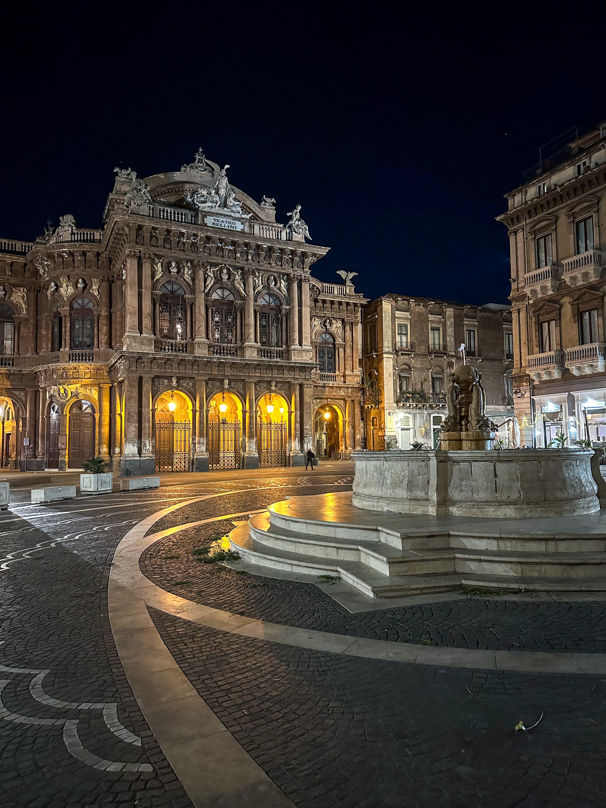

<em style={{textAlign: "center", display: 'block'}}>View of Etna from the
Ancient Theatre in Taormina.</em>

 

_The food was delicious, from the Tagliere di Salumi e Formaggi to the Pesce
Spada a Siciliana._

I had Sicily in mind for some time, and going to Catania was definitely
something I looked forward to. Initially, Palermo was the preferred destination,
until I realised I bought the tickets for
[Naples](https://silviuaavram.com/naples-2023) instead. Anyway, Catania was
supposed to be better as it was closer to Etna and Taormina, so off we went to
this place full of history. And cannoli.

## Catania

After arriving at the airport and getting into the car, I realised that I'm
about to drive in Siciliy and that came a bit scary. Oh, and the parking. Bad
move. However, after leaving the airport and arriving into town, I realised it's
actually pretty straightforward. People are actually quite nice, since I did not
know the way and struggled at times. If I was doing the same in Bucharest,
outward chaos whould have ensued. Parking was a bit of a hassle, due to the
limited space, but once we found a spot, we payed at a nearby parking meter and
went on with our business. Quite nice.

The apartment was near the Teatro Massimo Bellini, a very popular and
charismatic place with a plaza in front. Apparently, we stayed in (or near, I
did not quite understand) a building that was built by Mussolini. Yeaaah.
Anyway, it was close to the center, where we could stroll on the Via Etnea and
explore the shops and restaurants, and there were quite a few of them. The place
was quite popular all day long, and we enjoyed the very lively atmosphere, as
well as the nearby monuments of Sant'Agata church, University Square and the
Elephant Fountain.

|                Basilica Cattedrale di Sant'Agata                 |                 Teatro Massimo Bellini                  |
| :--------------------------------------------------------------: | :-----------------------------------------------------: |
|  |  |

Near the Etnea we found a very good (quite excelent, actually) restaurant,
Deliziosa, and we enjoyed it so much we went there twice. The food was
delicious, from the Tagliere di Salumi e Formaggi to the Pesce Spada a
Siciliana. Again, most excelent, would totally return. Also near the center is
the fish market, and it's exactly what you would expect from a good ol' Sicilian
market. If you're into fried fish, make sure to check out Scirocco. If you're
into a coffee spot with a quite charming host that does magic tricks, go to
Ciao. I must say, overall, the whole experience was pretty unique.

We also walked away from the center a few times, but the sights were not as
impressive. Sure, the city does have its charm, and there's no denying that it
has rich history and charm, but it does feel that it needs a little more
maintenance. And it's such a shame, given the city's potential. We walked
towards the waterfront then through San Cristoforo all the way to the Porta
Garibaldi, and although it was a relaxing walk, there was nothing much to see.
Also, towards the north, the Piazza Carlo Alberto di Savoia is, again, not the
best of sights. We had a pretty standard Italian coffee at a nearby coffee shop,
ate a brioche and went back towards San Berillo.

## Taormina and Aci Trezza

The weather proved to be better than expected, so we took the car one day for a
trip to Taormina, which was top of the go-to list. Once there, we parked and
went into town, and again, even though the place was undenyingly beautiful, it
felt that that it was not as great as we had hoped. Maybe the fact that we went
there in November did not help either, and many places and restaurants were
closed. We did find the Ancient Theatre open, and it was a great sight to see
the Etna from this impressive monument built by the ancient Greeks. The weather
was sunny and we were lucky to see the wonderful volcano in the distance very
clearly. And it was incredible, I could've stared at it forever. The trip was
totally worth it, even though we could not find much to do in the town itself.

|               Taormina Building               |           Aci Trezza            |
| :-------------------------------------------: | :-----------------------------: |
|  |  |

Consequently, we went back in the car and drove towards Catania, only to stop on
the way in Aci Trezza, a small town on the beach. We went for a walk on the
waterfront, enjoyed the town'n port and took pictures of the Cyclops.
Unfortunately, apart from this, there was nothing else to do, so we turned back
and drove all the way to Catania airport.

## Wrapping up

I'm going back to Sicily for sure, and will try to visit Palermo and the
surroundings next time, maybe even Syracuse, given its rich ancient history. I
did like the trip, for sure, although it was not my favorite out of 2023. Maybe
the Palermo option will be different, let's see, there's only one way to find
out.
