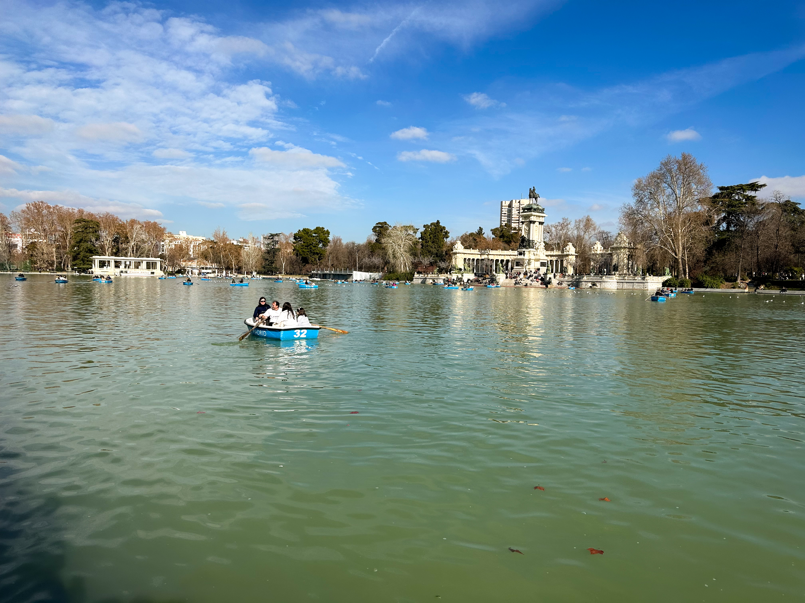
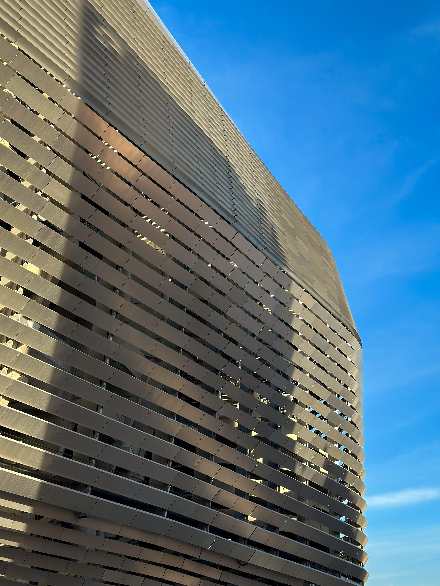

 <em
style={{textAlign: "center", display: 'block'}}>View over the lake in Parco del
Rotiro.</em>

 

_Truth be told, I don't mind palm trees with Christmas lights. I could live with
that._

Today, damas y caballeros, we stay in beautiful Spain, but this time we leave
the sunny South for Mardrid, the capital of football, culture and, well, Spain.
It was a long time coming, and I was super excited to start 2024 travelling
season with this one. I had high expectations, given the reviews I received from
my friends, and, honestly, I was still amazed by what the city had to offer.

## Royal Palace and Surroundings

If you like your trips cultural, you're in the right place. We started the trip
with the Royal Palace of Madrid, and, Dios mio, what a start. I've seen palaces
and museum, and quite plenty, until that point, but the Royal Palace of Madrid
exceeded my expectation by far. If you think you know already the meaning of
tasteful luxury, visit this place and reset your standards. Every single piece
of furniture, tapestry, design and artwork was exactly where it was supposed to
be, and the level of detail for every single one of them was incredible, from
engravings to finishing touches. They don't let you take pictures inside, and
it's really a shame, as it's probably one of the most exquisite places you could
feast your eyes upon.

|                  Catedral de la Almueda                   |            Room inside Royal Palace of Madrid            |
| :-------------------------------------------------------: | :------------------------------------------------------: |
|  |  |

We left the palace exactly when it was closing time, so there was no more time
left to visit the Almueda Cathedral unfortunately, but we did enjoy a very nice
walk around Plaza de la Almeria, and took some pictures with Campo del Moro in
the background. Quite close to the palace there's the Mercado de San Miguel,
which is quite a great place to stop by for an hour or two and enjoy some
empanadas and cervejas. Back to the hotel and ready for another day. We stayed
at the Room Mate Alba Hotel, which is located in the city center, but in a very
quiet area, and the hotel itself is quite nice. Between the Mercado and the
hotel we passed through Plaza Mayor, which is another landmark worth checking
out, given its surrounding buildings, coffee shops and vibrant atmosphere.

## Prado Museum, El Rotiro Park, Food and Coffee

Prado Museum is probably a must go if you're going to Madrid, and for good
reason, since it boasts such a vast collection of art pieces from artists such
as Francisco Goya and Diego Velazquez. You could spend a few days here without a
doubt, but we also had some other places in mind so we were happy to be done in
just a few hours. Outside, there's the beautiful park El Retiro, with its
signature pond decorated with the colonnades of the Alfonso XII monument. It was
a great walk to bask in the sun and forget that it's the middle of January for a
few hours. Right next to the park there's also the botanical garden, which would
have been a better pick in any other season, but we still enjoyed the impressive
collection of bonsai trees.

|                 Monument of Alfonso XII                 |              Madrid Street at Dusk               |
| :-----------------------------------------------------: | :----------------------------------------------: |
|  |  |

After leaving the botanical garden we went for a stroll through the upscale Goya
neighbourhood. It's nice over here. All buildings are very, very well
maintained, and they are simply beautiful and elegant. The city is just amazing,
I don't think I encountered anything that was either bad or at least "could be
better". Maybe the coffee was not as great as in other places, but there were
some coffee shops that were quite good, for instance the Norah Coffee & Brunch
in Goya. Don't forget to try the sweets. Another great option is Pascal
Specialty Coffee & Brunch, which was closer to the hotel, and features a brunch
selection more on the healthy side. If the coffee could have been better, the
food was actually amazing. Spain has great food, without a doubt, and other
places we could recommend in Madrid are Los Porfiados, for a cozy dinner, or
Fiaschetteria La Saletta, if you crave Italian. Other coffee options worth
mentioning are Alchemy and Dale.

## Santiago Bernabeu, Sorolla Museum and Gran Via

I'm not much into football, but when I watch it's most probably a Real Madrid
game, either in La Liga or Champions League. Visiting the Santiago Bernabeu was
something I really wanted to do, especially now with the updates it received.
From the outside it's quite a piece of art, I love the facade with its gray
shiny blades. On the inside, well, it's huge there are lots of big screens
everywhere and a retractable roof, letting you know that it's proudly
representing the 21st century. We could not enter the locker rooms, which was
quite a shame, but at least we saw the hall of trophies, and there are a lot of
them. This team knows what winning is about.

|               Santiago Bernabeu Stadium               |                 Gran Via                  |
| :---------------------------------------------------: | :---------------------------------------: |
|  |  |

After we left the stadium we went back towards the city center by foot and we
stopped at the Sorolla Museum on the way. It's actually the former house and
studio of Joaquin Sorolla, who travelled throughout Spain in order to create a
considerable collection of paintings. The art pieces inside the museum are
organised in a timeline manner, so we could follow along his interests and
favorite places as he aged, from his home city of Valencia, to the Spanish
countryside and the capital of Madrid, where he was very passionate about his
garden. The garden itself is a great place to relax on a bench, looking at the
pond and enjoying the shade of the trees.

|                 Sorolla Museum Garden                 |                  Sorolla Museum Interior                  |
| :---------------------------------------------------: | :-------------------------------------------------------: |
|  |  |

The last but not least landmark I would like to mention is the Gran Via, and I
would not miss it especially during the night, when I believe it really shines.
Both the buildings, the landmarks and the street itself are spoiled by huge
amount of light and it's a great way to end the day with a stroll to the shops
and just enjyoing the vibrant heart of this otherwise amazing city. It's trully
a great city, and probably one of my favorites so far. It's amazingly beautiful,
it does not seem to be that crowded, the people are friendly, the food is great,
the weather is pleasant and there are so many things to do. I would definitely
come back here one day, definitely on a Real Madrid match day. Looking forward,
hasta luego!
