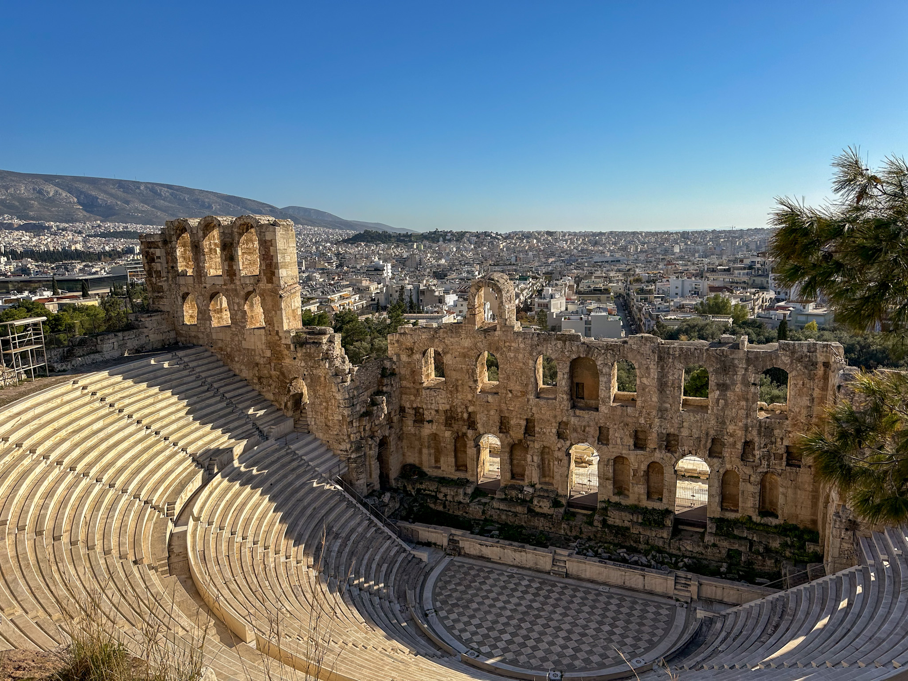
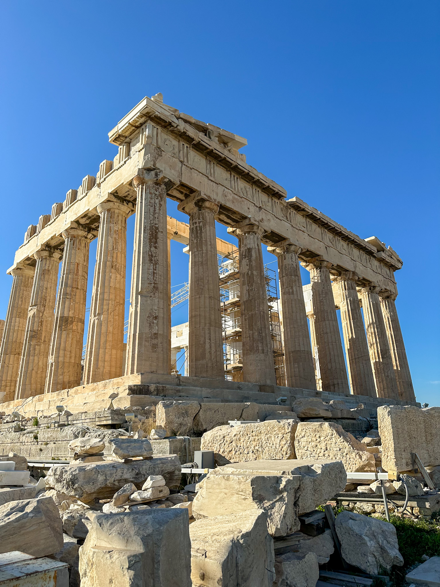
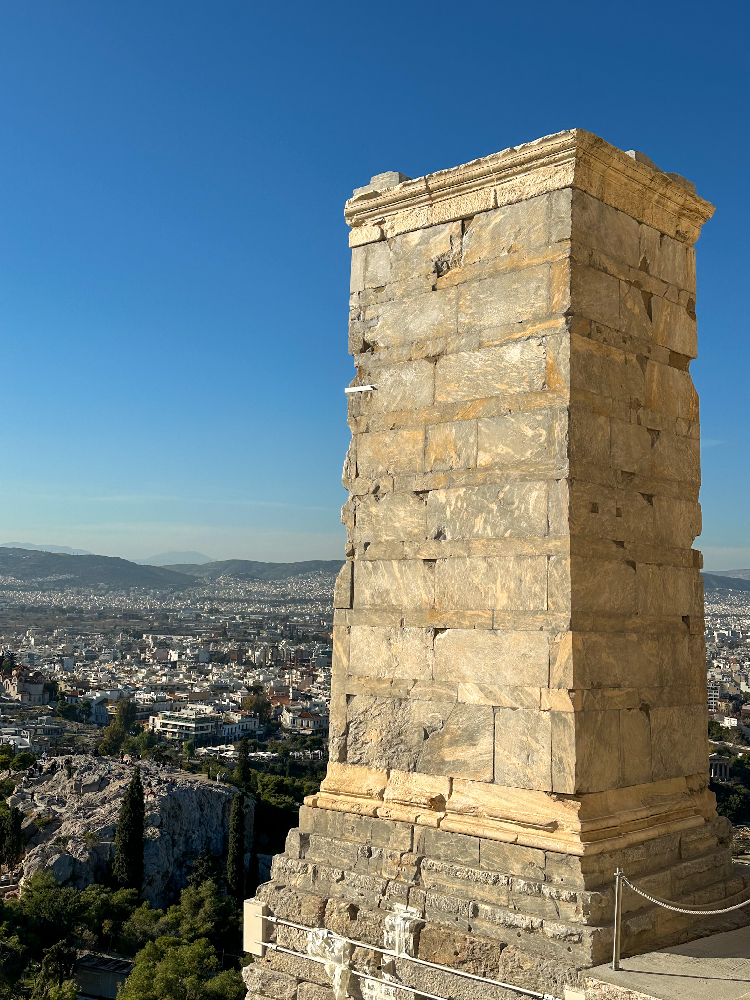
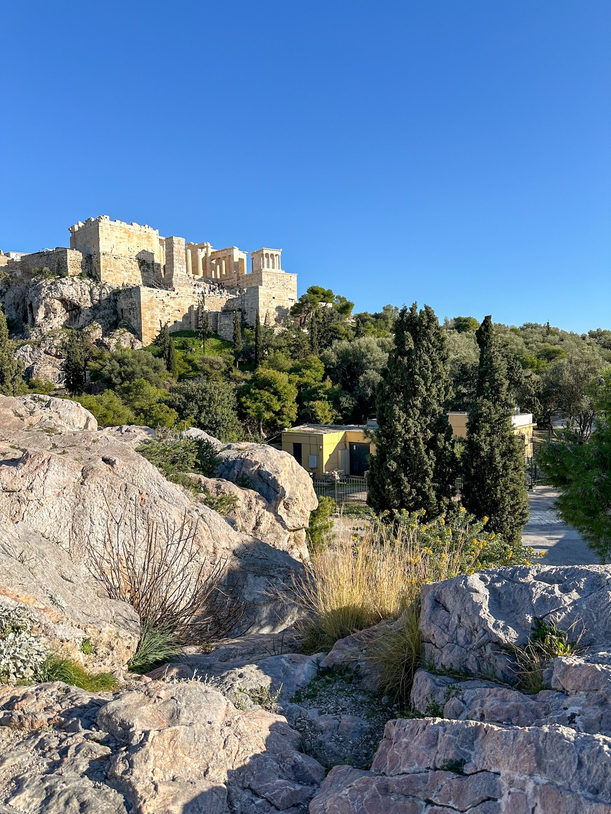
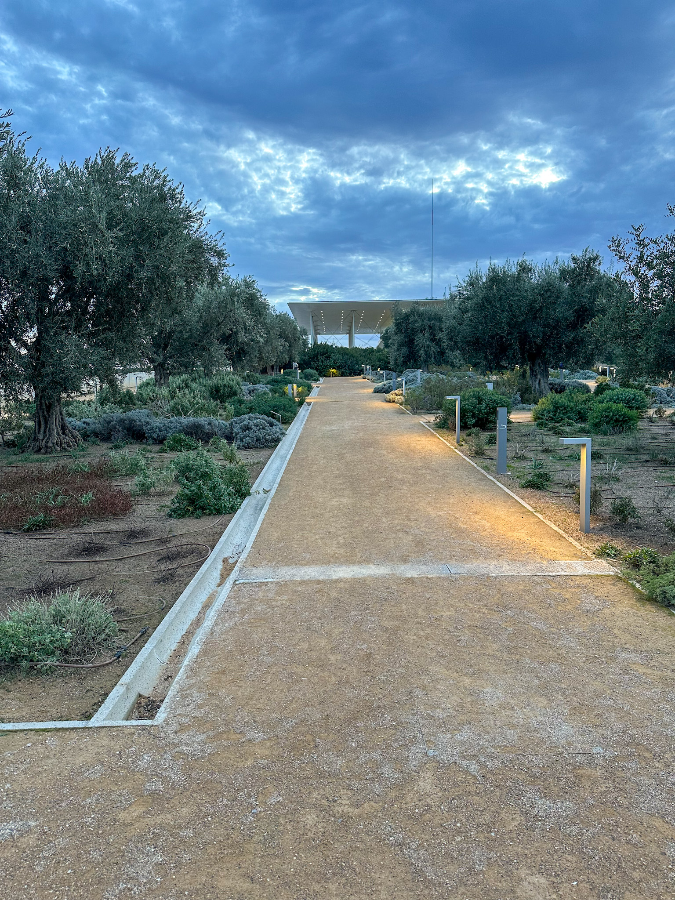

 <em
style={{textAlign: "center", display: 'block'}}>The Odeon of Herodes
Atticus.</em>

 

_But anyway, here I was, Syntagma square, baby._

Ever had that urge to just go some place, do nothing but eat, chill, have a few
walks with some coffee in between. Well, folks, how about some Athens in
February? After enjoying Madrid and Malaga in January and December, I developed
quite a passion for Mediterranean destinations during winter. All I wanted was
some place that was still warm, not that crowded but still offering relevant
stuff to do. And Athens really hit the nail in the head on this one.

Also, as a side note, notice that I'm writing about my February trip at the end
of September. I'm quite behind on this little travel blog I have going on, and I
decided to cut my articles short. I'll focus only on the good stuff, throw some
of the best pictures and I'll wrap it up sooner than expected. I'm not going
aiming to turn this blog into the Song of Ice and Fire.

## Athens Food & Walks

So, Athens. A very short flight from Bucharest. The train from the airport to
the city center takes longer than the flight, and it's even less enjoyable. That
says a lot considering I travelled low cost. But anyway, here I was, Syntagma
square, baby. I took my bags and went by bus to Koukaki, this popular
neighbourhood right next to old town, with more restaurants, bars and cats than
you can count. So, what's so special about the place? Well, it's the chill place
full of stuff to eat and drink that I was looking for. Found the local coffee
shop, Caffeine Dealer, and realised that Espresso Freddo and Iced Flat Whites
are a thing. Completely changed my life, this. As for eating, hmm, I would
probably say Karimino, Neratzia and Bite Box are quite nice, with both brunchy
things but also late meals.

|           Building on the Acropolis           |             View of Athens from the Acropolis              |
| :-------------------------------------------: | :--------------------------------------------------------: |
|  |  |

There's also a nice Turkish place just next to Koukaki, Cappadocia Grill Cafe,
where you can enjoy a good old Adana Kebab or some chicken if you prefer lighter
meat. However, probably the best place to get something to eat is the city
center. There's Usurum Brunch & Cocktails, with one of the best pancakes in the
world. There's Choureal, with, well, you can figure this one out. And Dope
Roasting, with coffee and some quick bites that are also healthy. This place is
also quite popular to work remotely. Right next to old town there's also Coffee
Joint, where you can eat the most civilized omelette, have an orange juice and
be on your way, no fuss included.

But, Silviu, Athens is a great cultural spot, one of the most relevant cities of
the Antiquity, with so much to offer in terms of culture and history and much
much more. Yeah, I've been to the Acropolis, it was nice, quite well preserved.
Oh well, visiting sights and museums was not the point, so I did not bother that
much. Anyway, there was another sight, sort of, that I visited as a
recommendation from a friend, and that was the Stavros Niarchos Foundation
Cultural Center. Apparently, some naval shipping tycoon built this place and,
when I first saw it, I was not sure if I was still in Athens. It seemed like a
building you would find more likely in Oslo. It's quite huge, with huge glass
windows, and with greenery on top of it. Really fancy, I loved it. I also loved
the walk from Koukaki to this place, all (ALL) the way throguh all (ALL) of
Kallithea. It was refreshing to walk through a neighbourhood that does not
probably make the top list of visiting.

|               View of the Acropolis from a nearby hill               |                   The garden and a view of Stavros Niarchos                    |
| :------------------------------------------------------------------: | :----------------------------------------------------------------------------: |
|  |  |

I had some other nice walks as well, like the ones in the Athens National
Garden, next to the Syntagma square. Or the ones around Kallimármaro and
Kolonaki. Overall, the city has that special something, you can feel it has
personality and that it has been around for a while. And that brings me to the
part where it's falling apart in many places, with so many ruined buildings,
unkept streets and sidewalks. You can feel that, from the economical point of
view, it's still struggling.

Even with the last downside, I loved my trip to Athens, it was exactly what I
needed at the time, and I'm actually looking forward to return soon.
