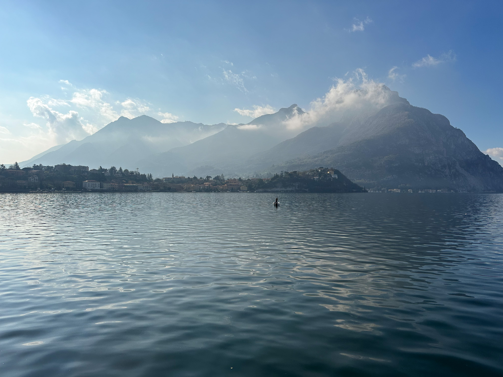
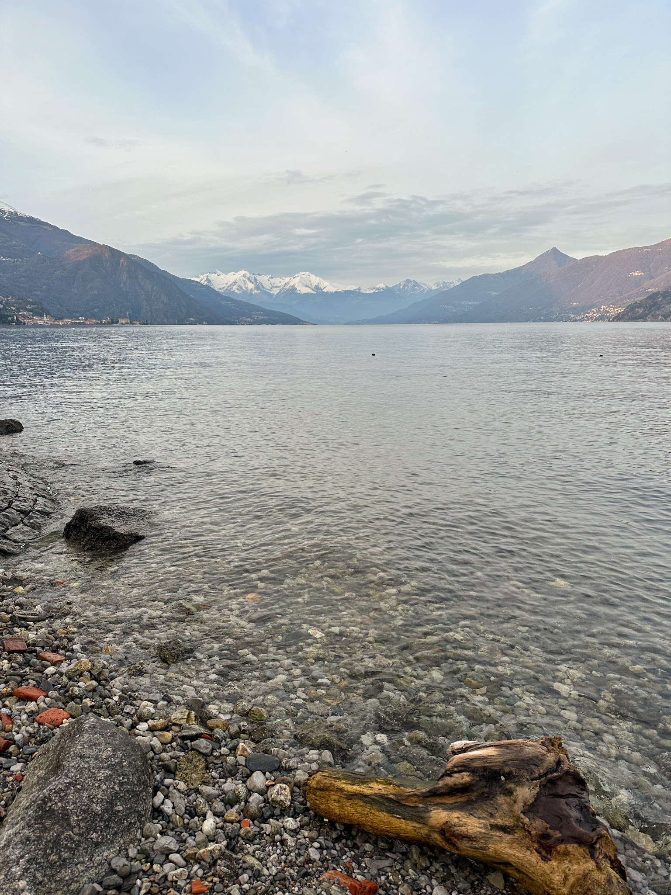
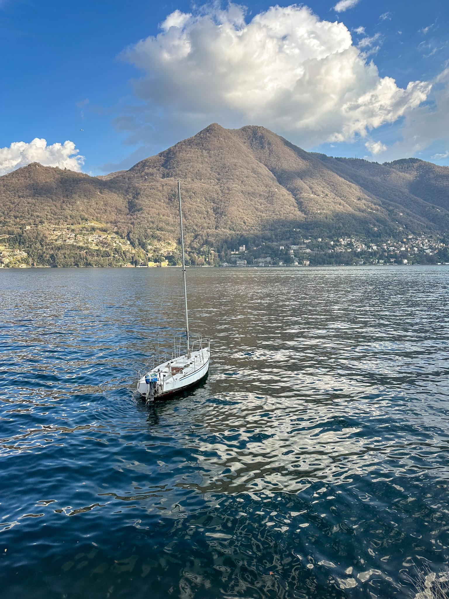
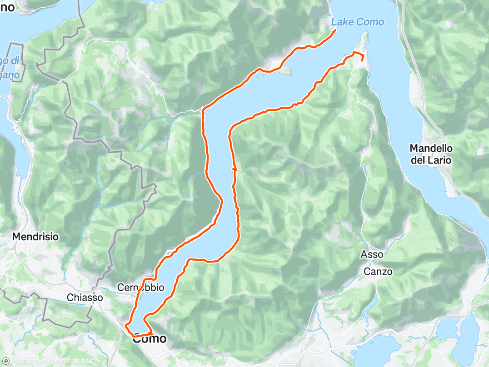
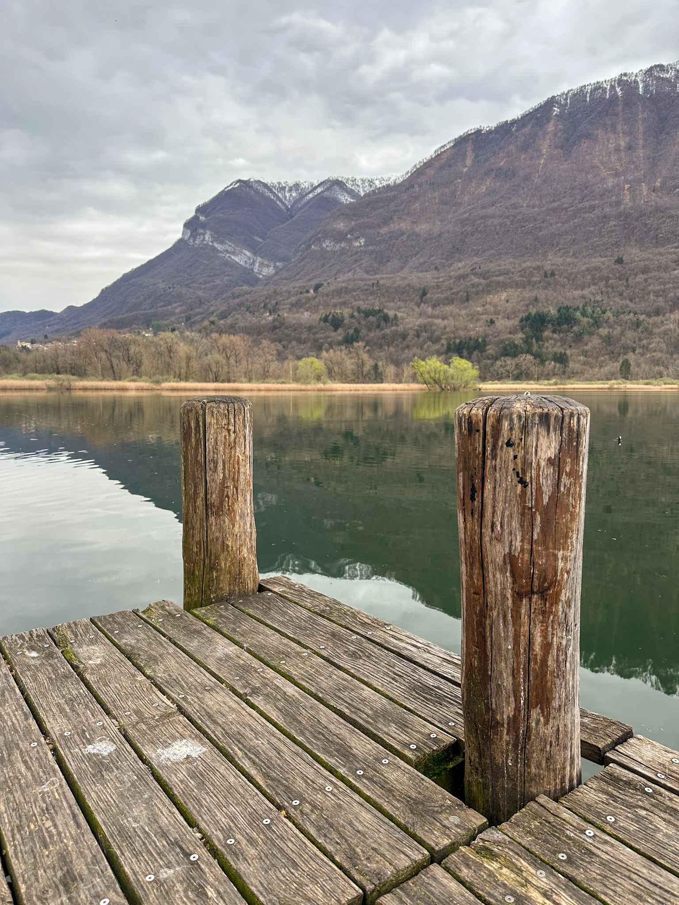
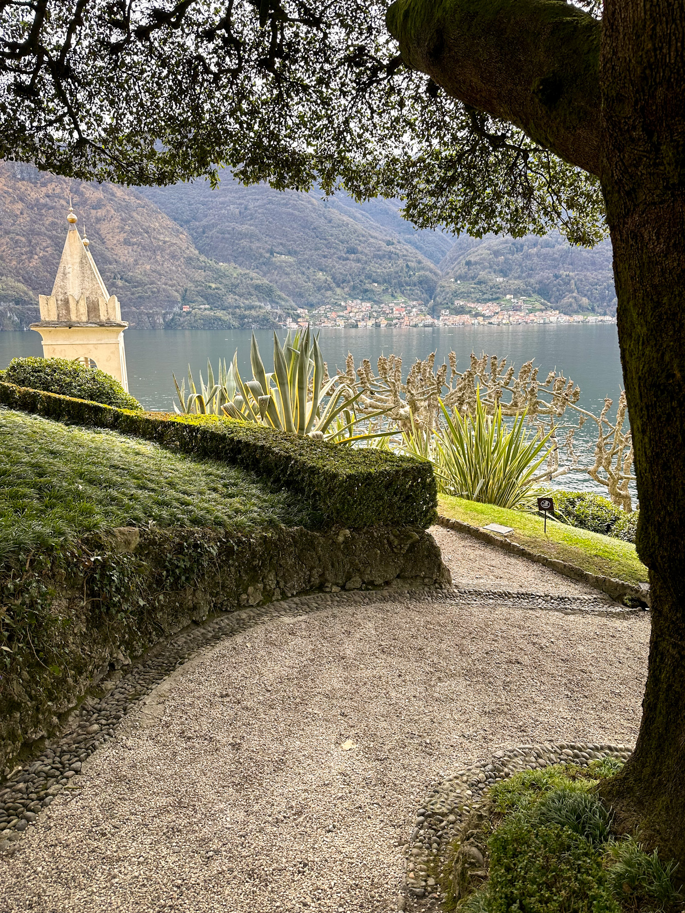
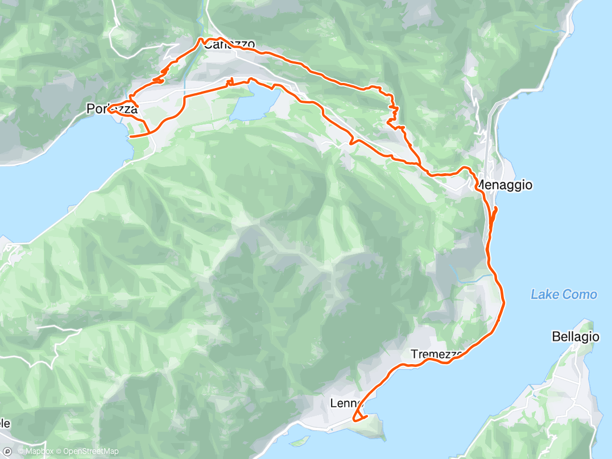
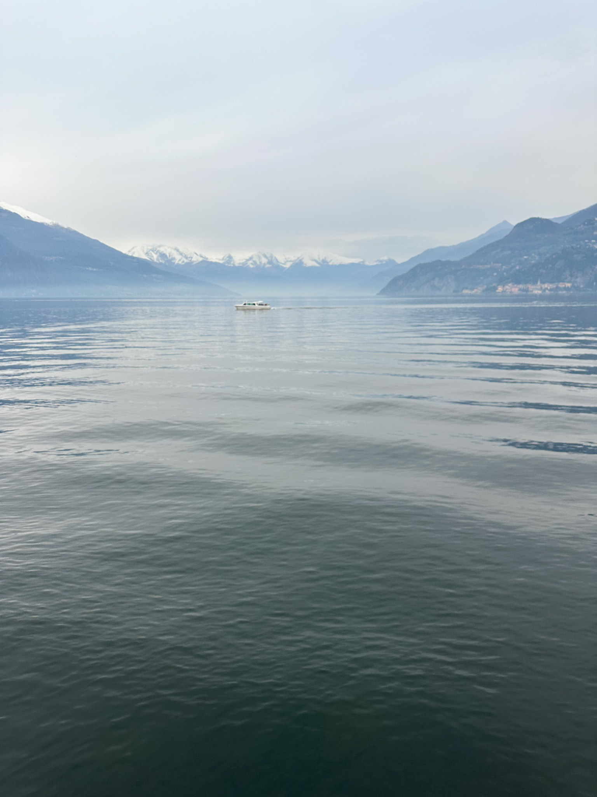
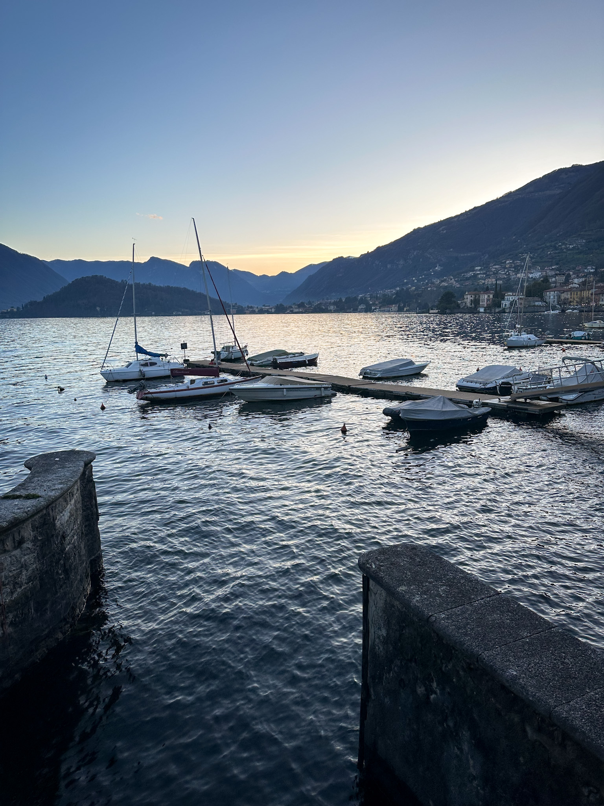

 <em
style={{textAlign: "center", display: 'block'}}>Lecco view of the Lake
Como.</em>

 

_Just reading a book and enjoing a coffee. Niiice._

I've been contemplating of booking a cheap flight to Milan, only with a
backpack, rent a car, drive all the way to Como to a hotel near the lake and
stay for a couple of nights. And, while there, rent a bike, pack a sandwich and
a San Benedetto, pick a couple of trails and don't look back. Maybe you should,
too.

Found a nice hotel in Bellagio that had breakfast included, Seta. There was also
a bike renting shop nearby, _Bike It! Bellagio_, and the best thing about it was
that they had a [website](https://www.bikeitbellagio.com/) which contained a few
bike trail suggestions, so it was easy to start the trip with minimum
preparation. Bellagio, as a town is quite nice, but there was a lot of
construction going around and there weren't many places to eat or have a coffee,
at least I did not find any. That was not on the convenient side, but the main
topic of the trip was biking, so I forgave the shortcoming.

## Bellagio - Como and back

A quite classic trip to start with, not very hard, but not very easy, as it
involved a few ups and downs along the way. The first checkpoint was the town of
Nesso, as it was almost half way to Como and had a couple of highlights: a
waterfall and a small bridge, Orrido di Nesso. It's worth a visit, don't mind
the reviews on Google, you don't need to be a pro climber to take the stairs.
There is also a small bar nearby, Bar la Cascata, to recharge the batteries with
a authentic Italian espresso and croissant.

|             View of the Alps on Como              |          Boat on the Como Lake           |
| :-----------------------------------------------: | :--------------------------------------: |
|  |  |

Back on the road and Como was not that far away, and the ride was pleasant.
Legend says that George Clooney owns a villa somewhere in the area, but I was
not lucky enough to find it. Dropping by and enjoing one cup of his Nespresso
was totally planned for the trip. Shame. Anyway, arrived in Como, beautiful as
ever, and quite crowded for March. The weather was nice, though, so I guess that
was the reason for such a large audience. But there was not enough time to
loiter, as daylight was not going to last forever in order to bike back to
Bellagio. There was a ferry to catch in Griante in order to make it back to
Bellagio. This second part of this trip was not that pleasant, since it involved
picking up the pace and avoid being on the road at night.

That being said, even with the faster pace, I did manage to enjoy the splendid
scenery Como has to offer. Every corner of water, every boat, every villa on the
shore, every bird in the sky. Everything was just perfectly part of the scenery
and it makes sense why owning a property on the lake is such a good idea. Just
reading a book and enjoing a coffee. Niiice.

Overall it was 65km ride and someone deserved some rest.

## Griante - Villa del Balbianello - Porlezza and back

Day 2, and surprisingly, not everything was hurting that much. For the second
part of the trip, I chose a route that involved going north all the way to Lake
Lugano. It started by taking the ferry from Bellagio to Griante, and a short
visit to Villa del Balbianello, in order to start things slow. After enjoying
the very well trimmed courtyard, it was time to hit the road again, and the
route went north to Menaggio but before entering the city, the route would
diverge from the main road, and it was uphill time baby. After this challenging
part, the route went west.

|             Lago di Piano             |                Villa del Balbianello                 |
| :-----------------------------------: | :--------------------------------------------------: |
|  |  |

The route was actually not that scenic to be honest, but it had a special bike
lane all the way, which was much appreciated. However, there was nothing that
special about the countryside, just farms, villages and a few cows here and
there. Lago de Piano was actually beautiful, with it being next to the
mountains, and it proved to be a good place to take a break. After taking a few
pics of this gorgeous mountain lake, it was time to finish the first half of the
route, in Porlezza. This very cozy town, just next to Lake Lugano, has a very
nice boardwalk to enjoy the lake from, and right next to it, a gelato place. How
thoughtful!

After a very needed break with coffee and icecream to lift the spirits back up,
it was time to head back home. The route back was different until Menaggio, and
this time, it was pure torture. It was a lot, and a lot, and a lot of uphill. I
died at least 5 times until reaching Naggio, the place where the route would
change from uphill to full speed downhill. Which was supposed to be good, right?
Wrong, as the downhill part was so steep, and it involved so many turns, it
proved that all the torture involved for reaching it proved to be not such a
good investment. Ideally, folks, do this one the other way around.

Anyway, the route was shorter than the first one, only 47km, but I believe it
was quite more challenging, due to all that uphill part. But eating icecream
next to the Lake Lugano? Priceless.

## Lecco

Day 3, time to go back home. Since the flight was scheduled for the evening,
Lecco was decided to become the third and last stop of the trip. The weather was
a mix of sun and rain, which was not all bad, given the really great pictures I
managed to take as a result of the shifting light. The town itself is quite nice
to stop for half a day, but the best bits involve the scenery. The view towards
Corni di Canzo is simply breathtaking, and I highly recommend going for a walk
along the Como promenade and enjoy the views. Quite impressive, and, again, the
sunlight really made it even better.

|               View of the Alps from Bellagio                |               Sunset over Como from Tremezzo                |
| :---------------------------------------------------------: | :---------------------------------------------------------: |
|  |  |

After going for a pizza (duuuh) at Pizzeria la Rosa and for a coffee (double
duuh) at Coffee&Coffee, it was time to take the rental to the car lot, enjoy the
airport van ride and the short trip back home. Biking on the Como proved to be
an excellent choice for a weekend getaway, and there would be more such trips in
the future for sure.
