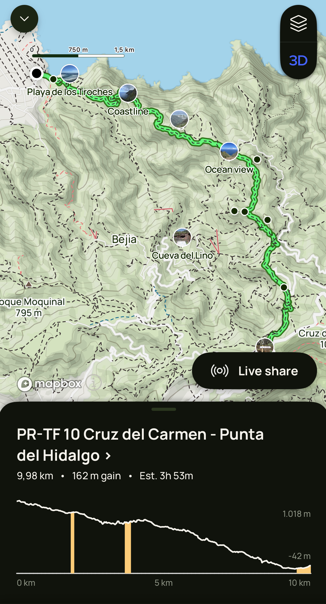

 <em
style={{textAlign: "center", display: 'block'}}>Rural Park of Anaga view near
the ocean.</em>

 

_There's also a Starbies on the promenade, perfect to sip on a Cold Brew while
watching surfers just getting destroyed by the waves. Oh, bliss._

Surf's up! It was time for a much more longer trip, and the place we chose was
Paradise. Tenerife does have a reputation. It's a go-to place for many
Europeans, as it's not very far from home, it's warm, it's beautiful, and
there's so much to do, from lying on the beach to hiking next to a volcano. Our
hopes were higher than the volcano, honestly, and we were not prepared to be
disappointed.

## Las Americas & Los Cristianos

We initially decided to book an airbnb in the Las Americas surfing and slow
lifing part of Adeje, but unfortunately, the place turned out to be quite bad,
and we moved out the next day. Not a very good start, but we eventually were
over it, as we moved to a better apartment in the town next to Adeje, Los
Cristianos. As a rule of thumb, make sure the accomodation has great and many
reviews, otherwise there may be surprises, and, frankly, you don't want to stay
in a dump while in Paradise.

|              Buenavista del Norte               |            Pine Forest on the road to Teide            |
| :---------------------------------------------: | :----------------------------------------------------: |
|  |  |

Los Cristianos is a nice place to stay while in Tenerife. The weather is great,
it has a few beaches, albeit quite standard city beaches. The more exotic ones
are further away, we'll get to those in a minute. We found a nice Romanian owned
coffee shop in town, Norio, which was great, even though there was no speciality
coffee option. Too bad. However, for food options, well, oh my Lord. Just a few:
Palmera for brunch, El Cine for fish and Sal Fina for Italian. What I liked a
lot was the promenade along the beach, that stretches from Los Cristianos all
the way to Las Americas. It's a great place to have a run during the morning, or
a relaxing walk at dusk. There's also a Starbies on the promenade, perfect to
sip a on Cold Brew while watching surfers just getting destroyed by the waves.
Oh, bliss. Oh, probably important. Rent a car.

Now, I get it. The place is 100% for tourists, no doubt. Half of the UK was
there, especially in the Las Americas part. But for good reason. When you just
sit on the beach, or on the balcony, and just look into the distance at the
landscape filled with picturesque mountains and cliffs, you realise that the
place is really special, and you're suddenly happy you're there. I was for sure,
and was terribly excited to discover some nature, which brings me to ...

## Mount Guajara

Was it a great idea to choose the Mount Guajara trail for a hiking session?
Definitely. Was it so poorly planned that everything turned out to be on the
edge? Also yes. At the end of the trip, I was exhausted, sunburned, out of
water, the sun was setting and it became quite windy and cold. All worth it, and
lessons were learned.

The Teide National Park is probably the number one spot in Tenerife, with a
scenery so incredible you'd probably mistake it for Mars. It's really special.
Right across the famous Teide volcano, there's another peak, not as high as the
former, but definitely imposing: Mount Guajara. And, surprise, surprise, it has
a hiking trail that starts from the Cañada Blanca, just off the main road. The
trail itself is not easy. There's a lot of walking at the start, then the
climbing begins steadily. The difficulty itself is not the climbing itself, but
the steady pace you need to have in order to reach the peak in time, as well as
come down the other part of the trail, that's more abrupt. It may be a better
idea to do it the other way around, climb like hell and then steadily come down
to the summit.

|          Mount Guajara Trail landscape          |         Teide Volcano         |
| :---------------------------------------------: | :---------------------------: |
|  |  |

And there's the sun. Look, the landscape does look like you're on Mars, and
there are no trees on Mars. No shade. Zero. Consequently, it would have been a
great idea to pack enough sunspray, more water, and a cap. Apart from these
minor inconveniences, the trail offers incredible views and it's enough
challenging such that, when coming back to the car, you're filled with a
refreshing sense of accomplishment and happiness. AllTrails was my hero and
helped me not get lost, even though the trail itself is quite well marked
physically.

And there's the main view, at the top. There are a couple of reasons to climb on
top of Mount Guajara. Firstly, you can see Mount Teide very well from the top,
and, well, everything else around you. It helped me trully appreciate the beauty
of the Teide National Park. And secondly, Mount Guajara served as an
astronomical observatory. I would assume that it's a great place to spend the
evening and see the stars. All in all, even though the trail really makes you
work for the views, I would say it's a must do if you're a hiking fan and plan
to go to Tenerife. Just, pack accordingly, please.

## Mirador Aguaide

Chaning gears, but not the car, I chose as my next hike to be in the Anaga
Natural Park, also a must see if you're spending time in Tenerife. It's on the
opposite side of the island, and it takes a bit more than an hour to get there
from Los Cristianos. Once I got there, the scenery changed abruptly yet again.
No more Los Cristianos beach vibes, or mountain volcanoes on Mars. This time, I
was deep into the Jumanji jungle, and it was just staggering! We parked the car
at the Cruz del Carmen, a parking spot that served as the start of the trail,
which was supposed to be a downhill hike all the way to Punta del Hidalgo. The
parking place is convenient, although it lacks any security cameras, so don't
forget to lock your car.

Since the trail was supposed to be quite long all the way to the end, I've
decided to cut it short, at least to the Mirado Aguaide, especially because
getting back was supposed to be much harder. Starting the trail, your usual vine
forest trails, all dark, humid and full of mud. However, after about half an
hour downhill into the forest, the trail cleared up, and the really beautiful
scenery started to show itself. We were walking on the edge of the cliffs, with
a deep valley to our left, and the cliffs were filled with trees, aloe vera as
tall as trees and some picturesque houses scattered around. This view, combined
with the gorgeous sun rays we cought, made the view so good that it was nothing
short of perfection.

|            Cruz del Carmen Trail Landscape            |         Masca Landscape         |
| :---------------------------------------------------: | :-----------------------------: |
|  |  |

We walked next to ravines, then some people's homes, then through a sheepfold,
and eventually we reached the village of Chinamada. There, we took a 2 minutes
break, before doing the last part of the hike, a 10 minute uphilll to the scenic
spot, Mirador Aguaide, our destination. From here, we could just admire the
jagged peaks of the Anaga, like a fortress against the vastness of the ocean. It
was quite late and we had to get back, but the view was just intoxicating, and
it made me feel so happy to be alive and be part of this beautfiul world. I'm
lost for words, but really, if you're in Tenerife, I would definitely recommend
going there, either from Carmen, or from Hidalgo, or just by car all the way to
Chinamada, although I do believe the feeling is more potent after a few hours of
breaking a sweat and enjoying the Anaga hilly landscape.

## Life's a Beach

Enough hiking (for now), let me tell you a thing or two about the beaches in
Tenerife. Yes, the ones in the South are quite good to just relax, grab a coffee
from Starbies, or two, go for surfing and whatnot. Los Cristianos or Duque ar
really good, but it's not setting them apart in any way. Just your regular
golden sand beach, close to the shopping center, a few palm trees here and
there. Las Teresitas is probably more impressive, due to its size, so if you're
planning to stay or take a trip to Santa Cruz, definitely check that out. I
especially liked the fact that the water was quite warm, warm enough to go for a
quick swim.

|            Bollullo Santa Ursula Trail Landscape            |            Benijo Black Sand Beach            |
| :---------------------------------------------------------: | :-------------------------------------------: |
|  |  |

On the other hand, I believe that Tenerife is actually more about natural
beaches, and there are quite a few of them, especially those with black sand.
Those are, indeed, quite special. We went to Bollullo, right next to Puerto de
la Cruz, and it was a blast! Great scenery, perfect sand, beach bar up the
coast, and a great sunset mix of colors that were perfect for taking pictures.
Other great beaches we went to were Playa del Roque de las Bodegas and Playa de
Benijo, but these are more up to the north, in the Anaga Park region. However,
picture this. You just came back fron a hiking trip in Anaga, it's the
afternoon, and you just throw your hiking shoes, crash on a beach with black
sand and enjoy the calming sound of the waves.

## More Trips and Hikes

One nice hike we did was around the Plaja del Bollullo, in the Santa Ursula
area, which was more like a walk overlooking the beaches. Until the walking
stopped, and a full climbing session started, until we reached the Mirador a
Santa Ana, with a great view over the area. Afterwards, it was time to enjoy the
rest of the day on the Bollullo beach, which you probably guessed by now, it's
my favorite. Another good hike we did is in Anaga, starting from Benijo and
climbing to the Mirador Cabezo del Tejo. The landscape on that part of the Anaga
is not as impressive as the one around Aguaide, but it was still worth to enjoy
the Anaga cliffs embracing the ocean. All from an altitude of 900m.

|              Cabezo del Tejo Trail Landscape              |           Garachico           |
| :-------------------------------------------------------: | :---------------------------: |
|  |  |

Last hike I will mention, which is more of a walk, is on the road to the Teide
national park, as you're going from the South. This area is covered with pine
trees, which, again is different from other areas of the island. And this is
probably the most incredible part of Tenerife. It's not a big island, but there
are so many different areas in terms of vegetaion and landscape, that you can
easily forget that you're on the same island. Anyway, this walk is through a
pine forest, which is split into 2 by a swathe of basalt, a kind reminder that
the volcano is still active.

You probably think that all I did during the trip was hiking, but that's not
really the case. We also went for day trips to different areas of the island,
all of which I really recommend. Some worth mentioning are:

- Mount Teide by cable cart, it's really cool to be on top of the volcano.
- Masca Village, just make sure the driver is not the emotional kind, as the
  road is really challenging.
- El Rayo Buenavista Del Norte, perfect for a walk close to the ocean and taking
  pictures with unique landscapes.
- Garachico, which has a great restaurant, Silogia.
- Puerto de la Cruz, where I was introduced to the Zaperoco.

## That's a Wrap

Tenerife is probably one of my favorite places so far, along with the Algarve in
Portugal, or New York. There's so much to do, and so much to see, and the
weather is almost always great. Consequently, I've went there a second time last
year, during the Christmas break, and I would still go there tomorrow if
possible. I love it, it deserves the hype, I can't find much against it. As long
as you rent a car, book an accomodation that has many good reviews and a great
rating, and you make sure to keep your bags secure, the place is really nothing
short of Paradise on Earth.

|                Mount Guajara Trail                 |                 Cruz del Carmen - Punta del Hidalgo Trail                  |
| :------------------------------------------------: | :------------------------------------------------------------------------: |
|  |  |

|             Bollullo - Santa Ursula Trail             |                 Benijo - Draguillo Trail                 |
| :---------------------------------------------------: | :------------------------------------------------------: |
|  |  |
