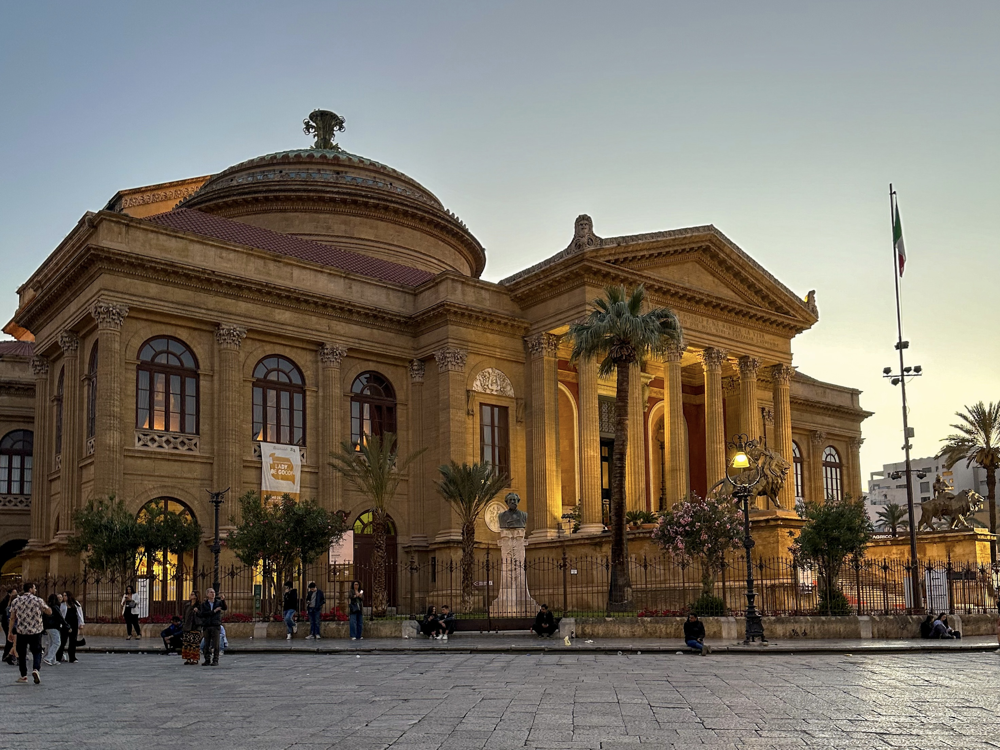

 <em
style={{textAlign: "center", display: 'block'}}>Teatro Massimo in Palermo.</em>

 

_There's also a Starbies on the promenade, perfect to sip on a Cold Brew while
watching surfers just getting destroyed by the waves. Oh, bliss._

Sicily deserved a part 2 after the
[Catania trip](https://silviuaavram.com/catania-2023), and Palermo was the
natural next stop. It's also conveniently situated near the beach, as well as
the nearby town of Cefalu, which was also on the trip list. We were so ready for
a few days of Dolce Vita, andare in spiaggia, mangiare i cannoli and enjoying
some ancient history combined with great scenery.

## Palermo Food

Not going to sugar-coat it: Sicily is the perfect place to fall in love with
life. Palermo is simply pure romance, and has so much to offer. We were lucky to
have booked an airbnb right next to the Vila Maqueda, _the place to be_. Every
restaurant and eating place was at most 5 minutes away, and, as you probably
imagine, we took advantage. If you are keeping a strict diet, avoid this place
like the plague. Otherwise, well, brace yourselves. We did not eat cannoli that
much until we got to Sicily, purely because there was nothing special about them
in any other place. Here though, totally different story, as they were just so
good, the cream was perfectly textured, the flavour just right, and the crunch
exactly like in the commercials. Cannoli&Co for reference, you're welcome.

Also here we discovered something else that we did not eat before just because
when we tried they were meh. Star number two: arancini. Balls of fried rice with
mozzarella and proscitto? Yes, please, keep them coming. Other culinary stars
were here as well, here in Hollyfood:

- gelato that is always welcome in any moment of the day.
- pizza that's handmade.
- aperol spritz to keep the vacation mood going.

These are always the super stars of Italy and Palermo did not come short in
delivering them. Oh, to make sure I won't forget. There's another Sicilian star
here, something I did not have before, and which proved to be worthy of
admiration: the Sicilian gelato brioche. A. Ma. Zing.

I'll stop. I'm hungry.

## Palermo Sights

So, the action is mostly around the Via Maqueda. We mostly covered it from the
Mariano Stabile intersection all to the way down to the University. It's the
place where we got most of the food I've mentioned above. It's a mix of
touristic hot spot and a locals get toghether place, especially during the
evening, around the Fontana Pretoria, and for good reason. The place and its
surroundings offer a great show of architecture, starting with the fountain
itself, nicknamed the "Fountain of Shame" due to its nude statues.

|             Quattro Canti - Piazza Villena             |                 Inside the Teatro Massimo                 |
| :----------------------------------------------------: | :-------------------------------------------------------: |
|  |  |

The Quattro Canti are also gorgeous, displaying the Baroque style very well.
Baroque can also be found on the nearby Chiesa e Monastero di Santa Caterina
d'Alessandria, where it's combined with elements from both the Gothic and
Renaissance architecture styles. Finally, Church of Saint Mary 'dell'Ammiraglio'
is also close to this beautiful cultural ensemnble. It's older than the others,
built in the 12th century, but equally beautiful and worth a visit. Usually,
when visiting Italy, churches are worth a visit, given all the effort that has
been put into building and maintaining them. From my experience, Rome has the
best, but the ones in Palermo are also truly special.

What we also liked was the inside of Teatro Massimo, where we enjoyed a guided
tour of the place. It's where the Godfather III opera scene was shot, so we
could not miss it. I'm making it a personal objective to return to Palermo and
enjoy a performance there. Adding it to my list, along Teatro alla Scala in
Milano.

In our city walks we also went by the Palermo Cathedral, Villa Bonanno and
Palazzo dei Normanni, when we decided to leave the Maqueda and take a right on
the Vittorio Emanuele. On our way back we took a slightly different route and
briefly went in the Chiesa del Gesù di Casa Professa. By going off the beaten
track, and on the more back streets of Palermo, we did feel the Sicilian vibe a
bit better, and it reminded me of those places in Catania and some parts of
Naples. The buildings are not very well maintained, and I would probably avoid
those kinds of places during the night. Towards the evening, we withdrew to the
"safe space" of the main street. I'm probably overreacting, as the streets were
actually not that far off the city center.

Another trip we did was to the Villa Giulia park, where apparently we stumbled
upon some photo shoots of very young people dressed formally. Apart from that it
was a beautiful stroll along the alleys with palm trees and flowers. Palermo is
a beautiful place to enjoy life and relax, where the only stressful thought is
how much you eat.

## Cefalu and Mondello

Road trip part! Since we were going to be in Palermo for quite a few days, we
decided to try some nearby sights. First on the list, the town of Cefalu. It's
the King's Landing kind of place, with narrow streets and packed houses, all on
the shore. It has a couple of landmarks as well, like the Duomo di Cefalù, a
Norman cathedral built in the 12th century, back when Sicility was ruled by
Normans after being liberated from the Arabs. Towering Cefalu is Ruderi del
Castello di Cefalù, the ruins of a castle alsop built by the Normans to defend
the place. Conveniently situated on top of a rocky hill, we managed to climb on
top, with quite some difficulty I might add (I was wearing jeans), but we
eventually made it to the top and enjoyed breathtaking visuals over Cefalu and
the surrounding area. Porta Pescara was also a great view, as well as the
Bastione di Capo Marchiafava and the nearby beach.

|            Cefalu View            |               Palermo Cathedral               |
| :-------------------------------: | :-------------------------------------------: |
|  |  |

As for Mondello, it was our option of spending a day on the beach, and it's a
very short ride from Palermo. The town is very cute, and it's famous for it's
fine sand beach, which we enjoyed very much. However, apart from the beach, we
did not find much else to do there, as the food and drink offerings are quite
poor, really. Next to the beach, the area is filled with pretty houses, and it
gave a relaxing place kind of vibe, where you just go and chill for a few days.

## Wrapping up

Given it was my second time in Sicily, I must say I enjoyed it more than the
first, and I would still considering coming back (now that I've watched White
Lotus). There's also Mount Etna to see, as well as Syracuse, Corleone maybe? Oh,
and definitely the Teatro Massimo show. Definitely there are enough reasons to
go back there, on top of the cannoli, obviously.
